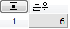
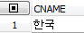
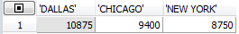
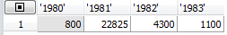
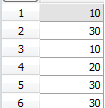
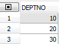
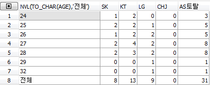

Oracle 1

2018년 4월 4일 수요일

오후 2:07

  ------------------------------------------------------------------------------------------------------------------------------------------------------------------------------------------------------------------------------------------------------------------------------------------------------------------------------------
  **Table of Contents**
  ------------------------------------------------------------------------------------------------------------------------------------------------------------------------------------------------------------------------------------------------------------------------------------------------------------------------------------
  - [Introduction](onenote:#Oracle%201&section-id={0F12DDF1-63BA-42E9-80F3-BFA988704E89}&page-id={F455CCA8-923B-4280-81F7-91196B0CE222}&object-id={A4B63F65-5AE1-448A-8403-2414036B2186}&B&base-path=https://d.docs.live.net/3dc04d8efc44e4f4/Documents/Book/Oracle.one)
  
      - [Oracle download](onenote:#Oracle%201&section-id={0F12DDF1-63BA-42E9-80F3-BFA988704E89}&page-id={F455CCA8-923B-4280-81F7-91196B0CE222}&object-id={31E32B74-7AA0-4B92-990E-C2825B1A29D4}&1C&base-path=https://d.docs.live.net/3dc04d8efc44e4f4/Documents/Book/Oracle.one)
  
      -
  
      - [Oracle database connection](onenote:#Oracle%201&section-id={0F12DDF1-63BA-42E9-80F3-BFA988704E89}&page-id={F455CCA8-923B-4280-81F7-91196B0CE222}&object-id={31E32B74-7AA0-4B92-990E-C2825B1A29D4}&22&base-path=https://d.docs.live.net/3dc04d8efc44e4f4/Documents/Book/Oracle.one)
  
      -
  
      - [Current user](onenote:#Oracle%201&section-id={0F12DDF1-63BA-42E9-80F3-BFA988704E89}&page-id={F455CCA8-923B-4280-81F7-91196B0CE222}&object-id={31E32B74-7AA0-4B92-990E-C2825B1A29D4}&2E&base-path=https://d.docs.live.net/3dc04d8efc44e4f4/Documents/Book/Oracle.one)
  
      -
  
      - [Table creation example](onenote:#Oracle%201&section-id={0F12DDF1-63BA-42E9-80F3-BFA988704E89}&page-id={F455CCA8-923B-4280-81F7-91196B0CE222}&object-id={31E32B74-7AA0-4B92-990E-C2825B1A29D4}&34&base-path=https://d.docs.live.net/3dc04d8efc44e4f4/Documents/Book/Oracle.one)
  
      -
  
      - [Query example](onenote:#Oracle%201&section-id={0F12DDF1-63BA-42E9-80F3-BFA988704E89}&page-id={F455CCA8-923B-4280-81F7-91196B0CE222}&object-id={31E32B74-7AA0-4B92-990E-C2825B1A29D4}&80&base-path=https://d.docs.live.net/3dc04d8efc44e4f4/Documents/Book/Oracle.one)
  
      -
  
      - [Column information](onenote:#Oracle%201&section-id={0F12DDF1-63BA-42E9-80F3-BFA988704E89}&page-id={F455CCA8-923B-4280-81F7-91196B0CE222}&object-id={31E32B74-7AA0-4B92-990E-C2825B1A29D4}&86&base-path=https://d.docs.live.net/3dc04d8efc44e4f4/Documents/Book/Oracle.one)
  
      - [Set pages](onenote:#Oracle%201&section-id={0F12DDF1-63BA-42E9-80F3-BFA988704E89}&page-id={F455CCA8-923B-4280-81F7-91196B0CE222}&object-id={97FD5C2D-D254-4B3B-9F61-FBD681B606D6}&55&base-path=https://d.docs.live.net/3dc04d8efc44e4f4/Documents/Book/Oracle.one)
  
      - [order by ](onenote:#Oracle%201&section-id={0F12DDF1-63BA-42E9-80F3-BFA988704E89}&page-id={F455CCA8-923B-4280-81F7-91196B0CE222}&object-id={31E32B74-7AA0-4B92-990E-C2825B1A29D4}&C6&base-path=https://d.docs.live.net/3dc04d8efc44e4f4/Documents/Book/Oracle.one)
  
      - [Column and row](onenote:#Oracle%201&section-id={0F12DDF1-63BA-42E9-80F3-BFA988704E89}&page-id={F455CCA8-923B-4280-81F7-91196B0CE222}&object-id={31E32B74-7AA0-4B92-990E-C2825B1A29D4}&E7&base-path=https://d.docs.live.net/3dc04d8efc44e4f4/Documents/Book/Oracle.one)
  
      -
  
      - [Table pretty](onenote:#Oracle%201&section-id={0F12DDF1-63BA-42E9-80F3-BFA988704E89}&page-id={F455CCA8-923B-4280-81F7-91196B0CE222}&object-id={97FD5C2D-D254-4B3B-9F61-FBD681B606D6}&57&base-path=https://d.docs.live.net/3dc04d8efc44e4f4/Documents/Book/Oracle.one)
  
      - [Distinct (removing duplication)](onenote:#Oracle%201&section-id={0F12DDF1-63BA-42E9-80F3-BFA988704E89}&page-id={F455CCA8-923B-4280-81F7-91196B0CE222}&object-id={23052C63-4C90-4550-94AD-FED2980E6CB5}&15&base-path=https://d.docs.live.net/3dc04d8efc44e4f4/Documents/Book/Oracle.one)
  
      - [SQL GATE install](onenote:#Oracle%201&section-id={0F12DDF1-63BA-42E9-80F3-BFA988704E89}&page-id={F455CCA8-923B-4280-81F7-91196B0CE222}&object-id={23052C63-4C90-4550-94AD-FED2980E6CB5}&1D&base-path=https://d.docs.live.net/3dc04d8efc44e4f4/Documents/Book/Oracle.one)
  
      -
  
      - [Null ](onenote:#Oracle%201&section-id={0F12DDF1-63BA-42E9-80F3-BFA988704E89}&page-id={F455CCA8-923B-4280-81F7-91196B0CE222}&object-id={23052C63-4C90-4550-94AD-FED2980E6CB5}&51&base-path=https://d.docs.live.net/3dc04d8efc44e4f4/Documents/Book/Oracle.one)
  
      - [NVL Function(null value logic)](onenote:#Oracle%201&section-id={0F12DDF1-63BA-42E9-80F3-BFA988704E89}&page-id={F455CCA8-923B-4280-81F7-91196B0CE222}&object-id={23052C63-4C90-4550-94AD-FED2980E6CB5}&74&base-path=https://d.docs.live.net/3dc04d8efc44e4f4/Documents/Book/Oracle.one)
  
      - [3 types of characters](onenote:#Oracle%201&section-id={0F12DDF1-63BA-42E9-80F3-BFA988704E89}&page-id={F455CCA8-923B-4280-81F7-91196B0CE222}&object-id={B6F500F6-29E0-4745-ABDB-5566AFF1776D}&CA&base-path=https://d.docs.live.net/3dc04d8efc44e4f4/Documents/Book/Oracle.one)
  
  - [Restricting and Sorting Data](onenote:#Oracle%201&section-id={0F12DDF1-63BA-42E9-80F3-BFA988704E89}&page-id={F455CCA8-923B-4280-81F7-91196B0CE222}&object-id={23052C63-4C90-4550-94AD-FED2980E6CB5}&8E&base-path=https://d.docs.live.net/3dc04d8efc44e4f4/Documents/Book/Oracle.one)
  
      - [where clause](onenote:#Oracle%201&section-id={0F12DDF1-63BA-42E9-80F3-BFA988704E89}&page-id={F455CCA8-923B-4280-81F7-91196B0CE222}&object-id={23052C63-4C90-4550-94AD-FED2980E6CB5}&A1&base-path=https://d.docs.live.net/3dc04d8efc44e4f4/Documents/Book/Oracle.one)
  
      - [Comparison operator](onenote:#Oracle%201&section-id={0F12DDF1-63BA-42E9-80F3-BFA988704E89}&page-id={F455CCA8-923B-4280-81F7-91196B0CE222}&object-id={B6F500F6-29E0-4745-ABDB-5566AFF1776D}&CF&base-path=https://d.docs.live.net/3dc04d8efc44e4f4/Documents/Book/Oracle.one)
  
      - [Date type check](onenote:#Oracle%201&section-id={0F12DDF1-63BA-42E9-80F3-BFA988704E89}&page-id={F455CCA8-923B-4280-81F7-91196B0CE222}&object-id={B6F500F6-29E0-4745-ABDB-5566AFF1776D}&DA&base-path=https://d.docs.live.net/3dc04d8efc44e4f4/Documents/Book/Oracle.one)
  
      - [like operator](onenote:#Oracle%201&section-id={0F12DDF1-63BA-42E9-80F3-BFA988704E89}&page-id={F455CCA8-923B-4280-81F7-91196B0CE222}&object-id={803E52A2-31E6-4E56-B118-166F44A07E9C}&51&base-path=https://d.docs.live.net/3dc04d8efc44e4f4/Documents/Book/Oracle.one)
  
      - [single quotation mark for character](onenote:#Oracle%201&section-id={0F12DDF1-63BA-42E9-80F3-BFA988704E89}&page-id={F455CCA8-923B-4280-81F7-91196B0CE222}&object-id={803E52A2-31E6-4E56-B118-166F44A07E9C}&61&base-path=https://d.docs.live.net/3dc04d8efc44e4f4/Documents/Book/Oracle.one)
  
      - [in operator](onenote:#Oracle%201&section-id={0F12DDF1-63BA-42E9-80F3-BFA988704E89}&page-id={F455CCA8-923B-4280-81F7-91196B0CE222}&object-id={803E52A2-31E6-4E56-B118-166F44A07E9C}&B6&base-path=https://d.docs.live.net/3dc04d8efc44e4f4/Documents/Book/Oracle.one)
  
      - [Database connection to team leader using Gate](onenote:#Oracle%201&section-id={0F12DDF1-63BA-42E9-80F3-BFA988704E89}&page-id={F455CCA8-923B-4280-81F7-91196B0CE222}&object-id={803E52A2-31E6-4E56-B118-166F44A07E9C}&F8&base-path=https://d.docs.live.net/3dc04d8efc44e4f4/Documents/Book/Oracle.one)
  
      -
  
      - [logic operator](onenote:#Oracle%201&section-id={0F12DDF1-63BA-42E9-80F3-BFA988704E89}&page-id={F455CCA8-923B-4280-81F7-91196B0CE222}&object-id={E89085C3-242A-4D91-B79F-0DF2C49713AB}&40&base-path=https://d.docs.live.net/3dc04d8efc44e4f4/Documents/Book/Oracle.one)
  
      - [user creation](onenote:#Oracle%201&section-id={0F12DDF1-63BA-42E9-80F3-BFA988704E89}&page-id={F455CCA8-923B-4280-81F7-91196B0CE222}&object-id={E89085C3-242A-4D91-B79F-0DF2C49713AB}&8F&base-path=https://d.docs.live.net/3dc04d8efc44e4f4/Documents/Book/Oracle.one)
  
      - [link ](onenote:#Oracle%201&section-id={0F12DDF1-63BA-42E9-80F3-BFA988704E89}&page-id={F455CCA8-923B-4280-81F7-91196B0CE222}&object-id={E89085C3-242A-4D91-B79F-0DF2C49713AB}&A0&base-path=https://d.docs.live.net/3dc04d8efc44e4f4/Documents/Book/Oracle.one)
  
      - [Priority of operator](onenote:#Oracle%201&section-id={0F12DDF1-63BA-42E9-80F3-BFA988704E89}&page-id={F455CCA8-923B-4280-81F7-91196B0CE222}&object-id={E89085C3-242A-4D91-B79F-0DF2C49713AB}&BA&base-path=https://d.docs.live.net/3dc04d8efc44e4f4/Documents/Book/Oracle.one)
  
  - [Function](onenote:#Oracle%201&section-id={0F12DDF1-63BA-42E9-80F3-BFA988704E89}&page-id={F455CCA8-923B-4280-81F7-91196B0CE222}&object-id={E89085C3-242A-4D91-B79F-0DF2C49713AB}&D7&base-path=https://d.docs.live.net/3dc04d8efc44e4f4/Documents/Book/Oracle.one)
  
      - [single row function](onenote:#Oracle%201&section-id={0F12DDF1-63BA-42E9-80F3-BFA988704E89}&page-id={F455CCA8-923B-4280-81F7-91196B0CE222}&object-id={E89085C3-242A-4D91-B79F-0DF2C49713AB}&ED&base-path=https://d.docs.live.net/3dc04d8efc44e4f4/Documents/Book/Oracle.one)
  
      - [Substr](onenote:#Oracle%201&section-id={0F12DDF1-63BA-42E9-80F3-BFA988704E89}&page-id={F455CCA8-923B-4280-81F7-91196B0CE222}&object-id={36C183E5-F78B-4B71-B322-DA58687BEBD8}&11&base-path=https://d.docs.live.net/3dc04d8efc44e4f4/Documents/Book/Oracle.one)
  
      - [another example of substr](onenote:#Oracle%201&section-id={0F12DDF1-63BA-42E9-80F3-BFA988704E89}&page-id={F455CCA8-923B-4280-81F7-91196B0CE222}&object-id={36C183E5-F78B-4B71-B322-DA58687BEBD8}&30&base-path=https://d.docs.live.net/3dc04d8efc44e4f4/Documents/Book/Oracle.one)
  
      - [instr function](onenote:#Oracle%201&section-id={0F12DDF1-63BA-42E9-80F3-BFA988704E89}&page-id={F455CCA8-923B-4280-81F7-91196B0CE222}&object-id={36C183E5-F78B-4B71-B322-DA58687BEBD8}&3E&base-path=https://d.docs.live.net/3dc04d8efc44e4f4/Documents/Book/Oracle.one)
  
      -
  
      - [replace function](onenote:#Oracle%201&section-id={0F12DDF1-63BA-42E9-80F3-BFA988704E89}&page-id={F455CCA8-923B-4280-81F7-91196B0CE222}&object-id={36C183E5-F78B-4B71-B322-DA58687BEBD8}&57&base-path=https://d.docs.live.net/3dc04d8efc44e4f4/Documents/Book/Oracle.one)
  
      - [regexp\_replace function](onenote:#Oracle%201&section-id={0F12DDF1-63BA-42E9-80F3-BFA988704E89}&page-id={F455CCA8-923B-4280-81F7-91196B0CE222}&object-id={36C183E5-F78B-4B71-B322-DA58687BEBD8}&5F&base-path=https://d.docs.live.net/3dc04d8efc44e4f4/Documents/Book/Oracle.one)
  
      - [Trim](onenote:#Oracle%201&section-id={0F12DDF1-63BA-42E9-80F3-BFA988704E89}&page-id={F455CCA8-923B-4280-81F7-91196B0CE222}&object-id={36C183E5-F78B-4B71-B322-DA58687BEBD8}&6C&base-path=https://d.docs.live.net/3dc04d8efc44e4f4/Documents/Book/Oracle.one)
  
      - [Concat](onenote:#Oracle%201&section-id={0F12DDF1-63BA-42E9-80F3-BFA988704E89}&page-id={F455CCA8-923B-4280-81F7-91196B0CE222}&object-id={36C183E5-F78B-4B71-B322-DA58687BEBD8}&92&base-path=https://d.docs.live.net/3dc04d8efc44e4f4/Documents/Book/Oracle.one)
  
      - [lpad, rpad](onenote:#Oracle%201&section-id={0F12DDF1-63BA-42E9-80F3-BFA988704E89}&page-id={F455CCA8-923B-4280-81F7-91196B0CE222}&object-id={36C183E5-F78B-4B71-B322-DA58687BEBD8}&9B&base-path=https://d.docs.live.net/3dc04d8efc44e4f4/Documents/Book/Oracle.one)
  
      - [length](onenote:#Oracle%201&section-id={0F12DDF1-63BA-42E9-80F3-BFA988704E89}&page-id={F455CCA8-923B-4280-81F7-91196B0CE222}&object-id={36C183E5-F78B-4B71-B322-DA58687BEBD8}&A6&base-path=https://d.docs.live.net/3dc04d8efc44e4f4/Documents/Book/Oracle.one)
  
      - [Number ](onenote:#Oracle%201&section-id={0F12DDF1-63BA-42E9-80F3-BFA988704E89}&page-id={F455CCA8-923B-4280-81F7-91196B0CE222}&object-id={36C183E5-F78B-4B71-B322-DA58687BEBD8}&C1&base-path=https://d.docs.live.net/3dc04d8efc44e4f4/Documents/Book/Oracle.one)
  
      - [Round](onenote:#Oracle%201&section-id={0F12DDF1-63BA-42E9-80F3-BFA988704E89}&page-id={F455CCA8-923B-4280-81F7-91196B0CE222}&object-id={36C183E5-F78B-4B71-B322-DA58687BEBD8}&C5&base-path=https://d.docs.live.net/3dc04d8efc44e4f4/Documents/Book/Oracle.one)
  
      - [trunc ](onenote:#Oracle%201&section-id={0F12DDF1-63BA-42E9-80F3-BFA988704E89}&page-id={F455CCA8-923B-4280-81F7-91196B0CE222}&object-id={36C183E5-F78B-4B71-B322-DA58687BEBD8}&D0&base-path=https://d.docs.live.net/3dc04d8efc44e4f4/Documents/Book/Oracle.one)
  
      - [mod](onenote:#Oracle%201&section-id={0F12DDF1-63BA-42E9-80F3-BFA988704E89}&page-id={F455CCA8-923B-4280-81F7-91196B0CE222}&object-id={36C183E5-F78B-4B71-B322-DA58687BEBD8}&D8&base-path=https://d.docs.live.net/3dc04d8efc44e4f4/Documents/Book/Oracle.one)
  
      - [power function](onenote:#Oracle%201&section-id={0F12DDF1-63BA-42E9-80F3-BFA988704E89}&page-id={F455CCA8-923B-4280-81F7-91196B0CE222}&object-id={36C183E5-F78B-4B71-B322-DA58687BEBD8}&E3&base-path=https://d.docs.live.net/3dc04d8efc44e4f4/Documents/Book/Oracle.one)
  
      - [Date functions](onenote:#Oracle%201&section-id={0F12DDF1-63BA-42E9-80F3-BFA988704E89}&page-id={F455CCA8-923B-4280-81F7-91196B0CE222}&object-id={36C183E5-F78B-4B71-B322-DA58687BEBD8}&FB&base-path=https://d.docs.live.net/3dc04d8efc44e4f4/Documents/Book/Oracle.one)
  
      - [Current date](onenote:#Oracle%201&section-id={0F12DDF1-63BA-42E9-80F3-BFA988704E89}&page-id={F455CCA8-923B-4280-81F7-91196B0CE222}&object-id={8070310F-5889-4E58-829D-1708FE6C8A29}&11&base-path=https://d.docs.live.net/3dc04d8efc44e4f4/Documents/Book/Oracle.one)
  
      - [Case conversion functions](onenote:#Oracle%201&section-id={0F12DDF1-63BA-42E9-80F3-BFA988704E89}&page-id={F455CCA8-923B-4280-81F7-91196B0CE222}&object-id={8070310F-5889-4E58-829D-1708FE6C8A29}&45&base-path=https://d.docs.live.net/3dc04d8efc44e4f4/Documents/Book/Oracle.one)
  
      - [Internal query checking](onenote:#Oracle%201&section-id={0F12DDF1-63BA-42E9-80F3-BFA988704E89}&page-id={F455CCA8-923B-4280-81F7-91196B0CE222}&object-id={8070310F-5889-4E58-829D-1708FE6C8A29}&56&base-path=https://d.docs.live.net/3dc04d8efc44e4f4/Documents/Book/Oracle.one)
  
      - [2 types of data conversion](onenote:#Oracle%201&section-id={0F12DDF1-63BA-42E9-80F3-BFA988704E89}&page-id={F455CCA8-923B-4280-81F7-91196B0CE222}&object-id={8070310F-5889-4E58-829D-1708FE6C8A29}&70&base-path=https://d.docs.live.net/3dc04d8efc44e4f4/Documents/Book/Oracle.one)
  
      -
  
      - [Date format](onenote:#Oracle%201&section-id={0F12DDF1-63BA-42E9-80F3-BFA988704E89}&page-id={F455CCA8-923B-4280-81F7-91196B0CE222}&object-id={8070310F-5889-4E58-829D-1708FE6C8A29}&DC&base-path=https://d.docs.live.net/3dc04d8efc44e4f4/Documents/Book/Oracle.one)
  
      - [Current session format alternation](onenote:#Oracle%201&section-id={0F12DDF1-63BA-42E9-80F3-BFA988704E89}&page-id={F455CCA8-923B-4280-81F7-91196B0CE222}&object-id={3AE91CBF-7D88-46FC-8B98-694439FCBE85}&3E&base-path=https://d.docs.live.net/3dc04d8efc44e4f4/Documents/Book/Oracle.one)
  
      - [Difference between RR and YY as date format](onenote:#Oracle%201&section-id={0F12DDF1-63BA-42E9-80F3-BFA988704E89}&page-id={F455CCA8-923B-4280-81F7-91196B0CE222}&object-id={3AE91CBF-7D88-46FC-8B98-694439FCBE85}&4E&base-path=https://d.docs.live.net/3dc04d8efc44e4f4/Documents/Book/Oracle.one)
  
      - [To\_char vs format change](onenote:#Oracle%201&section-id={0F12DDF1-63BA-42E9-80F3-BFA988704E89}&page-id={F455CCA8-923B-4280-81F7-91196B0CE222}&object-id={3AE91CBF-7D88-46FC-8B98-694439FCBE85}&58&base-path=https://d.docs.live.net/3dc04d8efc44e4f4/Documents/Book/Oracle.one)
  
      - [To\_number](onenote:#Oracle%201&section-id={0F12DDF1-63BA-42E9-80F3-BFA988704E89}&page-id={F455CCA8-923B-4280-81F7-91196B0CE222}&object-id={3AE91CBF-7D88-46FC-8B98-694439FCBE85}&78&base-path=https://d.docs.live.net/3dc04d8efc44e4f4/Documents/Book/Oracle.one)
  
      - [general function](onenote:#Oracle%201&section-id={0F12DDF1-63BA-42E9-80F3-BFA988704E89}&page-id={F455CCA8-923B-4280-81F7-91196B0CE222}&object-id={3AE91CBF-7D88-46FC-8B98-694439FCBE85}&90&base-path=https://d.docs.live.net/3dc04d8efc44e4f4/Documents/Book/Oracle.one)
  
      - [nvl2](onenote:#Oracle%201&section-id={0F12DDF1-63BA-42E9-80F3-BFA988704E89}&page-id={F455CCA8-923B-4280-81F7-91196B0CE222}&object-id={3AE91CBF-7D88-46FC-8B98-694439FCBE85}&94&base-path=https://d.docs.live.net/3dc04d8efc44e4f4/Documents/Book/Oracle.one)
  
      -
  
      - [Decode ](onenote:#Oracle%201&section-id={0F12DDF1-63BA-42E9-80F3-BFA988704E89}&page-id={F455CCA8-923B-4280-81F7-91196B0CE222}&object-id={3AE91CBF-7D88-46FC-8B98-694439FCBE85}&9C&base-path=https://d.docs.live.net/3dc04d8efc44e4f4/Documents/Book/Oracle.one)
  
      - [Case](onenote:#Oracle%201&section-id={0F12DDF1-63BA-42E9-80F3-BFA988704E89}&page-id={F455CCA8-923B-4280-81F7-91196B0CE222}&object-id={3AE91CBF-7D88-46FC-8B98-694439FCBE85}&B3&base-path=https://d.docs.live.net/3dc04d8efc44e4f4/Documents/Book/Oracle.one)
  
  -
  
  - [Group function](onenote:#Oracle%201&section-id={0F12DDF1-63BA-42E9-80F3-BFA988704E89}&page-id={F455CCA8-923B-4280-81F7-91196B0CE222}&object-id={3AE91CBF-7D88-46FC-8B98-694439FCBE85}&C7&base-path=https://d.docs.live.net/3dc04d8efc44e4f4/Documents/Book/Oracle.one)
  
      - [Max](onenote:#Oracle%201&section-id={0F12DDF1-63BA-42E9-80F3-BFA988704E89}&page-id={F455CCA8-923B-4280-81F7-91196B0CE222}&object-id={3AE91CBF-7D88-46FC-8B98-694439FCBE85}&E1&base-path=https://d.docs.live.net/3dc04d8efc44e4f4/Documents/Book/Oracle.one)
  
      - [Min](onenote:#Oracle%201&section-id={0F12DDF1-63BA-42E9-80F3-BFA988704E89}&page-id={F455CCA8-923B-4280-81F7-91196B0CE222}&object-id={6F304D9E-DAA1-4914-8B3B-A84BFC523E4E}&3C&base-path=https://d.docs.live.net/3dc04d8efc44e4f4/Documents/Book/Oracle.one)
  
      - [Avg ground function](onenote:#Oracle%201&section-id={0F12DDF1-63BA-42E9-80F3-BFA988704E89}&page-id={F455CCA8-923B-4280-81F7-91196B0CE222}&object-id={6F304D9E-DAA1-4914-8B3B-A84BFC523E4E}&B1&base-path=https://d.docs.live.net/3dc04d8efc44e4f4/Documents/Book/Oracle.one)
  
      - [null ignoring issue](onenote:#Oracle%201&section-id={0F12DDF1-63BA-42E9-80F3-BFA988704E89}&page-id={F455CCA8-923B-4280-81F7-91196B0CE222}&object-id={6F304D9E-DAA1-4914-8B3B-A84BFC523E4E}&B5&base-path=https://d.docs.live.net/3dc04d8efc44e4f4/Documents/Book/Oracle.one)
  
      - [Group function in search query](onenote:#Oracle%201&section-id={0F12DDF1-63BA-42E9-80F3-BFA988704E89}&page-id={F455CCA8-923B-4280-81F7-91196B0CE222}&object-id={918DE86F-5CE2-48FB-91B4-2D32E095DEF8}&3F&base-path=https://d.docs.live.net/3dc04d8efc44e4f4/Documents/Book/Oracle.one)
  
      - [Coding order & processing order](onenote:#Oracle%201&section-id={0F12DDF1-63BA-42E9-80F3-BFA988704E89}&page-id={F455CCA8-923B-4280-81F7-91196B0CE222}&object-id={918DE86F-5CE2-48FB-91B4-2D32E095DEF8}&4D&base-path=https://d.docs.live.net/3dc04d8efc44e4f4/Documents/Book/Oracle.one)
  
      - [Count (Group function)](onenote:#Oracle%201&section-id={0F12DDF1-63BA-42E9-80F3-BFA988704E89}&page-id={F455CCA8-923B-4280-81F7-91196B0CE222}&object-id={918DE86F-5CE2-48FB-91B4-2D32E095DEF8}&B8&base-path=https://d.docs.live.net/3dc04d8efc44e4f4/Documents/Book/Oracle.one)
  
      - [difference between where and having](onenote:#Oracle%201&section-id={0F12DDF1-63BA-42E9-80F3-BFA988704E89}&page-id={F455CCA8-923B-4280-81F7-91196B0CE222}&object-id={46AB6671-F6AA-4903-9271-BDAB211CA1C8}&3F&base-path=https://d.docs.live.net/3dc04d8efc44e4f4/Documents/Book/Oracle.one)
  
      - [Nesting group functions](onenote:#Oracle%201&section-id={0F12DDF1-63BA-42E9-80F3-BFA988704E89}&page-id={F455CCA8-923B-4280-81F7-91196B0CE222}&object-id={46AB6671-F6AA-4903-9271-BDAB211CA1C8}&47&base-path=https://d.docs.live.net/3dc04d8efc44e4f4/Documents/Book/Oracle.one)
  
      - [pivot, unpivot](onenote:#Oracle%201&section-id={0F12DDF1-63BA-42E9-80F3-BFA988704E89}&page-id={F455CCA8-923B-4280-81F7-91196B0CE222}&object-id={46AB6671-F6AA-4903-9271-BDAB211CA1C8}&D4&base-path=https://d.docs.live.net/3dc04d8efc44e4f4/Documents/Book/Oracle.one)
  
  - [Data analysis function](onenote:#Oracle%201&section-id={0F12DDF1-63BA-42E9-80F3-BFA988704E89}&page-id={F455CCA8-923B-4280-81F7-91196B0CE222}&object-id={E710A890-AC4B-4E8E-9A5E-8817A1E53789}&66&base-path=https://d.docs.live.net/3dc04d8efc44e4f4/Documents/Book/Oracle.one)
  
      - [Rank](onenote:#Oracle%201&section-id={0F12DDF1-63BA-42E9-80F3-BFA988704E89}&page-id={F455CCA8-923B-4280-81F7-91196B0CE222}&object-id={E710A890-AC4B-4E8E-9A5E-8817A1E53789}&7C&base-path=https://d.docs.live.net/3dc04d8efc44e4f4/Documents/Book/Oracle.one)
  
      - [Dense\_rank (removing degeneracy)](onenote:#Oracle%201&section-id={0F12DDF1-63BA-42E9-80F3-BFA988704E89}&page-id={F455CCA8-923B-4280-81F7-91196B0CE222}&object-id={E710A890-AC4B-4E8E-9A5E-8817A1E53789}&94&base-path=https://d.docs.live.net/3dc04d8efc44e4f4/Documents/Book/Oracle.one)
  
      - [Sub query in from clause](onenote:#Oracle%201&section-id={0F12DDF1-63BA-42E9-80F3-BFA988704E89}&page-id={F455CCA8-923B-4280-81F7-91196B0CE222}&object-id={B6F500F6-29E0-4745-ABDB-5566AFF1776D}&29&base-path=https://d.docs.live.net/3dc04d8efc44e4f4/Documents/Book/Oracle.one)
  
      - [ntile ](onenote:#Oracle%201&section-id={0F12DDF1-63BA-42E9-80F3-BFA988704E89}&page-id={F455CCA8-923B-4280-81F7-91196B0CE222}&object-id={B15FDC28-69A2-4DF6-9D18-CC5214AB30B1}&29&base-path=https://d.docs.live.net/3dc04d8efc44e4f4/Documents/Book/Oracle.one)
  
      - [Accumulating data](onenote:#Oracle%201&section-id={0F12DDF1-63BA-42E9-80F3-BFA988704E89}&page-id={F455CCA8-923B-4280-81F7-91196B0CE222}&object-id={B15FDC28-69A2-4DF6-9D18-CC5214AB30B1}&56&base-path=https://d.docs.live.net/3dc04d8efc44e4f4/Documents/Book/Oracle.one)
  
      - [listagg function](onenote:#Oracle%201&section-id={0F12DDF1-63BA-42E9-80F3-BFA988704E89}&page-id={F455CCA8-923B-4280-81F7-91196B0CE222}&object-id={B15FDC28-69A2-4DF6-9D18-CC5214AB30B1}&6F&base-path=https://d.docs.live.net/3dc04d8efc44e4f4/Documents/Book/Oracle.one)
  
      - [lead, lag function](onenote:#Oracle%201&section-id={0F12DDF1-63BA-42E9-80F3-BFA988704E89}&page-id={F455CCA8-923B-4280-81F7-91196B0CE222}&object-id={B15FDC28-69A2-4DF6-9D18-CC5214AB30B1}&9A&base-path=https://d.docs.live.net/3dc04d8efc44e4f4/Documents/Book/Oracle.one)
  
      - [pivot review](onenote:#Oracle%201&section-id={0F12DDF1-63BA-42E9-80F3-BFA988704E89}&page-id={F455CCA8-923B-4280-81F7-91196B0CE222}&object-id={B15FDC28-69A2-4DF6-9D18-CC5214AB30B1}&C6&base-path=https://d.docs.live.net/3dc04d8efc44e4f4/Documents/Book/Oracle.one)
  
      - [unpivot review](onenote:#Oracle%201&section-id={0F12DDF1-63BA-42E9-80F3-BFA988704E89}&page-id={F455CCA8-923B-4280-81F7-91196B0CE222}&object-id={B15FDC28-69A2-4DF6-9D18-CC5214AB30B1}&D2&base-path=https://d.docs.live.net/3dc04d8efc44e4f4/Documents/Book/Oracle.one)
  
          - [Get columns for unpivot](onenote:#Oracle%201&section-id={0F12DDF1-63BA-42E9-80F3-BFA988704E89}&page-id={F455CCA8-923B-4280-81F7-91196B0CE222}&object-id={5EC13C45-48E1-07ED-3C78-47DA1DCDB65C}&B&base-path=https://d.docs.live.net/3dc04d8efc44e4f4/Documents/Book/Oracle.one)
  
      -
  
      - [Excel date to oracle database](onenote:#Oracle%201&section-id={0F12DDF1-63BA-42E9-80F3-BFA988704E89}&page-id={F455CCA8-923B-4280-81F7-91196B0CE222}&object-id={C6C28CB0-E3E1-4515-B25F-D5595256A434}&D3&base-path=https://d.docs.live.net/3dc04d8efc44e4f4/Documents/Book/Oracle.one)
  
  - [Join](onenote:#Oracle%201&section-id={0F12DDF1-63BA-42E9-80F3-BFA988704E89}&page-id={F455CCA8-923B-4280-81F7-91196B0CE222}&object-id={442D67C7-7D80-43DE-97B6-A3246D0C88AB}&18&base-path=https://d.docs.live.net/3dc04d8efc44e4f4/Documents/Book/Oracle.one)
  
      -
  
      - [Join list](onenote:#Oracle%201&section-id={0F12DDF1-63BA-42E9-80F3-BFA988704E89}&page-id={F455CCA8-923B-4280-81F7-91196B0CE222}&object-id={442D67C7-7D80-43DE-97B6-A3246D0C88AB}&1C&base-path=https://d.docs.live.net/3dc04d8efc44e4f4/Documents/Book/Oracle.one)
  
          - [oracle join](onenote:#Oracle%201&section-id={0F12DDF1-63BA-42E9-80F3-BFA988704E89}&page-id={F455CCA8-923B-4280-81F7-91196B0CE222}&object-id={442D67C7-7D80-43DE-97B6-A3246D0C88AB}&1E&base-path=https://d.docs.live.net/3dc04d8efc44e4f4/Documents/Book/Oracle.one)
  
          - [1999 ANSI join](onenote:#Oracle%201&section-id={0F12DDF1-63BA-42E9-80F3-BFA988704E89}&page-id={F455CCA8-923B-4280-81F7-91196B0CE222}&object-id={442D67C7-7D80-43DE-97B6-A3246D0C88AB}&2D&base-path=https://d.docs.live.net/3dc04d8efc44e4f4/Documents/Book/Oracle.one)
  
      - [Equi join](onenote:#Oracle%201&section-id={0F12DDF1-63BA-42E9-80F3-BFA988704E89}&page-id={F455CCA8-923B-4280-81F7-91196B0CE222}&object-id={442D67C7-7D80-43DE-97B6-A3246D0C88AB}&4B&base-path=https://d.docs.live.net/3dc04d8efc44e4f4/Documents/Book/Oracle.one)
  
      - [Explicit statement for performance](onenote:#Oracle%201&section-id={0F12DDF1-63BA-42E9-80F3-BFA988704E89}&page-id={F455CCA8-923B-4280-81F7-91196B0CE222}&object-id={442D67C7-7D80-43DE-97B6-A3246D0C88AB}&7F&base-path=https://d.docs.live.net/3dc04d8efc44e4f4/Documents/Book/Oracle.one)
  
      - [Non equi join](onenote:#Oracle%201&section-id={0F12DDF1-63BA-42E9-80F3-BFA988704E89}&page-id={F455CCA8-923B-4280-81F7-91196B0CE222}&object-id={8DE955DE-3CFF-44CC-853A-71EA6E0ED5D0}&C&base-path=https://d.docs.live.net/3dc04d8efc44e4f4/Documents/Book/Oracle.one)
  
          - [Daemon process](onenote:#Oracle%201&section-id={0F12DDF1-63BA-42E9-80F3-BFA988704E89}&page-id={F455CCA8-923B-4280-81F7-91196B0CE222}&object-id={8DE955DE-3CFF-44CC-853A-71EA6E0ED5D0}&14&base-path=https://d.docs.live.net/3dc04d8efc44e4f4/Documents/Book/Oracle.one)
  
      - [Outer join](onenote:#Oracle%201&section-id={0F12DDF1-63BA-42E9-80F3-BFA988704E89}&page-id={F455CCA8-923B-4280-81F7-91196B0CE222}&object-id={8DE955DE-3CFF-44CC-853A-71EA6E0ED5D0}&8C&base-path=https://d.docs.live.net/3dc04d8efc44e4f4/Documents/Book/Oracle.one)
  
      - [self join](onenote:#Oracle%201&section-id={0F12DDF1-63BA-42E9-80F3-BFA988704E89}&page-id={F455CCA8-923B-4280-81F7-91196B0CE222}&object-id={8DE955DE-3CFF-44CC-853A-71EA6E0ED5D0}&C3&base-path=https://d.docs.live.net/3dc04d8efc44e4f4/Documents/Book/Oracle.one)
  
      - [right/left outer join (264p \~ 265p)](onenote:#Oracle%201&section-id={0F12DDF1-63BA-42E9-80F3-BFA988704E89}&page-id={F455CCA8-923B-4280-81F7-91196B0CE222}&object-id={FEE023FA-1839-43CA-A9D7-8B527A23A287}&5A&base-path=https://d.docs.live.net/3dc04d8efc44e4f4/Documents/Book/Oracle.one)
  
      - [on Join](onenote:#Oracle%201&section-id={0F12DDF1-63BA-42E9-80F3-BFA988704E89}&page-id={F455CCA8-923B-4280-81F7-91196B0CE222}&object-id={FEE023FA-1839-43CA-A9D7-8B527A23A287}&8D&base-path=https://d.docs.live.net/3dc04d8efc44e4f4/Documents/Book/Oracle.one)
  
      - [3 tables join](onenote:#Oracle%201&section-id={0F12DDF1-63BA-42E9-80F3-BFA988704E89}&page-id={F455CCA8-923B-4280-81F7-91196B0CE222}&object-id={FEE023FA-1839-43CA-A9D7-8B527A23A287}&AE&base-path=https://d.docs.live.net/3dc04d8efc44e4f4/Documents/Book/Oracle.one)
  
      - [using join (249p)](onenote:#Oracle%201&section-id={0F12DDF1-63BA-42E9-80F3-BFA988704E89}&page-id={F455CCA8-923B-4280-81F7-91196B0CE222}&object-id={9D377B93-1303-4F55-8564-91278D09636A}&E&base-path=https://d.docs.live.net/3dc04d8efc44e4f4/Documents/Book/Oracle.one)
  
      - [natural join (245 \~246)](onenote:#Oracle%201&section-id={0F12DDF1-63BA-42E9-80F3-BFA988704E89}&page-id={F455CCA8-923B-4280-81F7-91196B0CE222}&object-id={9D377B93-1303-4F55-8564-91278D09636A}&23&base-path=https://d.docs.live.net/3dc04d8efc44e4f4/Documents/Book/Oracle.one)
  
      -
  
      - [cross join (p 270)](onenote:#Oracle%201&section-id={0F12DDF1-63BA-42E9-80F3-BFA988704E89}&page-id={F455CCA8-923B-4280-81F7-91196B0CE222}&object-id={9D377B93-1303-4F55-8564-91278D09636A}&2D&base-path=https://d.docs.live.net/3dc04d8efc44e4f4/Documents/Book/Oracle.one)
  
  - [Set operator](onenote:#Oracle%201&section-id={0F12DDF1-63BA-42E9-80F3-BFA988704E89}&page-id={F455CCA8-923B-4280-81F7-91196B0CE222}&object-id={97D15A5E-D31D-486F-8E0F-6390A444DC19}&53&base-path=https://d.docs.live.net/3dc04d8efc44e4f4/Documents/Book/Oracle.one)
  
  -
  
      -
  
      - [list of set operators](onenote:#Oracle%201&section-id={0F12DDF1-63BA-42E9-80F3-BFA988704E89}&page-id={F455CCA8-923B-4280-81F7-91196B0CE222}&object-id={97D15A5E-D31D-486F-8E0F-6390A444DC19}&58&base-path=https://d.docs.live.net/3dc04d8efc44e4f4/Documents/Book/Oracle.one)
  
      - [Union all](onenote:#Oracle%201&section-id={0F12DDF1-63BA-42E9-80F3-BFA988704E89}&page-id={F455CCA8-923B-4280-81F7-91196B0CE222}&object-id={97D15A5E-D31D-486F-8E0F-6390A444DC19}&73&base-path=https://d.docs.live.net/3dc04d8efc44e4f4/Documents/Book/Oracle.one)
  
      - [Rollup](onenote:#Oracle%201&section-id={0F12DDF1-63BA-42E9-80F3-BFA988704E89}&page-id={F455CCA8-923B-4280-81F7-91196B0CE222}&object-id={C4790D51-3345-4350-9999-863489829E5F}&1A&base-path=https://d.docs.live.net/3dc04d8efc44e4f4/Documents/Book/Oracle.one)
  
      - [cube ](onenote:#Oracle%201&section-id={0F12DDF1-63BA-42E9-80F3-BFA988704E89}&page-id={F455CCA8-923B-4280-81F7-91196B0CE222}&object-id={C4790D51-3345-4350-9999-863489829E5F}&70&base-path=https://d.docs.live.net/3dc04d8efc44e4f4/Documents/Book/Oracle.one)
  
      - [Union](onenote:#Oracle%201&section-id={0F12DDF1-63BA-42E9-80F3-BFA988704E89}&page-id={F455CCA8-923B-4280-81F7-91196B0CE222}&object-id={C4790D51-3345-4350-9999-863489829E5F}&98&base-path=https://d.docs.live.net/3dc04d8efc44e4f4/Documents/Book/Oracle.one)
  
      - [order by should be last](onenote:#Oracle%201&section-id={0F12DDF1-63BA-42E9-80F3-BFA988704E89}&page-id={F455CCA8-923B-4280-81F7-91196B0CE222}&object-id={C4790D51-3345-4350-9999-863489829E5F}&E7&base-path=https://d.docs.live.net/3dc04d8efc44e4f4/Documents/Book/Oracle.one)
  
      -
  
      - [Reporting function list](onenote:#Oracle%201&section-id={0F12DDF1-63BA-42E9-80F3-BFA988704E89}&page-id={F455CCA8-923B-4280-81F7-91196B0CE222}&object-id={8E32493E-7B99-4B9C-8CDE-CF8C1B80F6B3}&C&base-path=https://d.docs.live.net/3dc04d8efc44e4f4/Documents/Book/Oracle.one)
  
          - [Roll up](onenote:#Oracle%201&section-id={0F12DDF1-63BA-42E9-80F3-BFA988704E89}&page-id={F455CCA8-923B-4280-81F7-91196B0CE222}&object-id={8E32493E-7B99-4B9C-8CDE-CF8C1B80F6B3}&1A&base-path=https://d.docs.live.net/3dc04d8efc44e4f4/Documents/Book/Oracle.one)
  
          - [Grouping sets](onenote:#Oracle%201&section-id={0F12DDF1-63BA-42E9-80F3-BFA988704E89}&page-id={F455CCA8-923B-4280-81F7-91196B0CE222}&object-id={8E32493E-7B99-4B9C-8CDE-CF8C1B80F6B3}&5F&base-path=https://d.docs.live.net/3dc04d8efc44e4f4/Documents/Book/Oracle.one)
  
      -
  
      -
  
      - [Intersect(321p)](onenote:#Oracle%201&section-id={0F12DDF1-63BA-42E9-80F3-BFA988704E89}&page-id={F455CCA8-923B-4280-81F7-91196B0CE222}&object-id={DCA76C3B-D984-4B10-B999-9E35F20963DF}&64&base-path=https://d.docs.live.net/3dc04d8efc44e4f4/Documents/Book/Oracle.one)
  
      -
  
      -
  
      - [minus(324p)](onenote:#Oracle%201&section-id={0F12DDF1-63BA-42E9-80F3-BFA988704E89}&page-id={F455CCA8-923B-4280-81F7-91196B0CE222}&object-id={DCA76C3B-D984-4B10-B999-9E35F20963DF}&9A&base-path=https://d.docs.live.net/3dc04d8efc44e4f4/Documents/Book/Oracle.one)
  
      - [Data types according to data size](onenote:#Oracle%201&section-id={0F12DDF1-63BA-42E9-80F3-BFA988704E89}&page-id={F455CCA8-923B-4280-81F7-91196B0CE222}&object-id={DCA76C3B-D984-4B10-B999-9E35F20963DF}&9E&base-path=https://d.docs.live.net/3dc04d8efc44e4f4/Documents/Book/Oracle.one)
  
      - [caution](onenote:#Oracle%201&section-id={0F12DDF1-63BA-42E9-80F3-BFA988704E89}&page-id={F455CCA8-923B-4280-81F7-91196B0CE222}&object-id={DCA76C3B-D984-4B10-B999-9E35F20963DF}&C6&base-path=https://d.docs.live.net/3dc04d8efc44e4f4/Documents/Book/Oracle.one)
  
      - [grouping](onenote:#Oracle%201&section-id={0F12DDF1-63BA-42E9-80F3-BFA988704E89}&page-id={F455CCA8-923B-4280-81F7-91196B0CE222}&object-id={DCA76C3B-D984-4B10-B999-9E35F20963DF}&E5&base-path=https://d.docs.live.net/3dc04d8efc44e4f4/Documents/Book/Oracle.one)
  
  - [Subquery in where clause](onenote:#Oracle%201&section-id={0F12DDF1-63BA-42E9-80F3-BFA988704E89}&page-id={F455CCA8-923B-4280-81F7-91196B0CE222}&object-id={C462AAD9-C195-46F3-95AB-B304829283E3}&18&base-path=https://d.docs.live.net/3dc04d8efc44e4f4/Documents/Book/Oracle.one)
  
      - [university data](onenote:#Oracle%201&section-id={0F12DDF1-63BA-42E9-80F3-BFA988704E89}&page-id={F455CCA8-923B-4280-81F7-91196B0CE222}&object-id={C462AAD9-C195-46F3-95AB-B304829283E3}&5E&base-path=https://d.docs.live.net/3dc04d8efc44e4f4/Documents/Book/Oracle.one)
  
      -
  
      - [Table name change](onenote:#Oracle%201&section-id={0F12DDF1-63BA-42E9-80F3-BFA988704E89}&page-id={F455CCA8-923B-4280-81F7-91196B0CE222}&object-id={C462AAD9-C195-46F3-95AB-B304829283E3}&64&base-path=https://d.docs.live.net/3dc04d8efc44e4f4/Documents/Book/Oracle.one)
  
      -
  
      - [bringing table from other database](onenote:#Oracle%201&section-id={0F12DDF1-63BA-42E9-80F3-BFA988704E89}&page-id={F455CCA8-923B-4280-81F7-91196B0CE222}&object-id={C462AAD9-C195-46F3-95AB-B304829283E3}&84&base-path=https://d.docs.live.net/3dc04d8efc44e4f4/Documents/Book/Oracle.one)
  
      - [subquery 3 tyeps](onenote:#Oracle%201&section-id={0F12DDF1-63BA-42E9-80F3-BFA988704E89}&page-id={F455CCA8-923B-4280-81F7-91196B0CE222}&object-id={C462AAD9-C195-46F3-95AB-B304829283E3}&C7&base-path=https://d.docs.live.net/3dc04d8efc44e4f4/Documents/Book/Oracle.one)
  
      -
  
      - [Single row sub query operators](onenote:#Oracle%201&section-id={0F12DDF1-63BA-42E9-80F3-BFA988704E89}&page-id={F455CCA8-923B-4280-81F7-91196B0CE222}&object-id={C462AAD9-C195-46F3-95AB-B304829283E3}&FF&base-path=https://d.docs.live.net/3dc04d8efc44e4f4/Documents/Book/Oracle.one)
  
      - [Single row sub query operators](onenote:#Oracle%201&section-id={0F12DDF1-63BA-42E9-80F3-BFA988704E89}&page-id={F455CCA8-923B-4280-81F7-91196B0CE222}&object-id={C1B49156-BC70-472E-AE6C-D1CFF7647515}&D&base-path=https://d.docs.live.net/3dc04d8efc44e4f4/Documents/Book/Oracle.one)
  
      - [Beware of sub query - not in (null) ](onenote:#Oracle%201&section-id={0F12DDF1-63BA-42E9-80F3-BFA988704E89}&page-id={F455CCA8-923B-4280-81F7-91196B0CE222}&object-id={C1B49156-BC70-472E-AE6C-D1CFF7647515}&4F&base-path=https://d.docs.live.net/3dc04d8efc44e4f4/Documents/Book/Oracle.one)
  
      - [Non pair wise](onenote:#Oracle%201&section-id={0F12DDF1-63BA-42E9-80F3-BFA988704E89}&page-id={F455CCA8-923B-4280-81F7-91196B0CE222}&object-id={D42D403D-ED26-4197-A4B3-1D9F6FCB9AF7}&10&base-path=https://d.docs.live.net/3dc04d8efc44e4f4/Documents/Book/Oracle.one)
  
      - [Pair wise](onenote:#Oracle%201&section-id={0F12DDF1-63BA-42E9-80F3-BFA988704E89}&page-id={F455CCA8-923B-4280-81F7-91196B0CE222}&object-id={D42D403D-ED26-4197-A4B3-1D9F6FCB9AF7}&20&base-path=https://d.docs.live.net/3dc04d8efc44e4f4/Documents/Book/Oracle.one)
  
      - [Multiple row subquery operators &gt;all, &lt;all, &gt; any, &lt;any](onenote:#Oracle%201&section-id={0F12DDF1-63BA-42E9-80F3-BFA988704E89}&page-id={F455CCA8-923B-4280-81F7-91196B0CE222}&object-id={3E691E0F-99F8-41D6-81F9-21F0FCA574A9}&F7&base-path=https://d.docs.live.net/3dc04d8efc44e4f4/Documents/Book/Oracle.one)
  
      - [Exists clause](onenote:#Oracle%201&section-id={0F12DDF1-63BA-42E9-80F3-BFA988704E89}&page-id={F455CCA8-923B-4280-81F7-91196B0CE222}&object-id={97FD5C2D-D254-4B3B-9F61-FBD681B606D6}&59&base-path=https://d.docs.live.net/3dc04d8efc44e4f4/Documents/Book/Oracle.one)
  
  - [Chapter 9. DML (Data manipulation language)](onenote:#Oracle%201&section-id={0F12DDF1-63BA-42E9-80F3-BFA988704E89}&page-id={F455CCA8-923B-4280-81F7-91196B0CE222}&object-id={0487A528-440B-4030-B04C-3251462B3DB3}&A0&base-path=https://d.docs.live.net/3dc04d8efc44e4f4/Documents/Book/Oracle.one)
  
      - [Insert ](onenote:#Oracle%201&section-id={0F12DDF1-63BA-42E9-80F3-BFA988704E89}&page-id={F455CCA8-923B-4280-81F7-91196B0CE222}&object-id={0487A528-440B-4030-B04C-3251462B3DB3}&EE&base-path=https://d.docs.live.net/3dc04d8efc44e4f4/Documents/Book/Oracle.one)
  
          - [Null](onenote:#Oracle%201&section-id={0F12DDF1-63BA-42E9-80F3-BFA988704E89}&page-id={F455CCA8-923B-4280-81F7-91196B0CE222}&object-id={0487A528-440B-4030-B04C-3251462B3DB3}&E9&base-path=https://d.docs.live.net/3dc04d8efc44e4f4/Documents/Book/Oracle.one)
  
      - [Update](onenote:#Oracle%201&section-id={0F12DDF1-63BA-42E9-80F3-BFA988704E89}&page-id={F455CCA8-923B-4280-81F7-91196B0CE222}&object-id={A30902FA-E254-46FA-8185-890EF1B51331}&92&base-path=https://d.docs.live.net/3dc04d8efc44e4f4/Documents/Book/Oracle.one)
  
      - [DML clause using sub query](onenote:#Oracle%201&section-id={0F12DDF1-63BA-42E9-80F3-BFA988704E89}&page-id={F455CCA8-923B-4280-81F7-91196B0CE222}&object-id={C840227F-780D-4569-BEFE-C9979F487714}&69&base-path=https://d.docs.live.net/3dc04d8efc44e4f4/Documents/Book/Oracle.one)
  
      - [Insert clause using subquery](onenote:#Oracle%201&section-id={0F12DDF1-63BA-42E9-80F3-BFA988704E89}&page-id={F455CCA8-923B-4280-81F7-91196B0CE222}&object-id={C840227F-780D-4569-BEFE-C9979F487714}&D3&base-path=https://d.docs.live.net/3dc04d8efc44e4f4/Documents/Book/Oracle.one)
  
      - [Merge](onenote:#Oracle%201&section-id={0F12DDF1-63BA-42E9-80F3-BFA988704E89}&page-id={F455CCA8-923B-4280-81F7-91196B0CE222}&object-id={431C6913-793A-40CE-9EE3-243ED87D93E5}&3D&base-path=https://d.docs.live.net/3dc04d8efc44e4f4/Documents/Book/Oracle.one)
  
      - [Truncate](onenote:#Oracle%201&section-id={0F12DDF1-63BA-42E9-80F3-BFA988704E89}&page-id={F455CCA8-923B-4280-81F7-91196B0CE222}&object-id={6BBF58FB-EBCF-46C2-BC43-170ED5EB18E6}&C&base-path=https://d.docs.live.net/3dc04d8efc44e4f4/Documents/Book/Oracle.one)
  
      - [Transection (42p)](onenote:#Oracle%201&section-id={0F12DDF1-63BA-42E9-80F3-BFA988704E89}&page-id={F455CCA8-923B-4280-81F7-91196B0CE222}&object-id={81ECB548-6383-4A75-B774-ED9D99D628DE}&C&base-path=https://d.docs.live.net/3dc04d8efc44e4f4/Documents/Book/Oracle.one)
  
          - [Implicit commit](onenote:#Oracle%201&section-id={0F12DDF1-63BA-42E9-80F3-BFA988704E89}&page-id={F455CCA8-923B-4280-81F7-91196B0CE222}&object-id={81ECB548-6383-4A75-B774-ED9D99D628DE}&1C&base-path=https://d.docs.live.net/3dc04d8efc44e4f4/Documents/Book/Oracle.one)
  
          - [Implicit rollback](onenote:#Oracle%201&section-id={0F12DDF1-63BA-42E9-80F3-BFA988704E89}&page-id={F455CCA8-923B-4280-81F7-91196B0CE222}&object-id={81ECB548-6383-4A75-B774-ED9D99D628DE}&48&base-path=https://d.docs.live.net/3dc04d8efc44e4f4/Documents/Book/Oracle.one)
  
  - [DDL (Data definition language)](onenote:#Oracle%201&section-id={0F12DDF1-63BA-42E9-80F3-BFA988704E89}&page-id={F455CCA8-923B-4280-81F7-91196B0CE222}&object-id={81ECB548-6383-4A75-B774-ED9D99D628DE}&59&base-path=https://d.docs.live.net/3dc04d8efc44e4f4/Documents/Book/Oracle.one)
  
      -
  
      - [Modify column's data type](onenote:#Oracle%201&section-id={0F12DDF1-63BA-42E9-80F3-BFA988704E89}&page-id={F455CCA8-923B-4280-81F7-91196B0CE222}&object-id={81ECB548-6383-4A75-B774-ED9D99D628DE}&9F&base-path=https://d.docs.live.net/3dc04d8efc44e4f4/Documents/Book/Oracle.one)
  
      - [Column add](onenote:#Oracle%201&section-id={0F12DDF1-63BA-42E9-80F3-BFA988704E89}&page-id={F455CCA8-923B-4280-81F7-91196B0CE222}&object-id={81ECB548-6383-4A75-B774-ED9D99D628DE}&A7&base-path=https://d.docs.live.net/3dc04d8efc44e4f4/Documents/Book/Oracle.one)
  
      - [Column delete](onenote:#Oracle%201&section-id={0F12DDF1-63BA-42E9-80F3-BFA988704E89}&page-id={F455CCA8-923B-4280-81F7-91196B0CE222}&object-id={3049E4DA-A0F5-428D-A79E-D2D960020153}&42&base-path=https://d.docs.live.net/3dc04d8efc44e4f4/Documents/Book/Oracle.one)
  
      - [Column hiding](onenote:#Oracle%201&section-id={0F12DDF1-63BA-42E9-80F3-BFA988704E89}&page-id={F455CCA8-923B-4280-81F7-91196B0CE222}&object-id={3049E4DA-A0F5-428D-A79E-D2D960020153}&46&base-path=https://d.docs.live.net/3dc04d8efc44e4f4/Documents/Book/Oracle.one)
  
      - [Drop unused columns](onenote:#Oracle%201&section-id={0F12DDF1-63BA-42E9-80F3-BFA988704E89}&page-id={F455CCA8-923B-4280-81F7-91196B0CE222}&object-id={3049E4DA-A0F5-428D-A79E-D2D960020153}&67&base-path=https://d.docs.live.net/3dc04d8efc44e4f4/Documents/Book/Oracle.one)
  
      - [Rename table name](onenote:#Oracle%201&section-id={0F12DDF1-63BA-42E9-80F3-BFA988704E89}&page-id={F455CCA8-923B-4280-81F7-91196B0CE222}&object-id={3049E4DA-A0F5-428D-A79E-D2D960020153}&76&base-path=https://d.docs.live.net/3dc04d8efc44e4f4/Documents/Book/Oracle.one)
  
      - [Table creation using sub query](onenote:#Oracle%201&section-id={0F12DDF1-63BA-42E9-80F3-BFA988704E89}&page-id={F455CCA8-923B-4280-81F7-91196B0CE222}&object-id={3049E4DA-A0F5-428D-A79E-D2D960020153}&DE&base-path=https://d.docs.live.net/3dc04d8efc44e4f4/Documents/Book/Oracle.one)
  
      - [Lock](onenote:#Oracle%201&section-id={0F12DDF1-63BA-42E9-80F3-BFA988704E89}&page-id={F455CCA8-923B-4280-81F7-91196B0CE222}&object-id={55EDF00F-2E34-44AD-8EF2-CCD8FB6ED107}&40&base-path=https://d.docs.live.net/3dc04d8efc44e4f4/Documents/Book/Oracle.one)
  
      - [Non-merge update](onenote:#Oracle%201&section-id={0F12DDF1-63BA-42E9-80F3-BFA988704E89}&page-id={F455CCA8-923B-4280-81F7-91196B0CE222}&object-id={55EDF00F-2E34-44AD-8EF2-CCD8FB6ED107}&50&base-path=https://d.docs.live.net/3dc04d8efc44e4f4/Documents/Book/Oracle.one)
  
      - [Bad query test](onenote:#Oracle%201&section-id={0F12DDF1-63BA-42E9-80F3-BFA988704E89}&page-id={F455CCA8-923B-4280-81F7-91196B0CE222}&object-id={55EDF00F-2E34-44AD-8EF2-CCD8FB6ED107}&89&base-path=https://d.docs.live.net/3dc04d8efc44e4f4/Documents/Book/Oracle.one)
  
      - [Constraint](onenote:#Oracle%201&section-id={0F12DDF1-63BA-42E9-80F3-BFA988704E89}&page-id={F455CCA8-923B-4280-81F7-91196B0CE222}&object-id={217CC0B4-D8C6-4BC2-B64E-1BFCAED7A369}&E&base-path=https://d.docs.live.net/3dc04d8efc44e4f4/Documents/Book/Oracle.one)
  
          - [5 types of constraint](onenote:#Oracle%201&section-id={0F12DDF1-63BA-42E9-80F3-BFA988704E89}&page-id={F455CCA8-923B-4280-81F7-91196B0CE222}&object-id={217CC0B4-D8C6-4BC2-B64E-1BFCAED7A369}&21&base-path=https://d.docs.live.net/3dc04d8efc44e4f4/Documents/Book/Oracle.one)
  
      - [Primary key constraint ](onenote:#Oracle%201&section-id={0F12DDF1-63BA-42E9-80F3-BFA988704E89}&page-id={F455CCA8-923B-4280-81F7-91196B0CE222}&object-id={217CC0B4-D8C6-4BC2-B64E-1BFCAED7A369}&34&base-path=https://d.docs.live.net/3dc04d8efc44e4f4/Documents/Book/Oracle.one)
  
      - [Confirmation of constraint](onenote:#Oracle%201&section-id={0F12DDF1-63BA-42E9-80F3-BFA988704E89}&page-id={F455CCA8-923B-4280-81F7-91196B0CE222}&object-id={217CC0B4-D8C6-4BC2-B64E-1BFCAED7A369}&9F&base-path=https://d.docs.live.net/3dc04d8efc44e4f4/Documents/Book/Oracle.one)
  
          - [With Column name](onenote:#Oracle%201&section-id={0F12DDF1-63BA-42E9-80F3-BFA988704E89}&page-id={F455CCA8-923B-4280-81F7-91196B0CE222}&object-id={217CC0B4-D8C6-4BC2-B64E-1BFCAED7A369}&ED&base-path=https://d.docs.live.net/3dc04d8efc44e4f4/Documents/Book/Oracle.one)
  
      - [Unique constraint](onenote:#Oracle%201&section-id={0F12DDF1-63BA-42E9-80F3-BFA988704E89}&page-id={F455CCA8-923B-4280-81F7-91196B0CE222}&object-id={217CC0B4-D8C6-4BC2-B64E-1BFCAED7A369}&FA&base-path=https://d.docs.live.net/3dc04d8efc44e4f4/Documents/Book/Oracle.one)
  
      - [Not null constraint ](onenote:#Oracle%201&section-id={0F12DDF1-63BA-42E9-80F3-BFA988704E89}&page-id={F455CCA8-923B-4280-81F7-91196B0CE222}&object-id={BBF9E905-9412-44D3-A42B-1EB128CBC09D}&8A&base-path=https://d.docs.live.net/3dc04d8efc44e4f4/Documents/Book/Oracle.one)
  
      - [Check constraint](onenote:#Oracle%201&section-id={0F12DDF1-63BA-42E9-80F3-BFA988704E89}&page-id={F455CCA8-923B-4280-81F7-91196B0CE222}&object-id={61FB63FD-D35C-4D5A-93B4-704CAB052208}&19&base-path=https://d.docs.live.net/3dc04d8efc44e4f4/Documents/Book/Oracle.one)
  
      - [Foreign key](onenote:#Oracle%201&section-id={0F12DDF1-63BA-42E9-80F3-BFA988704E89}&page-id={F455CCA8-923B-4280-81F7-91196B0CE222}&object-id={61FB63FD-D35C-4D5A-93B4-704CAB052208}&FC&base-path=https://d.docs.live.net/3dc04d8efc44e4f4/Documents/Book/Oracle.one)
  
      - [Enable or disable constraint](onenote:#Oracle%201&section-id={0F12DDF1-63BA-42E9-80F3-BFA988704E89}&page-id={F455CCA8-923B-4280-81F7-91196B0CE222}&object-id={EA4B24F3-6D31-4A72-99FD-0ADF4F164315}&25&base-path=https://d.docs.live.net/3dc04d8efc44e4f4/Documents/Book/Oracle.one)
  
          - [Query for disabling constraint](onenote:#Oracle%201&section-id={0F12DDF1-63BA-42E9-80F3-BFA988704E89}&page-id={F455CCA8-923B-4280-81F7-91196B0CE222}&object-id={EA4B24F3-6D31-4A72-99FD-0ADF4F164315}&3D&base-path=https://d.docs.live.net/3dc04d8efc44e4f4/Documents/Book/Oracle.one)
  
      - [Query for enabling constraint](onenote:#Oracle%201&section-id={0F12DDF1-63BA-42E9-80F3-BFA988704E89}&page-id={F455CCA8-923B-4280-81F7-91196B0CE222}&object-id={EA4B24F3-6D31-4A72-99FD-0ADF4F164315}&68&base-path=https://d.docs.live.net/3dc04d8efc44e4f4/Documents/Book/Oracle.one)
  
  - [Calculation](onenote:#Oracle%201&section-id={0F12DDF1-63BA-42E9-80F3-BFA988704E89}&page-id={F455CCA8-923B-4280-81F7-91196B0CE222}&object-id={D2D234FF-666A-4CC4-A0B1-3CD5F80A25D5}&2E&base-path=https://d.docs.live.net/3dc04d8efc44e4f4/Documents/Book/Oracle.one)
  
   
  ------------------------------------------------------------------------------------------------------------------------------------------------------------------------------------------------------------------------------------------------------------------------------------------------------------------------------------

Introduction
============

 

Oracle download
---------------

> otn.oracle.com

 

Oracle database connection
--------------------------

> : sqlplus sys/oracle as sysdba
>
> sys : user name
>
> oracle : password
>
> as sysdba : administrator connection
>
> sqlplus : SQL plus 쓴다

 

Current user
------------

> 현재 유저 보기 (show current user)
>
> : show user

 

Table creation example
----------------------

> <http://cafe.daum.net/oracleoracle/SRAm/1>
>
> alter session set nls\_Date\_format='RR/MM/DD';
>
> drop table emp;
>
> drop table dept;
>
> CREATE TABLE DEPT
>
>        (DEPTNO number(10),
>
>         DNAME VARCHAR2(14),
>
>         LOC VARCHAR2(13) );
>
> INSERT INTO DEPT VALUES (10, 'ACCOUNTING', 'NEW YORK');
>
> INSERT INTO DEPT VALUES (20, 'RESEARCH',   'DALLAS');
>
> INSERT INTO DEPT VALUES (30, 'SALES', 'CHICAGO');
>
> INSERT INTO DEPT VALUES (40, 'OPERATIONS', 'BOSTON');
>
> CREATE TABLE EMP (
>
>  EMPNO               NUMBER(4) NOT NULL,
>
>  ENAME               VARCHAR2(10),
>
>  JOB                 VARCHAR2(9),
>
>  MGR                 NUMBER(4) ,
>
>  HIREDATE            DATE,
>
>  SAL                 NUMBER(7,2),
>
>  COMM                NUMBER(7,2),
>
>  DEPTNO              NUMBER(2) );
>
> INSERT INTO EMP VALUES
> (7839,'KING','PRESIDENT',NULL,'81-11-17',5000,NULL,10);
>
> INSERT INTO EMP VALUES
> (7698,'BLAKE','MANAGER',7839,'81-05-01',2850,NULL,30);
>
> INSERT INTO EMP VALUES
> (7782,'CLARK','MANAGER',7839,'81-05-09',2450,NULL,10);
>
> INSERT INTO EMP VALUES
> (7566,'JONES','MANAGER',7839,'81-04-01',2975,NULL,20);
>
> INSERT INTO EMP VALUES
> (7654,'MARTIN','SALESMAN',7698,'81-09-10',1250,1400,30);
>
> INSERT INTO EMP VALUES
> (7499,'ALLEN','SALESMAN',7698,'81-02-11',1600,300,30);
>
> INSERT INTO EMP VALUES
> (7844,'TURNER','SALESMAN',7698,'81-08-21',1500,0,30);
>
> INSERT INTO EMP VALUES
> (7900,'JAMES','CLERK',7698,'81-12-11',950,NULL,30);
>
> INSERT INTO EMP VALUES
> (7521,'WARD','SALESMAN',7698,'81-02-23',1250,500,30);
>
> INSERT INTO EMP VALUES
> (7902,'FORD','ANALYST',7566,'81-12-11',3000,NULL,20);
>
> INSERT INTO EMP VALUES
> (7369,'SMITH','CLERK',7902,'80-12-09',800,NULL,20);
>
> INSERT INTO EMP VALUES
> (7788,'SCOTT','ANALYST',7566,'82-12-22',3000,NULL,20);
>
> INSERT INTO EMP VALUES
> (7876,'ADAMS','CLERK',7788,'83-01-15',1100,NULL,20);
>
> INSERT INTO EMP VALUES
> (7934,'MILLER','CLERK',7782,'82-01-11',1300,NULL,10);
>
> commit;

 

Query example
-------------

> sql&gt; select ename, sal from emp;
>
> 쿼리 명령어들

 

Column information
------------------

> sql&gt; desc emp
>
> desc: describe 의 약자
>
>  EMPNO : 사원번호
>
>  ENAME : 사원이름
>
>  JOB : 직업
>
>  MGR : 관리자의 사원번호
>
>  HIREDATE: 입사일
>
>  SAL : 월급
>
>  COMM : 커미션
>
>  DEPTNO : 부서번호
>
>  
>
> Pb 1. print out name and salaries
>
> select ename, sal, job 
>
>      from emp;
>
> 문제 2. 사원번호, 이름, 월급, 부서번호를 출력하시오
>
>  select empno, ename, sal, deptno 
>
> from emp;
>
>      
>
> 문제 3. 사원이름, 입사일, 월급, 커미션, 관리자 번호 출력하시오
>
> select ename, hiredate, sal, comm, mgr 
>
> from emp;
>
> 문제 4. 이름과 입사일을 출력하는데 최근에 입사한 사원부터 출력하시오
>
> select ename, hiredate
>
> from emp
>
> order by sal desc;
>
>  

Set pages
---------

> set pages 400

 

order by 
---------

> “데이터 정렬하는 절”
>
> ex)
>
> select ename, sal
>
> from emp
>
> order by sal asc;
>
> 낮은값에서 높은값순으로 정렬
>
> 옵션:

1.  asc → 낮은값에서 높은값

2.  desc → 높은값에서 낮은값 순으로 정렬

>  

Column and row
--------------

> 테이블은 데이터를 저장하는 논리적 저장소 이고 컬럼(columns)과
> 로우(row)로 구성되어 있다
>
>  
>
> {width="4.125in"
> height="3.0104166666666665in"}
>
> dept 테이블로 확인
>
> select \* from dept;
>
> select empno. ename, job, sal, comm from emp;
>
> 실행순서 : from → select
>
> 모든컬럼조회
>
> select \* 
>
> from emp;

 

Table pretty
------------

> SQL&gt; show lines ← 테이블 결과 출력 가로 사이즈
>
> SQL&gt; set lines 300
>
> SQL&gt; set pages 400

 

Distinct (removing duplication)
-------------------------------

> select distinct job 
>
> from emp;
>
>  

SQL GATE install
----------------

> install in cmd by administrator
>
> select \*
>
> from emp; (ctrl + enter)
>
> 문제6. 부서번호 중복제거 출력
>
> select distinct deptno f
>
> rom emp;
>
>  
>
> ex) select ename || ‘의 직업은’ || job 
>
> from emp; ** (그대로 복사x)**
>
>  
>
> 문제 7. SCOTT 의 부서번호는 10번 입니다. 라고 결과가 출력되게 하시오
>
> select ename || '의 부서번호는' || deptno || '입니다' from emp;
>
> 문제 8. 아래와 같이 결과가 출력되게 하시오!
>
> select ename || '의 월급은 ' || sal || '입니다' from emp order by sal
> desc;
>
> 컬럼별칭 사용법
>
> select ename as “이름”, sal as “월급” from emp;
>
>  
>
> 문제 9. 이름과 연봉(sal\*12) 을 출력하는데 연봉이 높은 사원부터
> 출력하고 컬럼명을 한글로 이름, 연봉으로 출력
>
> select ename as “이름”, sal\*12 as "연봉" from emp order by sal(or
> 연봉) desc;
>
> 실행순서) from → select → order , Therefore you can refer 연봉 in the
> order phase 
>
>  
>
> 문제10.  이름, 월급, 직업을 출력하는데 직업을 ABCD 순으로 출력되게
> 하고 컬럼명을 한글로 이름, 월급, 직업으로 출력되게 하시오
>
> select ename as "이름", sal as "월급", job as "직업" from emp order by
> job asc;
>
>  
>
> 문제 11. (점심시간 문제) 라인검사
>
> 아래와 같이 출력하는데 최근에 입사한 사원부터 출력되게 하시오
>
> select ename || '의 입사일은' || hiredate || '입니다' as "사원정보"
> from emp order by hiredate desc;

 

Null 
-----

a.  데이터가 없는 상태

b.  알수 없는 값 (unknown)

> 예제 ) 
>
> select ename,sal, comm
>
> from emp;
>
> select ename, sal, comm, sal+comm
>
> from emp;
>
> 왜 null을 만들었나?
>
> null이 존재하면 그룹함수를 사용할때 연산이 빨라지는 장점이 있다.
>
>  
>
> 예) 
>
> select sum(comm) from emp;
>
> select sum(nvl(comm,0)) from emp;
>
>  
>
> 문제12. 이름, 월급, 커미션을 출력하는데 커미션이 null인 사원들은 0으로
> 출력되게 하시오!
>
> select ename, sal, nvl(comm,0)
>
> from emp;
>
>  

NVL Function(null value logic)
------------------------------

> Null value logic 
>
> ex) nvl(column, 0) : null 대신에 0을 출력
>
> 문제13. 이름,월급,커미션, 월급+ 커미션을 출력하는데 요번달 월급을 줄수
> 있도록 결과가 출력되게 하시오!
>
> select ename, sal, comm , sal+nvl(comm,0)

-   from emp;

>  

3 types of characters
---------------------

> 산술 연산자 : \*/ + -
>
> 비교 연산자 : &gt;, &lt;, &gt;=, &lt;=, =, &lt;&gt;, !=, \^= (같지
> 않다 3가지)
>
> 논리 연산자:  and, or, not
>
>  

Restricting and Sorting Data
============================

2장 목차

1.  where 절 사용법

2.  비교 연산자 사용법

3.  기타 비교 연산자 사용법

4.  논리 연산자 사용법

5.  연산자 우선순위

>  

where clause
------------

> “where 절은 데이터 검색조건을 기술하는 절”
>
> 예제)
>
> select 컬럼
>
> from 테이블
>
> where 검색조건문
>
> 사원번호가 7788번인 사원의 사원번호와 이름을 출력하시오
>
> 3\~ select empno, ename
>
> 1\~ from emp
>
> 2\~ where empno= 7788; (검색조건)
>
> 앞에는 실험순서
>
>  
>
> 문제14. 월급이 3000인 사원의 이름과 월급을 출력하시오
>
> select ename, sal 
>
> from emp 
>
> where sal=3000;
>
>  
>
> 문제15. 월급이 1500 이상인 사원들의 이름과 월급을 출력하시오
>
> select ename, sal
>
> from emp
>
> where sal &gt;=2500;
>
> 문제16. 연봉이 36000이상인 사원들의 이름과 연봉을 출력하는데 컬럼명을
> 이름과 연봉으로 출력하시오
>
> select ename as “이름”, sal\*12 as “연봉”
>
> from emp
>
> where sal &gt;= 3000;
>
> sal 대신 연봉을 쓰면 출력안된다 왜냐하면 실행순서 때문에 (실행순서 //
> from → where → select)
>
>  
>
> 문제17. 직업이 salesman 인 사원들의 이름과 직업을 출력하시오
>
> select ename, job
>
> from emp
>
> where job=’SALESMAN’;
>
> 문제 18. 월급이 1000에서 3000 사이인 사원들의 이름과 월급을 출력하시오
>
> select ename, sal 
>
> from emp
>
> where sal &lt;= 3000 and sal &gt;=1000;
>
>  
>
> selct ename, sal
>
> from emp
>
> where sal between 1000 and 3000;
>
>  

Comparison operator
-------------------

> between and 연산자
>
>  
>
> 문제 19. 월급이 1000에서 3000사이가 아닌 사원들의 이름과 월급을
> 출력하시오
>
> select ename, sal
>
>         from emp
>
>   where sal not between 1000 and 3000; 
>
>  

Date type check
---------------

> 년도 데이터를 검색할때에는 현재 내가 접속한 프로그램에 날짜 형식이
> 어떻게 되어있는지 확인을 하고 날짜 검색을 해야 제대로 검색할수 있다.
>
> 확인하는 방법?
>
> select \*
>
> from nls\_session\_parameters;
>
> NLS stands for national language support
>
> 동양 서양 날짜형식 주의 필요
>
> 문제 20. 81년 12월 11일에 입사한 사원의 이름과 입사일 출력
>
> select ename, sal
>
>   from emp
>
>   where hiredate='11/Dec/81';
>
>   
>
> 문제 21. 1981 년에 입사한 사원들이 이름과 입사일을 출력
>
> select ename, hiredate
>
> from emp
>
> where hiredate between '1/Jan/81' and '31/Dec/81'; 
>
>  
>
> 문제 22. 직업이 SALESMAN 이 아닌 사원들의 이름과 직업을 출력하시오.
>
>  select ename, job
>
>           from emp
>
>           where job !='SALESMAN'; 
>
>           
>
> 문제23. 부서번호가 30번이 아닌 사원들의 이름과 부서번호 출력
>
>  select ename, deptno
>
>           from emp
>
>     where deptno !=30;

1.  between and

2.  like

3.  in

4.  is null

>  

like operator
-------------

> ex) 이름의 첫번째 철자가 s로 시작하는 사원들의 이름을 출력하시오!
>
> select ename
>
> from emp
>
> where ename like ‘S%’;
>
> (% : wild card 이 자리에 뭐가 와도 관계 없다. wild card 로 인식되려면
> 꼭 like 로 써야함)
>
>  

single quotation mark for character
-----------------------------------

> 숫자는 필요 없음
>
> 문제24. 이름의 끝글자가 T로 끝나는 사원이름 출력
>
> select ename
>
>   from emp
>
>   where ename like '%T';
>
> 문제25. 이름의 두번째 철자가 M인 사원들의 이름을 출력하시오!
>
> select ename 
>
> from emp
>
> where ename like ‘\_M%’;
>
> ! like 연산자를 사용할때 쓰는 키워드 

-   \_ : 이자리에 어떤게 와도 관계없는데 자릿수는 한자리

>  
>
> 문제 26. 이름의 세번째 철자가 L인 사원이름 출력
>
> select ename
>
>    from emp
>
>    where ename like '\_\_L%';
>
>  
>
> 문제 27. 81년도에 입사한 사원들의 이름과 입사일을 출력하는데 between
> and 쓰지 말고
>
> select ename, hiredate
>
> from emp
>
> where hiredate like '%81';
>
>  
>
> 아래의 insert문을 실행해서 데이터를 입력하시오
>
> insert into emp(empno, ename, sal)
>
> values( 1234, ‘A%B’, 3500);
>
> commit;
>
>  
>
> 문제 28. 이름의 두번째 철자가 %인 사원을 출력하시오
>
> select ename 
>
> from emp
>
> where ename like '\_m%%' escape 'm';
>
>                   
>
> 문제 29. 이름의 두번째 철자와 세번째 철자 %인 사원의 이름 출력
>
> select ename 
>
> from emp
>
> where ename like '\_m%m%%' escape 'm';
>
> 문제 30. 이름의 첫번째 철자가 S로 시작하지 않는 사원 이름 출력
>
> select ename
>
> from emp
>
> where ename not like 'S%';
>
>  

in operator
-----------

> 문제 31.  사원번호가 7788,7902, 7369 번인 사원들의 사원번호와 이름을
> 출력하시오
>
> select empno, ename
>
> from emp
>
> where empno in (7788,7902,7369);
>
>  
>
> 문제 32. 직업이 salesman, analyst 인 사원들의 이름과 직업을 출력하시오
> \~
>
> select ename, job 
>
> from emp
>
> where job='SALESMAN' or job='ANALYST';
>
>  
>
> select ename, job 
>
> from emp
>
> where job in('SALESMAN' ,'ANALYST');
>
>  
>
> 문제 33. 직업이 SALESMAN, ANALYST 가 아닌 사원들의 이름과 직업을 출력
>
> select ename,job 
>
> from emp
>
> where job not in ('SALESMAN','ANALYST');
>
> 문제 34. comm 이 null 인 사원들의 이름과 커미션 출력
>
> SELECT ename, comm 
>
> from emp
>
> where comm is null;    
>
>  
>
> pb. 35. print out job, commission of employees whose job is SALESMAN
> and whose commission is not null and sort it in descending order, and
> make 
>
> 문제 35. comm이 null 아니고 직업이 SALESMAN인 사원들의 이름과 월급과
> 직업과 커미션을 출력하는데 커미션이 높은 사원부터 출력하고 컬럼명을
> 이름, 월급, 직업, 커미션 한글로 출력되게 하시오
>
>  SELECT ename as "이름", sal as "월급", comm as "커미션"
>
>  from emp
>
>  where comm is not null and job='SALESMAN'
>
>  order by comm desc;  
>
>  
>
>  

Database connection to team leader using Gate
---------------------------------------------

> 192.168.19.3
>
> 유저이름: scott
>
> 패스워드: tiger
>
> 서비스이름: xe
>
> 접속모드: default
>
> ALTER SESSION SET nls\_date\_format ='RRRR/MM/DD';
>
> INSERT INTO EMP2
>
>        
> VALUES(5,'정호진',32,'1987/09/22','물리학','tbop02@gmail.com','010-2985-9834','서울시
> 광진구 화양동','LGT');
>
> COMMIT;
>
>  
>
> 문제 36. 이름과 전공과 나이를 출력하는데 나이가 높은 학생부터
>
> SELECT ename,major, age
>
> FROM EMP2
>
> ORDER BY age DESC;
>
>  
>
> 문제 37. 나이가 27에서 32사이인 학생들의 이름과 나이와 전공과 주소를
> 출력하시오
>
> SELECT ename, age, major, address
>
> FROM EMP2
>
> WHERE age BETWEEN 27 AND 32;  (where age &gt;=27 and age &lt;=32;)
>
>  
>
> 문제 38. 성이 김씨인 학생들의 이름과 나이를 출력하시오
>
> SELECT ename,age
>
> FROM EMP2
>
> WHERE ename LIKE '김%';
>
>  
>
> problem 39. print name and major of students whose majo
>
> SELECT ename, major
>
>  
>
> 문제 39. 전공이 컴퓨터 관련 학과가 아닌 학생들의 이름과 전공
>
> FROM EMP2
>
> WHERE major NOT LIKE '%컴퓨터%';
>
>  

logic operator
--------------

> and, or, not
>
> True and Null → Null 
>
> (because we do not know whether Null is True or False)
>
> True or Null → True
>
> (no matter what Null is, answer should be True)
>
> False or Null → Null
>
> False and Null → False
>
>  
>
> problem 40. print name, salay and job of employees whose job is
> SALESMAN and whose salary is more then 1200.
>
> SELECT ename, sal, JOB
>
> FROM EMP
>
> where sal &gt;= 1200 and job=’SALESMAN’;
>
>  
>
> Problem 41.print name, salary and department number of employees whose
> commission is null and dept.
>
> SELECT ename, sal, deptno
>
> FROM EMP
>
> WHERE COMM IS null AND deptno=20;
>
>  
>
> problem 42. print name, age and major of students whose major is
> related to computer and whose age is 20s. 
>
> SELECT ename, age ,major
>
> FROM EMP2
>
> WHERE major LIKE '%컴퓨터%' 
>
> AND age between 20 and 29;
>
> (do not use age like ’2%’)
>
> 문제 43. print out name, address and telecom company of students whose
> city is seoul and whose telecom company is SK.
>
> 주소가 서울이면서 통신사가 sk인 학생들의 이름과 주소와 통신사를
> 출력하시오.
>
> Problem 43. print  name, address and telecom 
>
> SELECT ename,address, telecom
>
>   FROM EMP2
>
>   WHERE address LIKE '서울%' AND telecom like 'sk%;
>
>  

user creation
-------------

> create user scott

-   identified by tiger;

> grant dba to scott; 
>
> (give dba permission to scott)
>
> show user;
>
> (confirm user name)
>
> sqlplus scott/tiger (connect as scott)
>
> link 
>
> create database link our\_class\_link
>
> connect to scott
>
> identified by tiger
>
> using ’192.168.19.3:1521/xe’;
>
> create table emp2
>
> as
>
> select \* from emp2@our\_class\_link;
>
> Problem 44. print name, age and major of students whose major is not
> related to computer, and sort by age in descending order and change
> column name to 이름, 나이 and 전공.
>
> SELECT ename, age, major
>
>         FROM EMP2
>
>     WHERE major NOT LIKE '%컴퓨터%'
>
>     ORDER BY age DESC;
>
>  

Priority of operator
--------------------

> priority of logic operator
>
> ex)
>
> select ename, sal, job
>
> from emp
>
> where job=’SALESMAN’
>
>  or job=’ANALYST’
>
> and sal &gt; 1500;
>
> which logic operator will be executed first?
>
> answer) and
>
> problem 55. change the above query as ‘or’ can be executed first.
>
> → just use parentheses

 

Function
========

the reason why function is necessary when you search for something is
that if you use function, you can search for variety of data.

ex) how much students in my class use Naver email

 

> what is the most frequent telecom students in my class use

-   single row function

one row input → one row output

-   multi row function

multi rows input → one row output

> {width="5.0in" height="3.375in"}

single row function
-------------------

> character data : upper, lower, initcap, substr, instr, replace,
> concat, lpad, rpad, ltrim, rtrim, trim
>
> number data : round, trunc, mod
>
> date values : months\_between, add\_months, next\_day, last\_day
>
> 변환 : to\_char, to\_number, to\_date
>
> 일반 : nvl, nvl2, decode, case
>
>  
>
> problem 46. query the below sql, then see.
>
> SELECT UPPER(ename), LOWER(ename), INITCAP(ename)
>
>         FROM EMP;

        

Substr
------

> Extract a sting of determined length
>
> query)
>
> select ename, substr(ename, 1, 3)

-   from emp;

> result)
>
> KING → KIN
>
> // from first character, take 3 characters
>
> Problem 47. print name and first character of the name
>
> SELECT ename, SUBSTR(ename, 1, 1)
>
>         FROM EMP2; 
>
> Problem 48. print name and age of our class students whose given name
> is ‘이’
>
> SELECT ename, age
>
>         FROM EMP2
>
>     WHERE SUBSTR(ename,1,1) = '이'; 
>
>  

another example of substr
-------------------------

> SELECT ename, SUBSTR(ename, -2,2)
>
>         FROM EMP2;
>
> → Minus counts order from end of sentence
>
> Problem 49. print addresses from our class table like below
>
> SELECT ename, SUBSTR(address, -3, 3)
>
>         FROM EMP2;
>
>  

instr function
--------------

> return the numerical position of a named character
>
> ex)
>
> select ename, instr(ename,’L’)
>
> from emp;
>
> Problem 50. print email, numerical position of @ of email.
>
> SELECT email, INSTR(il,'@')
>
>         FROM EMP2;
>
>         
>
> Problem 51. print sting after ’@’ of emails from our class table
>
> SELECT SUBSTR(email,INSTR(email,'@')+1)
>
>         FROM EMP2;   

 

replace function
----------------

> replace a named character with another named chacracter
>
> ex)
>
> select ename, replace
>
>  

regexp\_replace function
------------------------

> replace but using regular expression
>
> ex)
>
> SELECT ename, regexp\_replace(sal,'\[0-2\]','\*')
>
> FROM EMP;

 

Trim
----

> cut specific charater
>
> ex)
>
> when email=’eee@eee.com’
>
> rtrim(email, ‘.com’);
>
> → eee@eee
>
> Trim function example
>
> before problems, insert this one
>
> insert into emp(empno, ename, sal)
>
> values(2035, ’JANE    ‘,4500);
>
> ex)
>
> SELECT ename, sal 
>
> FROM EMP
>
> WHERE TRIM(ename)='JANE'; 
>
>      
>
> trim(ename) → trim leading and trailing characters from a character
> string
>
> rtrim(ename) → trim trailing characters from a character string
>
> ltrim(ename) → trim leading characters from a character string
>
>  
>
> Ex)
>
> SELECT TRIM('읍' FROM address) FROM emp2;
>
> {width="1.9375in"
> height="0.7291666666666666in"}
>
>  

Concat
------

> concatenate two columns’ data
>
> ex) select concat(ename,sal)
>
> from emp;
>
>  

lpad, rpad
----------

> Returns an expression left-padded to length of n characters with a
> character expression
>
> Returns an expression right-padded to length of n characters with a
> character expression
>
> ex) select ename, rpad(sal, 10, ‘\*’)
>
> from exp;
>
>  

length
------

> Return the number of characters in the expression
>
> ex) select ename, length(ename)
>
> from emp;
>
>  
>
> Problem 54, print out name and the number of characters of name of
> employees whose number of characters of name is equal or more than 5.
>
> SELECT ename, LENGTH(ename)
>
>         FROM EMP
>
>     WHERE LENGTH(ename)&gt;=5
>
>  
>
> Problem 55. print out name, address and length of address but order
> the print data in descending order
>
> SELECT ename, address, LENGTH(address)
>
>         FROM EMP2
>
>     ORDER BY LENGTH(address) DESC;
>
>  

Number 
-------

> round, trunc, mod
>
>  

Round
-----

> select 2567.56, round(2567.56,1)
>
> from dual; // dual is a virtual table because columns has to do with
> nothing
>
> → 2567.6
>
> // Rounds value to a specified decimal
>
>  

trunc 
------

> SELECT 2567.56, trunc(2567.56,-1)
>
>         FROM dual;
>
> → 2560
>
>  

mod
---

> finds the remainder of the argument divided by the second argument
>
> ex) select mod(10,3)
>
> from dual;
>
> →1
>
>  

power function
--------------

> power(x,y)
>
> return x to the y
>
> select power(2,3)
>
> from dual;
>
> → 8
>
>  
>
> Problem 56.
>
> SELECT SUBSTR(email,1,INSTR(email,'@')-1)
>
> FROM EMP2;
>
>  

Date functions
--------------

> months\_between, add\_months, next\_day, last\_day
>
> date - date = number
>
> date - number=date
>
> date + number=date
>
>  

Current date
------------

> ex)
>
> select sysdate
>
> from dual
>
>  
>
> Pb 57. print out how many days employees has worked so far since hired
>
> SELECT ROUND(sysdate-hiredate)

-   FROM emp;

>  
>
> Pb 58. print out how many months employees has worked so far since
> hired
>
> select ename, months\_between(sysdate,hiredate)

-   from emp;

>  
>
> Pb 59. print out the date after 100 months from now.
>
> SELECT SYSDATE, add\_months(sysdate,100)
>
>           FROM EMP; 
>
>  
>
> Pb 60. print out the date of following Monday.
>
> SELECT SYSDATE, NEXT\_DAY(SYSDATE,'mon')
>
> FROM DUAL;
>
>  
>
> Pb 61. print out the date of following Monday after 100 months
>
> SELECT NEXT\_DAY(add\_months(sysdate,100),'Mon')
>
> FROM DUAL; 
>
>  
>
> Pb 62. print out last day of this month.
>
> SELECT SYSDATE, LAST\_DAY(sysdate)
>
>         FROM DUAL;
>
>  
>
> Pb 62. print out how many days left in this month
>
> SELECT last\_day(sysdate)-SYSDATE
>
>         FROM DUAL; 
>
>  

Case conversion functions
-------------------------

> There are 3 types of data

a.  character

b.  numeric

c.  date

>  
>
>  

Internal query checking
-----------------------

> set autot on
>
> {width="4.385416666666667in"
> height="0.78125in"}
>
> oracle automatically convert wrong query
>
> But do not use this one for performance
>
> ※ Another example
>
> select ename, sal
>
> from emp
>
> where sal like ’30%’;
>
> As ‘30%’ can not be converted to character for %, so oracle change sal
> type to numeric type
>
> In SQL gate, push Ctrl+Alt+F7 to see internal process after drag
>
> {width="3.7916666666666665in"
> height="0.875in"}

2 types of data conversion
--------------------------

a.  Implicit conversion

> ex) select ename, sal
>
> from emp
>
> where sal like ’30%’
>
> It’s usually bad for performance.
>
> Mysql or Mssql do not support implicit type conversion

a.  Explicit conversion

> → explicitly change data type 

i.  to\_char

ii. to\_number

iii. to\_date

> ex) SELECT sal, TO\_CHAR(sal)
>
> FROM EMP;   
>
> ex) SELECT sal, TO\_CHAR(sal,'999,999')
>
> FROM EMP; 
>
> // 9 mean decimal point and any number can be put into this position. 
>
> {width="2.3333333333333335in"
> height="2.8333333333333335in"}
>
>  
>
>  
>
> Pb 64. print out name and salary\*2093045 and make it easier to see
>
> 이름과 salary\*2093045 를 보기편하게 출력하라.
>
> SELECT ename, TO\_CHAR(sal\*2093045,'999,999,999,999')
>
> FROM EMP;
>
> Pb. 65. print out today’s day.
>
> SELECT TO\_CHAR(SYSDATE,'day')
>
> FROM DUAL;      
>
> Pb 66. print out the day of your birth
>
> select ename,TO\_CHAR(birth,'day')
>
>         FROM EMP2
>
>     WHERE ename='정호진';
>
> Pb 67. print out name,birth and address of students whose birth day is
> Saturday.
>
> select ename, birth, address
>
>         FROM EMP2
>
>     WHERE TRIM(TO\_CHAR(birth,'day'))='Saturday';
>
> Pb 68. print out day of date after 100 months.
>
>  

Date format
-----------

a.  year : RRRR, RR, YYYY, YY

b.  Month : MM, Mon

c.  date : dd

d.  day : day, dy

e.  hour : HH, HH24

f.  minute : MI

g.  second : SS

h.  week : WW, IW

>  
>
>  
>
> pb 69. print out name and commission of Emp table.
>
> pb 70. print out name and commission but if null, convert it to 0.
>
> SELECT ename, REPLACE(NVL(comm,'-1'),'-1','no comm')
>
>         FROM EMP;
>
> or 
>
> SELECT ename, nvl(to\_char(comm),’no\_comm’)
>
>         FROM EMP;
>
>         
>
> // if you use nvl(comm,’no comm’), error occur because ‘no comm’ can
> not be converted to numeric.
>
> Pb 72. print out name and mgr(manager administration number but if
> null, replace it with ‘no manager’
>
> select name,
>
>  
>
> Pb 73. print out like the below
>
> SELECT ename || '의 커미션은' || nvl(comm,0) || '입니다'
>
>         FROM EMP
>
>     ORDER BY nvl(comm,0) desc; 
>
> Pb 74. print out name, comm order by comm in ascending order 
>
> 이름 커미션을 출력하는데 커미션이 높은 사원부터 출력하시오.
>
> SELECT ename, comm
>
> FROM EMP
>
> ORDER BY comm DESC nulls last; 
>
> Pb 75. print out name and commission in ascending order but null is
> first.
>
> SELECT ename, COMM
>
> FROM Emp
>
> ORDER BY COMM ASC nulls FIRST; 
>
> Pb 76.  print out name and hiredate of employees whose hiredate is Sep
> 10th in 1981.
>
> 81년 9월 10일에 입사한 사원들의 이름과 입사일을 출력하시오!
>
> SELECT ename, hiredate
>
> FROM EMP
>
> WHERE TO\_CHAR(hiredate,'RR/MM/DD')='81/09/10';
>
>  

Current session format alternation
----------------------------------

> ALTER SESSION SET nls\_date\_format='RR/MM/DD';
>
> // session : current connection environment
>
> &gt;SELECT ename, hiredate

-   FROM EMP

-   WHERE hiredate='81/09/10';

> ok!
>
>  

Difference between RR and YY as date format
-------------------------------------------

> RR chose nearest year
>
> ex) 1981 vs 2081 → 1981
>
> YY choose current century
>
> ex) 1981 vs 2081 → 2081
>
>  
>
> SELECT TO\_DATE('81','RR') FROM dual;
>
> SELECT TO\_DATE('81','yy') FROM dual;
>
> {width="1.7604166666666667in"
> height="0.3854166666666667in"}
>
>  
>
>  

To\_char vs format change
-------------------------

> SELECT ename, hiredate
>
> FROM EMP
>
> WHERE TO\_CHAR(hiredate,'YY/MM/DD')='81/09/10';
>
> do not change left-handed thing
>
> 좌변 절대 바꾸지 말것
>
> This way!
>
> &gt;&gt;&gt;&gt;&gt;&gt;
>
> SELECT ename, hiredate
>
> FROM EMP
>
> WHERE hiredate=TO\_DATE('81/09/10','RR/MM/DD') 
>
> &gt;&gt;&gt;&gt;&gt;&gt;
>
> Advantages

i.  alter session X

ii. to\_char X

>  

To\_number
----------

> create table emp05
>
> ( ename varchar2(20), 
>
> sal varchar2(20));
>
> insert into emp05 values(‘scott’, ’3000’);
>
> insert into emp05 values(‘smith’,’1500’);
>
> commit;
>
> &gt;&gt;&gt;&gt;
>
> SELECT \*
>
> FROM emp05
>
> WHERE sal=3000;   
>
> //even though salary input is numeric in where part, result will come
> out because of internal auto correction.
>
>  

general function
----------------

> nvl, nvl2, decode, case
>
>  

nvl2
----

> ex) select ename, sal, comm, nvl2(comm, sal+comm, sal)
>
> from emp;
>
> // Return sal+comm if comm is null, otherwise sal.
>
>  
>
> Decode 
>
> // kind of conditional print out 
>
> ex) print out name, salary , department number and bonus but if dept.
> no. is 10, print out 6000, if 20, 3400, other than that, 0.
>
> select ename, sal, deptno,
>
> decode(deptno, 10, 6000,
>
> 20, 3400,0)
>
> from emp;
>
>  
>
> Pb 78. print out name, majar, salary and bonus but if job is salesman,
> bonus should be 10000, other than that, print out 0.
>
> SELECT ename,job,sal, DECODE(job,'salesman',10000,0) AS "보너스"
>
> FROM EMP;  
>
>          
>
> Case
>
> print out name, age and bonus but if age is equal to or more than 30,
> bonus should be 5000, other then that, 0.
>
> 이름, 나이, 보너스를 출력하는데 나이가 30살 이상이면 보너스를
> 5000출력하고 나머지 나이는 30보다 작으면 0을 출력하시오
>
> Pb 79. print out name, age and bonus but if age is equal to or less
> than 25, print out 6000 as bonus, if 26\~30, 8000, if equal to or more
> than 30, 9000.
>
>  
>
> SELECT ename,age, 
>
> CASE WHEN age&lt;=25 THEN 6000 
>
> When age BETWEEN 26 AND 29 THEN 8000
>
> else 9000
>
> end
>
> FROM EMP2;

 

Group function
==============

1.  max 

2.  min

3.  sum

4.  avg

5.  count

6.  having 

7.  group overlapping

> “The group functions process a number of columns and return one
> result.”

 

Max
---

> EX) select max(sal)
>
> from emp;
>
>  
>
> Pb 80. print out maximum salary among employees whose job is SALESMAN.
>
> SELECT job, MAX(sal) // 4
>
> FROM EMP // 1
>
> WHERE job='SALESMAN'; //2
>
> group by job; //3  → means grouping
>
> error query)
>
> select job, max(sal)
>
> from emp
>
> where job=’SALESMAN’;
>
>  
>
> SELECT job,MAX(sal)
>
> FROM EMP
>
> GROUP BY job;   
>
>  
>
> Pb 81. print out dept. No. and maximum salary according to dept. No.
>
> 부서번호, 부서번호별로 최대월급을 출력하시오.
>
> SELECT deptno, MAX(sal) //3
>
> from EMP //1
>
> GROUP BY deptno;  //2
>
>  
>
> Pb 82. print out the above one except for dept. no. 1
>
> SELECT deptno, MAX(sal)
>
> from EMP
>
> WHERE deptno!=30
>
> GROUP BY deptno; 
>
> coding order is important but process order is different from what you
> put
>
>  
>
> Pb 83. print out job and maximum salary but exclude SALESMAN and order
> by maximum salary.
>
> SELECT job,MAX(sal) //4
>
> FROM EMP //1
>
> WHERE job!='SALESMAN' //2
>
> GROUP BY job  //3
>
> ORDER BY MAX(sal) DESC;  //5
>
>  
>
> Pb 84. print out telecom and maximum age group by telecom
>
> SELECT telecom, MAX(age)
>
> FROM EMP2
>
> GROUP BY telecom;  
>
>  
>
> Pb 85. print out major and maximum age according to major
>
> SELECT major, MAX(age)
>
> FROM EMP2
>
> GROUP BY major; 
>
>  

Min
---

> Pb 86. print out minimum salary.
>
> SELECT min(sal)
>
> FROM EMP;
>
>  
>
> Pb 87. print out job and minimum salary according to job.
>
> SELECT job, MIN(sal)
>
> FROM EMP
>
> GROUP BY job;
>
>  
>
> Pb 88. print out the above result but sort in descending order 
>
> SELECT job, MIN(sal)
>
> FROM EMP
>
> GROUP BY job
>
> ORDER BY MIN(sal) desc;     
>
>  
>
> Pb 89. From the above result, exclude ‘salesman’
>
> SELECT job, MIN(sal)
>
> FROM EMP
>
> WHERE job!='SALESMAN'
>
> GROUP BY job
>
> ORDER BY MIN(sal) desc;
>
>  
>
> Pb 90. print out age and the number of students according to age, and
> sort it in descending order, and change column name to 나이 and 건수.
>
> SELECT age AS "나이", COUNT(age) AS "건수"
>
> FROM EMP2
>
> GROUP BY age
>
> ORDER BY age DESC; 
>
>  
>
> function
>
> single row function : character, numeric, date, conversion, general
>
> multi row function : max, min, ave, sum, count
>
>  
>
> Pb 91.  print out name, age of students whose major is not related to
> computer, and sort it in descending order.
>
> SELECT ename, age
>
> FROM emp2
>
> WHERE major NOT LIKE '%컴퓨터%'
>
> ORDER BY age DESC;
>
>  
>
> Pb 92. print out department number and maximum salary according to
> department number but exclude department is 20, and sort it in
> descending order of maximun salary
>
> SELECT deptno, MAX(sal)
>
> FROM EMP
>
> WHERE deptno != 20
>
> GROUP BY deptno
>
> ORDER BY MAX(sal) DESC;
>
> or)
>
>  
>
> SELECT deptno, MAX(sal) as 최대월급 
>
> FROM EMP
>
> WHERE deptno != 20
>
> GROUP BY deptno
>
> ORDER BY 최대월급 DESC;
>
> // if there is no space in as name, dont have to use quotation but if
> use \_ or \$, double quotation mark is necessary
>
>  

Avg ground function
-------------------

> “Average”
>
>  

null ignoring issue
-------------------

> Group function ignore null value
>
> ex) select avg(sal) from emp;
>
> -----------------------------------
>
> sal 
>
> 3000
>
> 2000
>
> null
>
> 1000
>
> -----------------------------------
>
> → 2000
>
> //just ignore null value in oracle.
>
>  
>
> Pb 93. query the names and commission of all employees in EMP table.
>
> SELECT ename,comm
>
> FROM EMP;
>
>  
>
> Pb 94. print out name and job of employees whose commission is not
> null.
>
> SELECT job
>
> FROM EMP
>
> WHERE COMM IS NOT NULL;
>
>  
>
> Pb 95. print out the above again but  
>
> SELECT DISTINCT(job)
>
> FROM EMP
>
> WHERE COMM IS NOT NULL;
>
>  
>
> Pb 96. query the average commission of all employees
>
> SELECT AVG(comm)
>
> FROM EMP;
>
>  
>
> Pb 97. query the average commission but divide it by 14, not 4.
>
> SELECT AVG(NVL(comm,0))
>
> FROM EMP;
>
>  
>
> Pb 98. Is the below two query the same or not?
>
> select sum(comm) from emp;
>
> select sum(nvl(comm,0)) from emp;
>
> // a’s performance is better
>
>  
>
> Pb 99. print out the jobs and average salary and sort it in descending
> order of the average salary.
>
> SELECT job, AVG(sal)
>
> FROM EMP
>
> GROUP BY job
>
> ORDER BY AVG(sal) DESC;
>
>  
>
> Pb 100. print out job and average salary but only if average salary is
> equal to or more than 4000.
>
> // can not use group function in where clause
>
>  
>
> Use Having clause after group clause!!!
>
>  
>
> SELECT job,  avg(sal)
>
> FROM EMP
>
> GROUP BY job
>
> HAVING AVG(sal)&gt;=4000;
>
>  

Group function in search query
------------------------------

> → just use having
>
> Pb 101. print out department number and minimum salary according to
> department number but only if equal to or more than 2000.
>
> SELECT deptno, MIN(sal)
>
> FROM EMP
>
> GROUP BY deptno
>
> HAVING MIN(sal)&gt;=2000;
>
>  
>
> Coding order & processing order
>
> 5 select
>
> 1 from
>
> 2 where
>
> 3 group by
>
> 4 having
>
> 5 order by
>
>  
>
> Pb 102.  print out job and total salary of employees whose job is not
> SALESMAN but only if total salary &gt;=5000, and sort it in descending
> order of total salary.

-   SELECT job, SUM(sal)

-   FROM EMP

-   WHERE job !='SALESMAN'

-   GROUP BY job

-   HAVING SUM(sal)&gt;=5000

-   ORDER BY SUM(sal) DESC;

> Pb 103. print the above result but use thousand seperator to the total
> salary.

-   SELECT job, to\_char(SUM(sal),’99,999)

-   FROM EMP

-   WHERE job !='SALESMAN'

-   GROUP BY job

-   HAVING SUM(sal)&gt;=5000

-   ORDER BY SUM(sal) DESC;

> //do not use this query

-   SELECT job, to\_char(SUM(sal),’99,999)

-   FROM EMP

-   GROUP BY job

-   HAVING job != ‘SALESMAN’ and SUM(sal)&gt;=5000   // do not use job
    > condition in this in terms of performance

-   ORDER BY SUM(sal) DESC;

> // job != ‘SALESMAN’ ← use in where clause
>
> Pb 104. print out name, hired date and hired year (4character)

-   SELECT ename, hiredate, TO\_CHAR(hiredate,'RRRR')

-   FROM EMP; 

> Pb 105.  print out hired date(4digit) and total salary according to
> the hired date.

-   SELECT TO\_CHAR(hiredate,'RRRR'), SUM(Sal)

-   FROM EMP

-   GROUP BY TO\_CHAR(hiredate,'RRRR');

>  
>
> Pb 106.  print out hired date(4digit), total salary, average salary,
> maximum salary and minimum salary according to the hired date.
>
> SELECT TO\_CHAR(hiredate,'RRRR'), SUM(Sal), AVG(sal),
> MAX(sal),MIN(sal)
>
> FROM EMP
>
> GROUP BY TO\_CHAR(hiredate,'RRRR');
>
>  

Count (Group function)
----------------------

> “count rows”
>
> ex)
>
> select count(empno)
>
> from emp;
>
> → total rows
>
> ex)
>
> select count(\*)
>
> from emp;
>
> → total rows
>
> ex) select count(comm)
>
> from emp;
>
> → only rows which doesn’t include null value
>
> Pb 107. print out job and the number of employees according to the job

-   SELECT job, COUNT(\*)

-   FROM EMP

-   GROUP BY job;

> Pb 108. print job and the number of employees according to job but
> only in case the number of employees is equal to or more than 4.

-   SELECT job, COUNT(\*)

-   FROM EMP

-   GROUP BY job

-   HAVING COUNT(\*) &gt;=4;

> Pb 109. print job and the number of employees according to job but
> only in case the number of employees is equal to or more than 4, and
> sort it in descending order of the number of employees according to
> job

-   SELECT job, COUNT(\*)

-   FROM EMP

-   GROUP BY job

-   HAVING COUNT(\*) &gt;=4

-   ORDER BY COUNT(\*) DESC;

> Pb 110. print out the above again, but exclude the case that job is
> SALESMAN

-   SELECT job, COUNT(\*)

-   FROM EMP

-   WHERE job !='SALESMAN'

-   GROUP BY job

-   HAVING COUNT(\*) &gt;=4

-   ORDER BY COUNT(\*) DESC;

> Pb 111. print out the number of students whose major is related to
> statistics

-   SELECT COUNT(\*)

-   FROM EMP2

-   WHERE major LIKE '%통계%';

>  
>
> Pb 112. (lunch time problem)
>
> {width="1.7083333333333333in"
> height="1.375in"}
>
>  
>
>  
>
>  
>
> SELECT SUBSTR(address,1,3),COUNT(\*)
>
> FROM EMP2
>
> GROUP BY SUBSTR(address,1,3)
>
> ORDER BY COUNT(\*) DESC;
>
>  

difference between where and having
-----------------------------------

> where : general search
>
> having : Group search
>
>  

Nesting group functions
-----------------------

> Pb 113. print out job without overlap, and count it.
>
> SELECT COUNT(DISTINCT job)
>
> FROM EMP;
>
> Pb 114. query the number of kind of ages.
>
> SELECT COUNT(DISTINCT age)
>
> FROM EMP2;
>
> Pb 115. print out the job and average salary according to jobs.
>
> SELECT AVG(Sal)
>
> FROM EMP
>
> GROUP BY job;
>
> Pb 116. print out the maximum average salay from the above result
>
> SELECT max(AVG(Sal))
>
> FROM EMP
>
> GROUP BY job;
>
>  
>
> Pb 117. print out the number of employees of job who has maximum
> number of employees.
>
> SELECT max(COUNT(\*))
>
> FROM EMP
>
> GROUP BY job;
>
> Pb 118. 위의 결과중 가장 인원수가 많은 직업을 무엇인지?
>
>  
>
> Pb 119. print out dept. no. and total salaries according to dept.no. (
> do you need horizontal out? think about it)
>
> Pb 119. 부서번호, 부서번호별 토탈 월급 출력(그룹 함수결과 세로→ 가로)
> 필요? 생각해보자
>
> SELECT deptno, SUM(sal)
>
> FROM EMP
>
> GROUP BY deptno;
>
> Pb 120. print out salaries of employees whose department number is 30.
>
>  
>
> Pb 120. 부서번호가 30번인 사원들의 월급만 출력하시오
>
> SELECT sal
>
> FROM EMP
>
> WHERE deptno=30;
>
> pb 121. query the below
>
> select decode (deptno, 10, sal,0)
>
> from emp;
>
> pb 122. sum the above result.
>
> select SUM(decode(deptno, 10, sal,0))
>
> from emp;
>
> pb  122. 직업,직업별 토탈월급을 출력하는데 아래와같이 출력하시오
>
> select sum(decode(job, 'SALESMAN',sal ,0)) AS "SALESMAN" , 
>
> sum(decode(job, 'CLERK',sal,0)) AS "CLERK",
>
> sum(decode(job,'PRESIDENT',sal,0)) AS "PRESIDENT"
>
> from emp;
>
> Pb 123.
>
> Pb 123. 입사한 년도, 입사한 년도별 토탈월급을 출력하시오
>
> SELECT 
>
> SUM(DECODE(TO\_CHAR(hiredate,'RRRR'),'1980',sal,0)) AS "1980",
>
> SUM(DECODE(TO\_CHAR(hiredate,'RRRR'),'1983',sal,0)) AS "1983",
>
> SUM(DECODE(TO\_CHAR(hiredate,'RRRR'),'1982',sal,0)) AS "1982",
>
> SUM(DECODE(TO\_CHAR(hiredate,'RRRR'),'1981',sal,0)) AS "1981"
>
> FROM EMP; 
>
> Pb 124.
>
> select job,
>
> sum(decode(deptno, 10, sal,0)) AS "10" , 
>
> sum(decode(deptno, 20, sal,0)) AS "20",
>
> sum(decode(deptno, 30, sal,0)) AS "30"
>
> from EMP
>
> GROUP BY job;
>
> {width="2.25in"
> height="1.1770833333333333in"}
>
>  

pivot, unpivot
--------------

> horizontal → vertical // vertical → horizontal

1.  pivot

2.  Unpivot

>  
>
> Pb 125. print out department number and total salaries according to
> department number horizontally
>
> Pb 125. 부서번호, 부서번호별 토탈월급을 가로로 출력.
>
> 3// SELECT \*
>
> 1// FROM ( SELECT deptno, sal FROM emp)  → after putting 
>
> 2// pivot( SUM(sal) FOR deptno IN (10,20,30));
>
> {width="1.5208333333333333in"
> height="0.4375in"}
>
> Pb 126. print out job and total salaries according to the job
> horizontally using pivot
>
>  
>
> Pb 126.  직업, 직업별 토탈월급을 출력하는데 pivot을 써서 가로로
> 출력하시오!
>
> SELECT \*
>
> FROM (SELECT job,sal FROM emp)
>
> pivot (SUM(sal) FOR job IN
> ('SALESMAN','CLERK','PRESIDENT','MANAGER','ANALYST'));
>
> Pb 127. just query for update
>
> update emp2
>
> set telecom ='lg'
>
> where telecom in ('LG','uplus','LGU+','LGT');
>
> commit;
>
> update emp2
>
> set telecom ='kt'
>
> where telecom ='KT';
>
> commit;
>
> update emp2
>
> set telecom ='cjh'
>
> where telecom='CJH';
>
> commit;
>
>  
>
> 2 전공 데이터 정재
>
> update emp2
>
> set major='컴퓨터공학'
>
> where major='컴퓨터 공학';
>
> select major
>
> from emp2
>
> order by major asc;
>
> update emp2
>
> set major='경영정보학'
>
> where major='경영정보';
>
> update emp2
>
> set major='기술융합공학'
>
> where major='기술융합공학과';
>
> update emp2
>
> set major='시스템경영공학'
>
> where major='시스템경영공학부';
>
> commit;
>
> Pb 127. 통신사, 통신사별 인원수를 출력하는데 통신사별 인원수가
> 높은것부터 출력하시오!

-   SELECT telecom, COUNT(\*)

-   FROM EMP2

-   GROUP BY telecom

-   ORDER BY COUNT(\*) DESC;

>  
>
> Pb 128. print the above out rotated by 90 degree
>
> SELECT \*
>
> FROM (SELECT telecom FROM EMP2)
>
> pivot ( COUNT(telecom) FOR telecom IN ('kt','lg','sk','cjh'));
>
>  
>
> Pb 129. 
>
> SELECT \* 
>
> FROM (SELECT major,age FROM EMP2)
>
> pivot ( COUNT(\*) FOR age IN (24,25,26,27,28,29,32));
>
> {width="4.8125in"
> height="3.5416666666666665in"}
>
>  

Data analysis function
======================

> Data analysis function helps analyze data which is not easily solved
> by existed function. 

i.  rank

ii. dense\_rank

iii. ntile

iv. accumulated data output

v.  pivot

vi. unpivot

>  

Rank
----

> ex)
>
> SELECT ename, sal,
>
>         RANK() OVER (ORDER BY sal desc) 순위
>
>     FROM EMP;
>
> {width="1.9791666666666667in"
> height="2.8541666666666665in"}
>
> Pb. 130. 
>
> SELECT ename,age,
>
>         RANK() OVER (ORDER BY age desc) 순위
>
>     FROM EMP2; 
>
> {width="2.0208333333333335in"
> height="2.0729166666666665in"}
>
>  

Dense\_rank (removing degeneracy)
---------------------------------

> SELECT ename,age,
>
>         dense\_RANK() OVER (ORDER BY age desc) 순위
>
>     FROM EMP2; 
>
> {width="1.9375in"
> height="2.0833333333333335in"}
>
> Pb 131.      
>
> SELECT ename,sal,
>
>         DENSE\_RANK() OVER(ORDER BY sal desc) 순위
>
>     FROM EMP
>
>     WHERE job='SALESMAN';
>
>     
>
> {width="1.5729166666666667in"
> height="0.90625in"}
>
> Pb 132. 월급이 1000에서 3000사이인 사원들의 이름과 월급과 입사일과
> 순위를 출력하는데 순위가 먼저 입사한 사원부터 순위를 부여하시오
>
> SELECT ename, sal,hiredate,
>
>  DENSE\_RANK() OVER (ORDER BY hiredate asc) 순위
>
>  FROM EMP
>
>  WHERE sal BETWEEN 1000 AND 3000; 
>
>  
>
> {width="3.3125in"
> height="2.3645833333333335in"}
>
> pb 133. 월급이 300인 사원은 사원 테이블에서 월급의 순위가 어떻게
> 되는가?
>
> select 
>
>  dense\_RANK(3000) within group (ORDER BY sal desc) 순위
>
>  FROM EMP;
>
>  
>
> {width="0.8645833333333334in"
> height="0.40625in"}
>
>  pb 134.
>
>  SELECT 
>
>  DENSE\_RANK(25) WITHin GROUP (ORDER BY age desc) 순위
>
>  FROM EMP2;
>
>  
>
> {width="0.9166666666666666in"
> height="0.3854166666666667in"}
>
> Pb 135. 통신사, 이름, 나이 순위를 출력하는데 각 통신사별 나의에 따라
> 순위를 메겨 출력하시오.
>
>  SELECT telecom, ename, age,
>
>  RANK() OVER (PARTITION BY telecom order BY age desc) 순위
>
>  FROM EMP2; 
>
>  
>
> Pb 136. 직업, 이름, 월급, 순위를 출력하는데 순위가 직업별로 각각
> 월급이 높은 순서대로 순위를 출력하시오!
>
>  SELECT job,ename,sal,
>
>  dense\_RANK() OVER (PARTITION BY job ORDER BY sal desc) 순위
>
>  FROM EMP; 
>
> {width="2.5104166666666665in"
> height="2.8229166666666665in"}
>
>  
>
> Pb. 137. 전공, 이름, 나의, 순위를 출력하는데 순위가 전공별로 각각
> 나이가 높은 학생부터 순위가 출력되게 하시오.
>
>  SELECT major, ename, age,
>
>  DENSE\_RANK() OVER(PARTITION BY major ORDER BY age desc) 순위
>
>  FROM EMP2; 
>
> {width="2.65625in"
> height="2.96875in"}
>
> Pb 138. 위의 결과에서 순위가 1위인 학생들만 출력.
>
>  

Sub query in from clause
------------------------

>  SELECT \*
>
>  FROM(SELECT major, ename, age,
>
>  dense\_RANK() over (PARTITION BY major ORDER BY age desc) AS 순위
>
>  FROM EMP2
>
>  )WHERE 순위=1; 
>
>  
>
>  
>
> {width="2.6354166666666665in"
> height="3.5520833333333335in"}
>
> Pb 139, 직업, 이름, 월급, 순위를 출력하는데 직업별로 각각 월급의
> 순위가 1위인 사원들만 출력하시오.
>
>  SELECT \* 
>
>  FROM (
>
>  SELECT job,ename, sal,
>
>  DENSE\_RANK() OVER (PARTITION BY job ORDER BY sal desc) 순위
>
>  FROM EMP
>
>  )
>
>  WHERE 순위=1; 
>
> {width="2.5104166666666665in"
> height="1.3229166666666667in"}
>
>  
>
> ntile 
>
> “divide a column into n”
>
> ex)
>
> select ename, sal,
>
> ntile(4) over (order by sal desc) 등급
>
> from emp;
>
> {width="1.9166666666666667in"
> height="2.8125in"}
>
>  
>
> Pb. 140. 통신사, 이름, 나이, 등급을 출력하는데 나이을 통신사별로 각각
> 등급을 나누는데 4등급으로 등급을 나누시오
>
> SELECT telecom, ename,age,
>
> NTILE(4) OVER (PARTITION BY telecom ORDER BY age desc) 등급
>
> FROM EMP2;
>
> {width="2.6979166666666665in"
> height="2.28125in"}
>
>  
>
> Pb 141. 위에 결과에서 등급이 1등급이 학생들만 출력하시오
>
> SELECT \* 
>
> FROM(
>
> SELECT telecom, ename,age,
>
> NTILE(4) OVER (PARTITION BY telecom ORDER BY age desc) 등급
>
> FROM EMP2
>
> )
>
> WHERE 등급=1;
>
> {width="2.6770833333333335in"
> height="2.0833333333333335in"}
>
>  

Accumulating data
-----------------

> ex) 
>
> select empno, ename, sal,

-   sum(Sal) over (order by empno) 누적치

> from emp;
>
> {width="2.6770833333333335in"
> height="2.7916666666666665in"}
>
>  
>
> Pb 142. 부서번호, 사원번호, 이름, 월급, 월급의 누적치를 출력하는데
> 월급의 누적치가 부서번호별로 각각 월급의 누적치가 출력되게 하시오
>
> SELECT deptno, empno, ename, sal,
>
> SUM(sal) OVER (PARTITION BY deptno ORDER BY sal) 누적치
>
> FROM EMP;
>
> {width="3.375in" height="2.8125in"}
>
>  

listagg function
----------------

> print data horizontally
>
> ex)
>
> select deptno,
>
> listagg(ename,’,’) within group (order by ename asc)
>
> from emp
>
> group by deptno;
>
> !! group by phrase
>
> Pb 143. 통신사, 이름을 출력하는데 통신사 별로 각각 이름이 가로로
> 출력되게 하시오.
>
> SELECT telecom,
>
> listagg(ename,',') within GROUP(ORDER BY telecom asc)
>
> fROM EMP2
>
> GROUP BY telecom;        
>
> {width="3.3854166666666665in"
> height="0.90625in"}
>
>  
>
> Pb 144.  아래와 같이 결과를 출력하시오.
>
> SELECT telecom,
>
> listagg(ename|| '(' || age || ')',',')  within GROUP(ORDER BY age
> desc)
>
> FROM EMP2
>
> GROUP BY telecom;
>
> {width="3.78125in"
> height="0.9583333333333334in"}

 

lead, lag function
------------------

> “print out previous or next row on next line”
>
> ex)
>
> select empno, ename, sal,
>
> lead(sal, 1) over (order by empno) lead\_sal,
>
> lag(sal,1) over (order by empno) lag\_sal
>
> from emp;
>
> {width="3.5104166666666665in"
> height="2.8333333333333335in"}
>
>  
>
> Pb145. 이름, 생일, 나의 바로 전 생일자 생일, 나의 바로 다음생일자 생일
>
> SELECT ename,age,birth,
>
> LEAD(age,1) OVER( ORDER BY age) lead\_birth,
>
> lag(age,1) OVER( ORDER BY age) lag\_birth
>
> FROM EMP2
>
> ORDER BY age DESC;
>
> ![\_口 ENAME 성호 진 은하찬 대찬중 차호셤 대근호 김건태 지윤철 김 토
> 성민 중 김\[H경 윤지미 김치우 AGE BIRTH LEAD BIRTH 32 1987-09-22 오 전
> 1200 :00 null) 29 1990-07-18 오 전 12:00:00 28 1991-10-26 오 전
> 12:00:00 28 1991-07-01 오 전 12:00:00 28 1991-0 국-져 오 전 12:00:00
> 28 1991-01-12 오 전 12:00:00 28 1991-06-22 오 전 12:00:00 28
> 1991-10-28 오 전 12:00:00 28 1991-10-20 오 전 12:00:00 28 1991-10-13
> 오 전 12:00:00 27 1992-05-25 오 전 12:00:00 27 1992-09-11 오 전
> 12:00:00 27 1992-01-21 오 전 12:00:00 27 1992-05-25 오 전 12:00:00 27
> 1992-07-15 오 전 12:00:00 27 1992-09-23 오 전 12:00:00 LAG BIRTH
> ](oracle1_image/media/image31.png){width="4.552083333333333in"
> height="3.34375in"}
>
>  
>
> Pb 146. 부서번호, 사원번호, 이름, 월급을 출력하고 그 옆에 부서번호별로
> 각각 바로 그 전 사원번호인 사원의 월급이 출력되게 하고 부서별로
> 정렬하시오
>
> SELECT deptno, empno, ename, sal,
>
> LEAD(sal,1) OVER(PARTITION BY deptno ORDER BY sal asc) lead\_sal,
>
> lag(sal,1) OVER(PARTITION BY deptno ORDER BY sal asc) lag\_sal
>
> FROM EMP          
>
> ORDER BY deptno ASC;
>
>  

pivot review
------------

> //  row→col
>
> ex)
>
> select \*
>
> from (select deptno, sal from emp)
>
> pivot( sum(Sal) for deptno in (10,20,30))
>
>  

unpivot review
--------------

> // col → row
>
> 예제)
>
> SELECT \* FROM order2
>
> unpivot ( cnt FOR item IN (BICYCLE,CAMERA,NOTEBOOK)); // 작은따옴표
> 없음
>
> // item, cnt ← any name is okay
>
>  

### Get columns for unpivot

> SELECT column\_name
>
> FROM user\_tab\_cols
>
> WHERE table\_name = 'SUCIDE';
>
>  
>
> SELECT listagg( r,',') within GROUP (ORDER BY r) e
>
> FROM
>
> (
>
> SELECT column\_name AS r
>
> FROM user\_tab\_cols
>
> WHERE table\_name = 'SUCIDE'
>
> )
>
> WHERE r LIKE 'Y%'
>
>  
>
> //unpivot 은 '' 없음
>
>  
>
>  
>
> Pb 147. 살인이 가장 많이 일어나는 장소가 어디인가
>
> SELECT crime\_type,c\_loc,cnt,
>
> RANK() OVER (ORDER BY cnt desc) 순위
>
> FROM(
>
> SELECT \*
>
> from crime\_loc
>
> unpivot(cnt for c\_loc in( 아파트, 집, 고속도로, 노상, 상점, 시장노점,
> 숙박업소, 병원, 사무실, 공장, 공사장, 창고, 역대합실, 지하철, 교통,
> 유흥접객업소, 유원지, 학교, 금융기관, 의료기관, 종교기관, 산야,해상,
> 부대, 구금장소, 공지, 기타 ))
>
> )
>
> WHERE crime\_type='살인'
>
> ORDER BY cnt DESC;
>
>  
>
> {width="2.8229166666666665in"
> height="2.0729166666666665in"}
>
>  
>
> Pb 148. 절도가 많이 일어나는 장소가 어디인지 장소와,건수와 순위가 출력
>
> SELECT crime\_type,c\_loc,cnt,
>
> RANK() OVER (ORDER BY cnt desc) 순위
>
> FROM(
>
> SELECT \*
>
> from crime\_loc
>
> unpivot(cnt for c\_loc in( 아파트, 집, 고속도로, 노상, 상점, 시장노점,
> 숙박업소, 병원, 사무실, 공장, 공사장, 창고, 역대합실, 지하철, 교통,
> 유흥접객업소, 유원지, 학교, 금융기관, 의료기관, 종교기관, 산야,해상,
> 부대, 구금장소, 공지, 기타 ))
>
> )
>
> WHERE crime\_type='절도'
>
> ORDER BY cnt DESC;
>
> {width="2.8645833333333335in"
> height="2.1354166666666665in"}
>
>  
>
>  
>
> Column 가져오기
>
>  
>
> SELECT \* FROM crime\_cause;
>
>  
>
> SELECT column\_name
>
> FROM user\_tab\_cols
>
> WHERE table\_name = 'SUCIDE';
>
>  
>
> SELECT listagg( r,',') within GROUP (ORDER BY r) e
>
> FROM
>
> (
>
> SELECT column\_name AS r
>
> FROM user\_tab\_cols
>
> WHERE table\_name = 'CRIME\_CAUSE'
>
> )
>
> WHERE r NOT LIKE 'C%';
>
> Pb 149. 살인을 일으키는 가장 큰 원인이 무엇인지 범죄 원인, 건수,
> 순위를 출력하시오 !
>
>  
>
> Column 가져오기
>
>  
>
> SELECT \* FROM crime\_cause;
>
>  
>
> SELECT column\_name
>
> FROM user\_tab\_cols
>
> WHERE table\_name = 'SUCIDE';
>
>  
>
> SELECT listagg( r,',') within GROUP (ORDER BY r) e
>
> FROM
>
> (
>
> SELECT column\_name AS r
>
> FROM user\_tab\_cols
>
> WHERE table\_name = 'CRIME\_CAUSE'
>
> )
>
>  
>
>  
>
> SELECT crime\_type,c\_loc, cnt,
>
> RANK() OVER (ORDER BY cnt desc) rank
>
> FROM crime\_cause
>
> unpivot(cnt FOR c\_loc IN (
>
> 생계형,
>
> 유흥,
>
> 도막,
>
> 허영심,
>
> 복수,
>
> 해고,
>
> 징벌,
>
> 가정불화,
>
> 호기심,
>
> 유혹,
>
> 사고,
>
> 불만,
>
> 부주의,
>
> 기타))
>
> WHERE crime\_type='살인';
>
> {width="2.8854166666666665in"
> height="2.8125in"}
>
>  
>
> Pb150.
>
> create table crime\_cause2
>
> as
>
> SELECT crime\_type, cause, cnt,
>
> RANK() OVER (ORDER BY cnt desc) rank
>
> FROM crime\_cause
>
> unpivot(cnt FOR cause IN (
>
> 생계형,
>
> 유흥,
>
> 도막,
>
> 허영심,
>
> 복수,
>
> 해고,
>
> 징벌,
>
> 가정불화,
>
> 호기심,
>
> 유혹,
>
> 사고,
>
> 불만,
>
> 부주의,
>
> 기타))
>
> WHERE crime\_type='살인';
>
> You can make table by bring the result, and then query again
>
>  
>
> Pb 151. 가정불화로 인해서 생기는 범죄유형을 출력하시오.
>
> SELECT crime\_type,
>
> RANK() OVER (ORDER BY cnt desc) 순위
>
> FROM crime\_cause2
>
> WHERE cause='가정불화';
>
> {width="1.78125in"
> height="2.1979166666666665in"}
>
>  
>
> Pb 152. 방화 원인 순위1개 1개만 출력하시오.
>
> SELECT cause
>
> FROM(
>
> SELECT cause, cnt,
>
> RANK() OVER (ORDER BY cnt desc) 순위
>
> FROM crime\_cause2
>
> WHERE crime\_type='방화'
>
> )
>
> WHERE 순위=1;
>
> {width="1.03125in"
> height="0.4270833333333333in"}

-   서울시 물가 데이터를 오라클에 입력

> &gt;ed price.sql
>
> // put query
>
> &gt;@price.sql
>
>  
>
> Pb 153. 
>
> select \* from price;
>
>  
>
>  
>
> Pb 154. 사과를 파는 판매장과 가격을 출력하는데 가격이 높은곳부터
>
> SELECT a\_name,a\_price,m\_name
>
> FROM price
>
> WHERE a\_name LIKE '%사과%'
>
> ORDER BY a\_price DESC;
>
> {width="3.0833333333333335in"
> height="1.8020833333333333in"}
>
>  
>
> Pb 155. 위에 결과를 다시 출력하는데 가격의 순위도 같이 출력하시오
>
> SELECT a\_name,a\_price,m\_name,
>
> DENSE\_RANK() OVER (ORDER BY a\_price desc) AS 순위
>
> FROM price
>
> WHERE a\_name LIKE '%사과%'
>
> ORDER BY a\_price desc;
>
> {width="3.6666666666666665in"
> height="1.8125in"}
>
>  
>
> Pb 156. 위의 결과에서 순위가 1위부터 10까지 출력
>
> SELECT \*
>
> FROM (
>
> SELECT a\_name,a\_price,m\_name,
>
> DENSE\_RANK() OVER (ORDER BY a\_price desc) AS 순위
>
> FROM price
>
> WHERE a\_name LIKE '%사과%'
>
> ORDER BY a\_price DESC
>
> )
>
> WHERE 순위 BETWEEN 1 AND 10;
>
> {width="3.6458333333333335in"
> height="3.1979166666666665in"}
>
>  

Excel date to oracle database
-----------------------------

> sqlgate → import → csv → …
>
> Pb 157. 마지막문제
>
> SELECT cname
>
> FROM(
>
> SELECT cname, Y2012
>
> FROM sucide
>
> ORDER BY Y2012 DESC NULLS LAST
>
> )
>
> WHERE rownum=1;
>
>  
>
> SELECT cname
>
> FROM(
>
>   SELECT cname,
>
>   DENSE\_RANK() OVER (ORDER BY Y2012 DESC NULLs last) 순위
>
>   FROM sucide
>
>   )
>
> where 순위=1;
>
> {width="0.96875in"
> height="0.3854166666666667in"}
>
>  
>
> Pb 158. 직업, 이름, 입사일, 순위를 출력하는데 순위가 직업별로 각각
> 먼저 입사한 사원순으로 순위를 출력하시오!
>
> SELECT job,ename,hiredate,
>
> DENSE\_RANK() OVER (PARTITION BY job ORDER BY hiredate asc) 순위
>
> FROM EMP;         
>
> {width="3.4270833333333335in"
> height="2.28125in"}
>
>  
>
> Pb 159. 위의 결과에서 1등만.
>
> {width="3.4895833333333335in"
> height="1.1875in"}

 

Join
====

여러개의 테이블의 데이터를 하나의 결과로 모아서 출력하는 SQL 문법

>  

Join list
---------

### oracle join

-   equi join

-   non equi join

-   outer join

-   self join

### 1999 ANSI join

-   full outer join

-   right outer join

-   left outer join

-   on clause join

-   using clause join

-   natural join

-   cross join

>  
>
> ex) select \* from dept;
>
> {width="2.4166666666666665in"
> height="0.9375in"}
>
>  

Equi join
---------

> ex) 이름과 부서위치를 출력하시오!
>
> select ename, loc
>
> from emp, dept
>
> where emp.deptno = dept.deptno;  // join query, not search query.
>
> {width="1.625in"
> height="2.8229166666666665in"}
>
>  
>
> ex)
>
> select ename, loc
>
> from emp, DEPT;
>
> {width="1.2395833333333333in"
> height="3.15625in"}
>
> Pb 160) 사원번호, 이름, 월급, 부서위치를 출력하시오!
>
> SELECT empno,ename,sal,loc
>
> FROM emp, DEPT
>
> WHERE emp.deptno=dept.deptno;
>
> {width="2.6666666666666665in"
> height="2.0625in"}
>
>  
>
> Pb 161. 사원번호, 이름, 월급, 부서위치, 부서번호를 출력하시오!

-   SELECT emp.deptno,empno,ename,sal,loc

-   FROM emp, DEPT

-   WHERE emp.deptno=dept.deptno;

>  
>
> {width="3.3229166666666665in"
> height="1.25in"}

 

Explicit statement for performance
----------------------------------

> SELECT emp.deptno, emp.empno, emnp.ename, emp.sal, dept.loc
>
> FROM emp, DEPT
>
> WHERE emp.deptno=dept.deptno;
>
> SELECT e.deptno, e.empno, e.ename, e.sal, d.loc
>
> FROM emp e, DEPT d
>
> WHERE e.deptno=d.deptno;
>
>  
>
> Pb 162. 월급이 3000이상인 사원들의 이름과 월급과 부서위치를
> 출력하시오!
>
> SELECT E.eNAME, e.sal, e.deptno
>
> FROM EMP e, DEPT d
>
> WHERE e.deptno=d.deptno AND e.sal &gt;=3000;
>
> {width="2.09375in"
> height="0.7083333333333334in"}
>
>  
>
> Pb 163. 이름의 첫글자가 S로 시작하는 사원들의 이름과 부서위치를
> 출력하시오!

-   SELECT E.eNAME, e.deptno

-   FROM EMP e, DEPT d

-   WHERE e.deptno=d.deptno AND e.ename LIKE 'S%';

> {width="1.625in"
> height="0.5520833333333334in"}
>
>  
>
> Pb 164. 월급이 1000과 3000 사이 출력.

-   SELECT E.eNAME, e.sal, e.deptno, d.dname

-   FROM EMP e, DEPT d

-   WHERE e.deptno=d.deptno AND e.sal BETWEEN 1000 AND 3000;

> {width="2.8645833333333335in"
> height="1.0520833333333333in"}
>
>  
>
> Pb 165. DALLAS 근무

-   SELECT E.eNAME,  d.loc

-   FROM EMP e, DEPT d

-   WHERE e.deptno=d.deptno AND d.loc='DALLAS';

> {width="1.5520833333333333in"
> height="1.1354166666666667in"}
>
>  
>
> Pb. 166. 

-   SELECT d.loc, listagg(E.eNAME,',') within GROUP (ORDER BY E.eNAME)

-   FROM EMP e, DEPT d 

-   WHERE e.deptno=d.deptno

-   GROUP BY d.loc; 

> {width="3.6041666666666665in"
> height="0.75in"}
>
>  
>
> Pb 167. 부서위치, 이름 월급,순위를 출력하는데 순위가 부서위치별로 각각
> 워급이 높은순서대로 순위출력
>
> SELECT d.loc,e.ename, e.sal, DENSE\_RANK() OVER(PARTITION BY d.loc
> ORDER BY e.sal desc) 순위
>
> FROM EMP e, DEPT d 
>
> WHERE e.deptno=d.deptno
>
> {width="2.96875in"
> height="1.8020833333333333in"}
>
>  
>
> DROP TABLE salgrade;
>
> create table salgrade
>
> ( grade   number(10),
>
>   losal   number(10),
>
>   hisal   number(10) );
>
> insert into salgrade  values(1,700,1200);
>
> insert into salgrade  values(2,1201,1400);
>
> insert into salgrade  values(3,1401,2000);
>
> insert into salgrade  values(4,2001,3000);
>
> insert into salgrade  values(5,3001,9999);
>
> commit;

 

Non equi join
-------------

> Hash 조인으로 돌아가지 않는다
>
> SELECT e.ename, s.grade
>
> FROM EMP e,salgrade s
>
> WHERE e.sal BETWEEN s.losal AND s.hisal 

 

### Daemon process

> → optimizer
>
> SQL문의 실행계획을 만들고 실행을 한다
>
>  
>
>  
>
> Pb 168. 등급 5만 출력
>
> SELECT e.ename, s.grade
>
> FROM EMP e,salgrade s
>
> WHERE e.sal BETWEEN s.losal AND s.hisal AND s.grade=5;
>
>  
>
> Pb 169. print out like the below
>
> SELECT s.grade,listagg(e.ename,',') WITHin GROUP(ORDER BY s.grade
> desc) grade
>
> FROM EMP e, salgrade s
>
> WHERE e.sal BETWEEN s.losal AND s.hisal
>
> GROUP BY s.grade;
>
> {width="2.9791666666666665in"
> height="1.1145833333333333in"}
>
>  
>
> Pb 170. 아래와 같이 결과를 출력
>
> SELECT s.grade,listagg(e.ename || '(' || e.sal || ')' ,',') WITHin
> GROUP(ORDER BY s.grade desc) grade
>
> FROM EMP e,salgrade s
>
> WHERE e.sal BETWEEN s.losal AND s.hisal
>
> GROUP BY s.grade;
>
> {width="3.25in"
> height="1.0833333333333333in"}
>
>  
>
> Pb 171.
>
> SELECT s.grade, listagg(e.ename || '(' ||
> LTRIM(TO\_CHAR(e.sal,'9,999')) || ')' ,', ') WITHin GROUP(ORDER BY
> s.grade desc) grade
>
> FROM EMP e,salgrade s
>
> WHERE e.sal BETWEEN s.losal AND s.hisal
>
> GROUP BY s.grade;
>
> {width="3.4479166666666665in"
> height="1.1458333333333333in"}
>
>  
>
> Pb 172. 이름과 월급과 등급 출력
>
> SELECT e.ename, s.grade, e.sal
>
> FROM EMP e,salgrade s
>
> WHERE e.sal BETWEEN s.losal AND s.hisal;
>
>  
>
> Pb 173. 아래와 같이 결과를 출력
>
> SELECT e.ename, 
>
> DECODE(s.grade,5,'A',4,'B',3,'C',2,'D',1,'F'), 
>
> e.sal
>
> FROM EMP e,salgrade s
>
> WHERE e.sal BETWEEN s.losal AND s.hisal;
>
> {width="1.5104166666666667in"
> height="2.3333333333333335in"}
>
>  
>
> Pb 174. 
>
> SELECT grade,listagg(ename,',') within GROUP (ORDER BY ename desc)
>
> from
>
> (
>
> SELECT e.ename, 
>
> DECODE(s.grade,5,'A',4,'B',3,'C',2,'D',1,'F') AS grade
>
> FROM EMP e,salgrade s
>
> WHERE e.sal BETWEEN s.losal AND s.hisal
>
> )
>
> GROUP BY grade;
>
> {width="3.625in"
> height="1.1666666666666667in"}
>
>  

Outer join
----------

> equi join 으로는 볼수 없는 결과를 볼때 사용하는 조인으로  equi join
> 으로 조인 안된 데이터를 볼때 사용하는 방법
>
> Select e.ename, d.loc
>
> FROM DEPT d,EMP e
>
> WHERE e.deptno (+) = d.DEPTNO;
>
> {width="1.6041666666666667in"
> height="2.8333333333333335in"}
>
>  
>
> Pb 175. 아래의 데이터를 입력하고 사원이름은 있고 부서위치가 null인
> 경로를 출력되게 하시오
>
> Insert into emp(empno, ename, sal, deptno) 
>
> Values(2034,'JACK',3400,70); 
>
>  
>
> select e.ename,d.loc
>
> FROM DEPT d,EMP e
>
> WHERE e.deptno = d.DEPTNO (+);
>
>  
>
> {width="1.59375in"
> height="2.8125in"}
>
>  
>
> Pb 176. 아래와같이
>
> select e.ename,d.loc
>
> FROM EMP e FULL outer JOIN DEPT d
>
> on e.deptno = d.DEPTNO;
>
>  
>
> {width="1.59375in"
> height="3.1770833333333335in"}
>
> query&gt;
>
> DELETE FROM EMP where hiredate IS NULL;
>
> COMMIT;
>
>  
>
> SELECT e.ename,d.loc
>
> FROM dept d FULL outer JOIN emp e
>
> ON(d.deptno=e.deptno);
>
>  

self join
---------

> “자기 자신의 테이블과 조인하는 문법”
>
> 177\. 사원이름, 관리자의 이름을 출력하시오! (직속상사)
>
> SELECT e.ename, m.ename
>
> FROM EMP m , EMP e
>
> WHERE m.mgr=e.empno;
>
>  
>
> 178\. 아래와 같이
>
> SELECT e.ename AS 관리자, m.ename AS 직원
>
> FROM EMP m , EMP e
>
> WHERE e.empno(+) = m.mgr; 
>
> {width="1.4895833333333333in"
> height="2.6458333333333335in"}
>
>  
>
> 179\. 아래와 같이
>
> SELECT e.ename ,listagg(m.ename,',') within GROUP (ORDER BY e.ename)
> AS Employee
>
> FROM EMP m , EMP e
>
> WHERE e.empno(+) = m.mgr
>
> GROUP BY e.ename;
>
> {width="3.6875in"
> height="1.4583333333333333in"}
>
>  
>
> 180\. 부서위치, 이름, 월급, 순위를 출력하는데 순위가 부서위치별로 각각
> 월급이 높은 사원순으로 순위를 부여하시오!

-   SELECT d.loc,e.ename,e.sal,

-   DENSE\_RANK() OVER (PARTITION BY loc ORDER BY sal) AS 순위

-   FROM EMP e, DEPT d

-   WHERE e.deptno=d.deptno;

>  
>
> Pb 181. 통신사 테이블 생성한다. 
>
> create table telecom\_price  (
>
> telecom varchar2(10),
>
> t\_price number(10),
>
> t\_profit number(10));
>
>  
>
> insert into telecom\_price
>
> values('sk',60000,0);
>
> insert into telecom\_price
>
> values('lg',65000,3);
>
> insert into telecom\_price
>
> values('kt',64000,2);
>
> commit;
>
>  
>
> 182.
>
> SELECT e.ename, e.age, e.telecom, t.t\_price
>
> FROM EMP2 e, telecom\_price t
>
> WHERE e.telecom=t.telecom;
>
> {width="2.8958333333333335in"
> height="2.1979166666666665in"}
>
>  
>
> Pb 183.
>
> SELECT d.loc,SUM(e.sal)
>
> FROM EMP e, DEPT d
>
> WHERE e.deptno=d.deptno
>
> GROUP BY d.loc;
>
> {width="1.875in" height="0.75in"}
>
>  
>
> pb 184. 통신사별 금액 합 출력
>
> SELECT t.telecom, SUM(t.t\_price)
>
> FROM EMP2 e, telecom\_price t
>
> WHERE e.telecom=t.telecom
>
> GROUP BY t.telecom;
>
> {width="2.21875in"
> height="0.7395833333333334in"}
>
>  
>
> Pb 185. 이름,나이, 통신사, 통신사 월납정액을 출력하는데 CJH를 쓰는
> 이근호 학생도 출력되게 하시오!
>
> SELECT e.ename, e.age, t.telecom, t.t\_price
>
> FROM EMP2 e, telecom\_price t
>
> WHERE e.telecom=t.telecom (+);
>
>  
>
> {width="2.8958333333333335in"
> height="1.09375in"}
>
>  

right/left outer join (264p \~ 265p)
------------------------------------

> “SQL of outer join of oracle join, expressed by 1999 ansi.”
>
>  

-   oracle join

> ex) select e.ename , dloc
>
> from emp e, dept d
>
> where e.deptno (+) = d.deptno;
>
>  

-   1999 ansi join

> select e.ename, d.loc
>
> from emp e right outer join dept d
>
> on ( e.deptno= d.deptno)
>
> !! oracle join use search condition in where clause, but ansi join
> only use join caluse in ‘on’ caluse.
>
>  
>
> Pb 186. change the below oracle join query to 1999 ansi query.
>
> SELECT e.ename, d.loc
>
> FROM EMP e left outer JOIN DEPT d
>
> ON (e.deptno=d.deptno);
>
>  
>
> Pb 187. emp2 와 telecom\_price 를 조인해서 아래의 결과를 출력하시데
> 1999 ansi 문법으로 수행하시오.
>
> SELECT e.ename, t.t\_price
>
> FROM EMP2 e left outer JOIN TELECOM\_price t
>
> ON (e.telecom = t.telecom)  
>
> {width="1.6458333333333333in"
> height="1.8125in"}
>
>  

on Join
-------

> “join query in “on clause”

-   oracle join query

> select e.ename, d.loc
>
> from emp e, dept d
>
> where e.deptno=d.deptno;
>
>  

-   1999 ansi join query

> select e.ename, d.loc
>
> from emp e join dept d
>
> on (e.deptno = d.deptno);
>
> Pb 188. 이름과 통신사 월정앵ㄱ을 출력하는데 on절을 사용한 조인문법으로
> 수행하시오
>
> SELECT e.ename, t.t\_price
>
> FROM EMP2 e JOIN TELECOM\_price t
>
> ON (e.telecom = t.telecom)
>
>  

3 tables join
-------------

> ex) 이름, 월급, 부서위치, 급여등급(grade)을 출력하시오!

-   oracle join

> select e.ename, e.sal, d.loc, s.grade
>
> from emp e, dept d, salgrade s
>
> where (e.deptno=d.deptno) and e.sal between s.losal and s.hisal;
>
>  
>
> ※ The number of join condition = the number of tables-1
>
>  
>
> Pb 189. 아래에 보너스라는 테이블을 생성하고 이름과 월급과 부서위치와
> 보너스를 출력하시오!
>
> create table bonus as 
>
> select empno, sal\*30 as bonus
>
> from emp;
>
> SELECT e.ename, e.sal, d.loc, b.bonus
>
> FROM EMP e, DEPT d, bonus b
>
> WHERE e.deptno=d.deptno AND e.empno=b.empno
>
> {width="2.6354166666666665in"
> height="1.0104166666666667in"}
>
>  
>
> Pb 190. 위의 sql을 on절을 사용한 조인 문법으로 변경하시오!
>
> SELECT e.ename, e.sal, d.loc, b.bonus
>
> FROM EMP e JOIN DEPT d
>
> ON(e.deptno=d.deptno) JOIN bonus b ON(e.empno=b.empno);
>
>  
>
> Pb 191. 이름, 월급, 부서위치, 급여등급(grade)을 출력하시오!( on절을
> 사용한 조인)
>
> SELECT e.ename, e.sal, d.loc, g.grade
>
> FROM EMP e JOIN DEPT d
>
> ON (e.deptno=d.deptno) JOIN SALGRADE g ON (e.sal BETWEEN g.losal AND
> g.hisal)
>
>  
>
> Pb 192. 이름과 부서위치를 출력하는데 DAALS 근무만.

-   oracle join

    -   SELECT e.ename, d.loc

    -   FROM EMP e, DEPT d

    -   WHERE e.deptno=d.deptno AND d.loc='DALLAS';

>  

-   1999 ANSI join

> SELECT e.ename, d.loc
>
> FROM EMP e JOIN DEPT d
>
> on e.deptno=d.deptno 
>
> WHERE d.loc='DALLAS'; 
>
>  

using join (249p)
-----------------

> ex) 이름과 부서위치를 using 절을 사용한 조인으로 출력한다.
>
> select e.ename, d.loc
>
> from emp e join dept d
>
> using(deptno);  //do not write like e.deptno
>
> pb 193. 학생이름, 통신사 월정액을 출력하는데 using 절을 사용한
> 조인으로 출력하시오!

-   SELECT e.ename, t.t\_price

-   FROM EMP2 e JOIN TELECOM\_PRICE t

-   USING(telecom);

>  

natural join (245 \~246)
------------------------

> 이름과 부서위치를 출력
>
> select e.ename, d.loc
>
> from emp e natural join dept d;
>
> // automatically join
>
>  

cross join (p 270)
------------------

> “join everything”

-   oracle 

> select e.ename, d.loc
>
> from emp e, dept d;
>
>  

-   1999 ansi 

> select e.ename, d.loc
>
> from emp e cross join dept d;
>
>  
>
> P 194. 부서위치, 부서위치별 토탈월급, 부서위치별 최대월급, 부서위치별
> 최소월급, 부서위치별 인원수를 출력하시오!
>
> SELECT d.loc, SUM(e.sal), MAX(e.sal), MIN(e.sal), COUNT(e.empno)
>
> FROM EMP e JOIN DEPT d
>
> ON e.deptno=d.deptno
>
> GROUP BY d.loc;
>
>  
>
> Pb 195. 부서위치, 부서위치별 인원수를 출력하는데 부서위치별 인원수가
> 3명 이상인것만 출력하고 부서위치별 인원수가 높은것부터 출력하시오!
>
> SELECT d.loc, COUNT(\*)
>
> FROM EMP e JOIN DEPT d
>
> ON e.deptno=d.deptno
>
> GROUP BY d.loc
>
> HAVING COUNT(\*) &gt;=3
>
> ORDER BY COUNT(\*) DESC;  
>
>  
>
> {width="1.7604166666666667in"
> height="0.7083333333333334in"}
>
>  
>
> Pb 196. 통신사, 통신사별 월 토탈 금액을 출력하는데 ,
>
> 통신사별 월금액 토탈금액이 10만우너 이상인 것만 출력,
>
> 토탈금액이 높은것부터 출력
>
>  
>
> SELECT e.telecom, sum(t.t\_price)
>
> FROM EMP2 e JOIN TELECOM\_PRICE t
>
> ON e.telecom=t.telecom
>
> GROUP BY e.telecom
>
> HAVING sum(t.t\_price)&gt;=100000
>
> ORDER BY sum(t.t\_price) DESC;
>
> {width="2.2604166666666665in"
> height="0.7604166666666666in"}
>
>  
>
> Pb. 197.
>
> {width="3.3645833333333335in"
> height="1.2916666666666667in"}
>
>  
>
> SELECT job, 
>
> SUM(DECODE(d.loc,'DALLAS',e.sal,0)) AS DALLAS,
>
> SUM(DECODE(d.loc,'CHICAGO',e.sal,0)) AS CHICAGO,
>
> SUM(DECODE(d.loc,'NEW YORK',e.sal,0)) AS "NEW YORK"
>
> FROM EMP e JOIN DEPT d
>
> ON e.deptno = d.deptno
>
> GROUP BY job;
>
> {width="3.2083333333333335in"
> height="1.1666666666666667in"}
>
>  
>
> SELECT \* 
>
> FROM 
>
> (
>
> SELECT e.job,e.sal,d.loc   
>
> FROM EMP e JOIN DEPT d
>
> ON e.deptno = d.deptno
>
> )
>
> pivot(SUM(sal) FOR loc IN ('DALLAS','CHICAGO','NEW YORK'));
>
> {width="3.28125in"
> height="1.1145833333333333in"}
>
>  
>
> Pb 198.부서위치, 부서위치별 토탈월급을 세로로 출력하시오!
>
> SELECT d.loc, SUM(e.sal)   
>
> FROM EMP e JOIN DEPT d
>
> ON e.deptno = d.deptno
>
> GROUP BY d.loc;
>
> {width="1.8958333333333333in"
> height="0.71875in"}
>
>  
>
> Pb 199. 부서위치, 부서위치별 토탈월급을 아래와 같이 가로로 출력.
>
> SELECT \*
>
> FROM (
>
> SELECT d.loc, e.sal   
>
> FROM EMP e JOIN DEPT d
>
> ON e.deptno = d.deptno
>
> )
>
> pivot(SUM(sal) FOR loc IN ('DALLAS','CHICAGO','NEW YORK'));
>
>  
>
> {width="2.7604166666666665in"
> height="0.3958333333333333in"}
>
>  
>
> Pb 200.
>
> SELECT \* 
>
> FROM 
>
> (
>
> SELECT TO\_CHAR(e.hiredate,'RRRR') AS hiredate,e.sal   
>
> FROM EMP e JOIN DEPT d
>
> ON e.deptno = d.deptno
>
> )
>
> pivot(SUM(sal) FOR hiredate IN ('1980','1981','1982','1983'));
>
> {width="2.6354166666666665in"
> height="0.40625in"}
>
>  
>
> Pb 201.
>
> SELECT \*
>
> FROM 
>
> (
>
> SELECT d.loc,TO\_CHAR(e.hiredate,'RRRR') AS hiredate,e.sal   
>
> FROM EMP e JOIN DEPT d
>
> ON e.deptno = d.deptno
>
> )
>
> pivot(SUM(sal) FOR hiredate IN ('1980','1981','1982','1983'));
>
>  
>
> 문제 202. 아래와 같이 결과를 출력하시오!
>
> SELECT \* 
>
> FROM 
>
> (
>
> SELECT e.job,d.loc   
>
> FROM EMP e JOIN DEPT d
>
> ON e.deptno = d.deptno
>
> )
>
> pivot(count(\*) FOR loc IN ('DALLAS','CHICAGO','NEW YORK'));
>
>  
>
>  
>
> {width="3.3333333333333335in"
> height="1.1458333333333333in"}
>
>  
>
> Pb. 203. DALLAS 에서 근무하는 사원들의 월급중 최대월급

-   SELECT MAX(e.sal)   

-   FROM EMP e JOIN DEPT d

-   ON e.deptno = d.deptno

-   WHERE d.loc='DALLAS';

>  
>
> Pb 204. CHICAGO 에서 근무하는 사원들중에 가장 늦게 입사한 사원의
> 입사일을 출력

-   SELECT MAX(e.hiredate)   

-     FROM EMP e JOIN DEPT d

-     ON e.deptno = d.deptno

-     WHERE d.loc='CHICAGO';

>  

Set operator
============

 

{width="4.979166666666667in"
height="4.0625in"}

 

list of set operators
---------------------

> set function

-   union all\\

-   union

-   grouping sets

-   roll

> reporting function

-   roll up

-   cube

-   grouping sets

\
Union all
---------

> “ combine two results and print out into one”
>
> ex) 

-   직업, 직업별 토탈월급 출력

> SELECT job,SUM(Sal)
>
> FROM EMP
>
> GROUP BY job;  
>
> {width="1.7708333333333333in"
> height="1.1458333333333333in"}

-   사원테이블의 전체 토탈월급을 출력하시오

> SELECT SUM(Sal)
>
> FROM EMP;
>
> {width="1.15625in"
> height="0.4270833333333333in"}
>
>  
>
> \* 위의 두개의 결과 집합을 하나의 합집합으로 출력하시오
>
> SELECT job,SUM(Sal)
>
> FROM EMP
>
> GROUP BY job        
>
> UNION all
>
> SELECT '전체토탈', SUM(Sal)
>
> FROM EMP;
>
> The difference between union and union all
>
> Guidelines
>
> The guidelines for UNION and UNION ALL are the same, with the
> following two exceptions that pertain to UNION ALL: Unlike UNION,
> duplicate rows are not eliminated and the output is not sorted
>
> by default.
>
>  
>
> Pb 205.
>
> SELECT job,TO\_CHAR(SUM(Sal),'99,999')
>
> FROM EMP
>
> GROUP BY job        
>
> UNION all
>
> SELECT '전체토탈', TO\_CHAR(SUM(Sal),'99,999')
>
> FROM EMP;
>
>  
>
> {width="2.8333333333333335in"
> height="1.28125in"}
>
>  
>
> Pb 206. 아래와 같이 결과를 출력하시오!
>
> SELECT TO\_CHAR(deptno), SUM(sal)
>
> FROM EMP
>
> GROUP BY deptno
>
> UNION ALL
>
> SELECT '전체토탈',SUM(sal)
>
> FROM EMP;  
>
> {width="2.3541666666666665in"
> height="0.9583333333333334in"}
>
>  
>
> Pb 207.
>
> SELECT job, count(\*)
>
> FROM EMP
>
> GROUP BY job
>
> UNION ALL
>
> SELECT '전체토탈',count(\*)
>
> FROM EMP;
>
> {width="2.21875in"
> height="1.3333333333333333in"}
>
>  
>
> Pb 208. 부서번호, 부서번호별 평균월급을 출력하는데 맨 아래쪽에 전체
> 평균월급을 출력하시오
>
> SELECT TO\_CHAR(deptno), ROUND(aVG(sal))
>
> FROM EMP
>
> GROUP BY deptno
>
> UNION ALL
>
> SELECT null,ROUND(avg(sal))
>
> FROM EMP;
>
>  
>
> {width="2.8541666666666665in"
> height="0.9583333333333334in"}
>
>  
>
> Pb 209. 부서번호, 부서번호별 토탈월급을 출력하는데 아래와 같이 맨
> 아래쪽에 전체 토탈월급을 출력하시오!
>
> SELECT TO\_CHAR(deptno), sum(sal)
>
> FROM EMP
>
> GROUP BY deptno
>
> UNION ALL
>
> SELECT null,SUM(sal)
>
> FROM EMP;
>
>  
>
> {width="2.375in"
> height="0.8854166666666666in"}
>
>  

Rollup
------

> SELECT deptno, SUM(sal)
>
> FROM EMP
>
> GROUP BY ROLLUP(deptno);
>
> {width="1.8333333333333333in"
> height="0.9166666666666666in"}
>
>  
>
> Pb. 210
>
> SELECT nvl(job,'전체토탈'), TO\_CHAR(SUM(sal),'99,999')
>
> FROM EMP
>
> GROUP BY ROLLUP(job);
>
> {width="3.40625in"
> height="1.3541666666666667in"}
>
>  
>
> Pb 211. 입사한 년도(4자리), 입사한 년도별 토탈월급을 출력하시오!
>
> SELECT (TO\_CHAR(hiredate,'RRRR')), TO\_CHAR(SUM(sal),'99,999')
>
> FROM EMP
>
> GROUP BY TO\_CHAR(hiredate,'RRRR');
>
>  
>
> Pb 212. 위의 결과에 맨 아래쪽에 전체 토탈월급이 출력되게 하시오
>
> SELECT nvl(TO\_CHAR((TO\_CHAR(hiredate,'RRRR'))),'전체토탈'),
> TO\_CHAR(SUM(sal),'99,999')
>
> FROM EMP
>
> GROUP BY ROLLUP(TO\_CHAR(hiredate,'RRRR'));
>
> {width="4.770833333333333in"
> height="0.96875in"}
>
>  
>
> Pb213. 부서위치, 부서위치별 토탈월급을 출력

-   SELECT d.loc, SUM(e.sal)

-   FROM EMP e, DEPT d

-   WHERE e.deptno=d.deptno

-   GROUP BY d.loc;

> {width="1.8333333333333333in"
> height="0.8125in"}
>
> Pb 214. 위의 결과에서 맨 아래쪽에 전체 토탈 월급이 출력되게 하시오

-   SELECT d.loc, SUM(e.sal)

-   FROM EMP e, DEPT d

-   WHERE e.deptno=d.deptno

-   GROUP BY ROLLUP(d.loc);

>  
>
> {width="1.875in" height="0.96875in"}
>
>  
>
> cube 
>
> Pb 215. 토탈월급이 아래쪽에 출려고디는게 아니라 위쪽에 출력되게 하시오
>
> SELECT d.loc, SUM(e.sal)
>
> FROM EMP e, DEPT d
>
> WHERE e.deptno=d.deptno
>
> GROUP BY cube(d.loc);
>
> {width="1.78125in" height="1.0in"}
>
>  
>
> Pb 216. 위의 결과를 다시 출력하는데 이번에는 cube쓰지말고 union all로
> 수행해 보시오 !
>
> SELECT null, SUM(e.sal)
>
> FROM EMP e, DEPT d
>
> WHERE e.deptno=d.deptno
>
> UNION all
>
> SELECT d.loc, SUM(e.sal)
>
> FROM EMP e, DEPT d
>
> WHERE e.deptno=d.deptno
>
> GROUP BY d.loc;
>
> {width="1.7708333333333333in"
> height="0.9375in"}
>
>  
>
> Union
>
> eliminate duplicated rows
>
>  
>
>  ex)
>
>  select deptno
>
>  from emp
>
>  union all
>
>  select deptno
>
>  from emp;
>
>  
>
> {width="1.09375in"
> height="1.125in"}
>
> vs
>
>  seelct deptno
>
>  from emp
>
>  union
>
>  select deptno
>
>  from emp;
>
>  
>
> {width="1.03125in"
> height="0.78125in"}
>
> not only eliminate duplication but also sort.
>
> Pb 216. 아래의 SQL의 결과와 똑같은 결과가 나오게끔 union all로
> 작성해보시오
>
>  select deptno,SUM(sal)
>
>  from EMP
>
>  GROUP BY deptno
>
>  UNION
>
>  select NULL, SUM(sal)
>
>  from emp;
>
>  
>
>  
>
> select deptno,SUM(sal)
>
>  from EMP
>
>  GROUP BY deptno 
>
>  UNION all
>
>  select NULL as deptno, SUM(sal)
>
>  from emp
>
>  ORDER BY deptno ASC;  
>
>  
>
> {width="1.8333333333333333in"
> height="0.9166666666666666in"}
>
>  

order by should be last
-----------------------

> Pb217. 아래의 sql의 결과를 union all로 수행하시오
>
> select deptno, sum(Sal)
>
> from emp
>
> group by cube(deptno);
>
> \`select NULL AS deptno, sum(Sal)\`
>
> from emp
>
> UNION all   
>
> select deptno,sum(Sal)
>
> from emp
>
> GROUP BY deptno
>
> ORDER BY deptno asc nulls first; 
>
> {width="1.8333333333333333in"
> height="0.9583333333333334in"}
>
>  

Reporting function list
-----------------------

i.  rollup

ii. cube

iii. grouping sets

iv. grouping

### Roll up

> Pb 218. 직업, 부서번호, 직업별 부서번호별, 토탈월급을 출력하시오.
>
> SELECT deptno,job, SUM(sal)
>
> FROM EMP
>
> GROUP by deptno,job
>
> ORDER BY deptno, job;  
>
> {width="2.3958333333333335in"
> height="1.875in"}
>
>  
>
> Example
>
> pb219. 아래와 같이 출력하시오
>
> SELECT deptno,job, SUM(sal)
>
> FROM EMP
>
> GROUP by ROLLUP((deptno,job));
>
> {width="2.4583333333333335in"
> height="2.0833333333333335in"}
>
>  
>
> SELECT deptno,job, SUM(sal)
>
> FROM EMP
>
> GROUP by ROLLUP(deptno,job);
>
> {width="2.4375in"
> height="2.65625in"}
>
>  
>
> Pb220. 텔레콤, 전공, 텔레콤별 전공별 인원수를 출력하시오.
>
> SELECT telecom,major,COUNT(\*)
>
> FROM EMP2
>
> GROUP BY telecom,major;
>
>  
>
> Pb 221. 위의 결과에서 맨 아래쪽에 전체토탈 인원수가 출력되게 하시오.
>
> SELECT telecom,major,COUNT(\*)
>
> FROM EMP2
>
> GROUP BY ROLLUP((telecom,major));
>
>  
>
> Pb 222. 위의 결과를 아래와 같이 중간중간 통신사별 인원수도 출력되게
> 하시오
>
> SELECT telecom,major,COUNT(\*)
>
> FROM EMP2
>
> GROUP BY ROLLUP(telecom,major);
>
>  

### Grouping sets

> ex)
>
> Pb 222를 rollup이 아니라 grouping sets로 변경해보세요
>
> select telecom, major, count(\*)
>
> from emp2
>
> group by grouping sets(
>
> (telecom,major),
>
> (major),
>
> ());
>
>  
>
> PB 223. 아래의 rollup의 결과를 grouping sets로 수행하시오!
>
> SELECT deptno, SUM(sal)
>
> FROM EMP
>
> GROUP BY ROLLUP(deptno);
>
> select deptno, SUM(sal)
>
> from emp
>
> group by grouping sets(
>
> (deptno),
>
> ());
>
>  
>
> Pb 224. 아래의 rollup의 결과를 grouping sets 로 변경하시오
>
> select deptno, job, sum(sal)
>
> from emp
>
> group by rollup(deptno,job);
>
> select deptno, job, sum(sal)
>
> from emp
>
> group by GROUPING sets ((deptno,job), (deptno),());
>
>  
>
> Pb 225.
>
> 아래와 같이 결과를 출력하시오
>
> select deptno, NVL(job,'부서토탈'), sum(sal)
>
> from emp
>
> group by GROUPING sets ((deptno,job), (deptno));
>
>  
>
> Pb 226.
>
> select deptno,
>
> CASE WHEN deptno IS NULL THEN '전체토탈'
>
> else NVL(job,'부서토탈')
>
> END,
>
> sum(sal)
>
> from emp
>
> group by GROUPING sets ((deptno,job), (deptno),());
>
>  
>
> select deptno,
>
> DECODE(deptno,NULL,'전체토탈',NVL(job,'부서토탈')), 
>
> sum(sal)
>
> from emp
>
> group by GROUPING sets ((deptno,job), (deptno),());
>
> {width="4.447916666666667in"
> height="2.6145833333333335in"}
>
>  
>
> Pb 227. 아래와 같이 결과를 출력하시오!
>
> SELECT DEPTno,ename,SUM(sal)
>
> FROM EMP
>
> GROUP BY GROUPING sets((ename,deptno),())
>
> ORDER BY deptno;        
>
> {width="2.3958333333333335in"
> height="3.0208333333333335in"}
>
>  
>
> 문제 228. 위의 결과를 grouping sets를 쓰지 말고 uinon all로 해서
> 수행하시오
>
> SELECT deptno,ename,SUM(sal)
>
> FROM EMP
>
> GROUP BY GROUPING sets((deptno,ename))
>
> UNION ALL
>
> SELECT NULL,null,SUM(sal)
>
> FROM EMP
>
> ORDER BY deptno;
>
> {width="2.3958333333333335in"
> height="2.9791666666666665in"}
>
>  
>
> Pb 229.
>
> SELECT NVL(job,'토탈값'),
>
> SUM(DECODE(deptno,10,sal,0)) "10",                          
>
> SUM(DECODE(deptno,20,sal,0)) "20",
>
> SUM(DECODE(deptno,30,sal,0)) "30"
>
> FROM EMP
>
> group BY ROLLUP(job);
>
> {width="2.65625in"
> height="1.3645833333333333in"}
>
>  
>
> Pb 230.
>
> SELECT NVL(TO\_CHAR(age),'전체'),
>
> sum(DECODE(telecom,'sk',1,0)) "SK",                          
>
> sum(DECODE(telecom,'kt',1,0)) "KT",
>
> sum(DECODE(telecom,'lg',1,0)) "LG",
>
> sum(DECODE(telecom,'chj',1,0)) "CHJ"
>
> FROM EMP2
>
> GROUP BY ROLLUP(age);
>
>  
>
> {width="3.6145833333333335in"
> height="1.7395833333333333in"}
>
> SELECT NVL(TO\_CHAR(age) , '토탈') age,
> SUM(sk),SUM(kt),SUM(lg),SUM(cjh) 
>
>    FROM (
>
>        SELECT age, telecom
>
>        FROM EMP2
>
>         )
>
>     pivot (COUNT(\*) FOR telecom IN
>
>        ('sk' AS sk ,'kt' AS kt,'lg' AS lg,'cjh' AS cjh))
>
>     GROUP BY GROUPING sets ((age) ,());
>
>  
>
>  
>
> Pb 231.아래와 같이 결과를 출력하시오!
>
>   SELECT NVL(TO\_CHAR(age),'전체'),
>
>   sum(DECODE(telecom,'sk',1,0)) "SK",                          
>
>   sum(DECODE(telecom,'kt',1,0)) "KT",
>
>   sum(DECODE(telecom,'lg',1,0)) "LG",
>
>   sum(DECODE(telecom,'chj',1,0)) "CHJ",
>
>   COUNT(age) as토탈
>
>   FROM EMP2
>
>   GROUP BY ROLLUP(age);
>
>   
>
> {width="4.25in"
> height="1.7291666666666667in"}
>
>  
>
> SELECT NVL(TO\_CHAR(age) , '토탈') age,
> SUM(sk),SUM(kt),SUM(lg),SUM(sk)+SUM(kt)+SUM(lg)
>
> FROM(
>
> SELECT age, telecom
>
> FROM EMP2
>
> )
>
> pivot (COUNT(\*) FOR telecom IN
>
> ('sk' AS sk ,'kt' AS kt,'lg' AS lg,'cjh' AS cjh))
>
> GROUP BY rollup(age);
>
>  

Intersect(321p)
---------------

> ex) 학생이름이 2건이 입력된 학생을 출력하시오!
>
> SELECT ename,COUNT(\*)
>
> FROM EMP2
>
> GROUP BY ename
>
> HAVING COUNT(\*)&gt;=2;
>
>  
>
> delete \* from emp2 where ename=”송윤호”;
>
> DELETE FROM EMP2
>
> WHERE ROWID = (SELECT ROWID FROM EMP2 WHERE ename='송윤호' AND
> rownum=1);
>
> 우리반에 전공이 경제학인 학생들의 데이터만 가지고 emp7이라는 테이블을
> 생성하시오!
>
> CREATE TABLE emp7
>
> AS
>
> SELECT \*
>
> FROM EMP2
>
> WHERE major = '경제학';
>
> COMMIT;    
>
>  
>
> Example)
>
> SELECT \* FROM EMP2
>
> intersect
>
> SELECT \* FROM emp7;  
>
> {width="3.75in"
> height="0.7395833333333334in"}
>
>  
>
>  

minus(324p)
-----------

> ex) emp2와 emp7과의 차집합을 출력하시오!
>
>  

Data types according to data size
---------------------------------

i.  **small data**

ii. **big data**

> to analyze small data
>
> Server for development ----- Server 
>
> 100 million         -------- 10000milion
>
> make db link to see emp2 table of ‘Hyechan’
>
> create database LINK dblink7
>
> CONNECT TO scott
>
> IDENTIFIED BY tiger
>
> USING '192.168.19.3:1521/xe';
>
> Pb 232.짝꿍하고 나하고 emp2 테이블의 데이터의 차이가 존재하는지 확인
>
> SELECT \* FROM EMP2
>
> minus
>
> SELECT \* FROM emp2@dblink7
>
>  

caution
-------

> order by 절은 맨 아래쪽 쿼리에만 사용할 수 있고 order by 절을
> 사용하려면 쿼리문들의 컬럼명이 다 동일해야 한다.
>
> 데이터 타입도 맞춰줘야 한다.
>
> ex)
>
> SELECT deptno, SUM(sal)
>
> FROM EMP
>
> GROUP BY deptno
>
> UNION ALL
>
> select TO\_NUMBER(NULL) AS deptno, sum(sal)
>
> FROM EMP
>
> ORDER BY deptno desc nulls FIRST;   
>
>  

grouping
--------

> “null 과 grouping 되는 결과를 보기위해서 어쩔수 업이  null로 출력되는
> 데이터를 구분해 주기 위해서 사용하는 함수
>
> ex) 
>
> SELECT deptno, SUM(sal),GROUPING(deptno)
>
> FROM EMP
>
> GROUP BY ROLLUP(deptno); 
>
> {width="3.125in" height="0.9375in"}
>
>  
>
> UPDATE EMP
>
> SET deptno=NULL
>
> WHERE deptno=10;
>
>  
>
> SELECT deptno, SUM(sal),GROUPING(deptno)
>
> FROM EMP
>
> GROUP BY ROLLUP(deptno);
>
> {width="3.09375in"
> height="0.9479166666666666in"}

 

Subquery in where clause
========================

> ex) print out names and salaries of those who have more salary than
> JONES.
>
> SELECT ename,sal
>
> FROM EMP
>
> WHERE sal &gt; (SELECT sal FROM EMP WHERE ename='JONES')
>
>  
>
> {width="1.4166666666666667in"
> height="0.75in"}
>
>  
>
> Pb 233. SCOTT 과 같은 월급을 받는 사원의 이름과 월급을 출력하시오!
>
> SELECT ename,sal
>
> FROM EMP
>
> WHERE sal = (SELECT sal FROM EMP WHERE ename='SCOTT');
>
>  
>
> {width="1.4479166666666667in"
> height="0.5625in"}
>
>  
>
> Pb 234. scott 제외
>
> SELECT ename,sal
>
> FROM EMP
>
> WHERE sal = (SELECT sal FROM EMP WHERE ename='SCOTT')
>
> AND ename!='SCOTT';
>
>  
>
> Pb 235. ALLEN 보다 늦게 입사한 사원들의 이름과 입사일을 출력하시오
>
> SELECT ename,hiredate
>
> FROM EMP
>
> WHERE hiredate &gt; (SELECT hiredate FROM EMP WHERE ename='ALLEN');
>
>  
>
> Pb 236. 최대 월급을 받는 사람의 이름과 월급
>
> SELECT ename,sal
>
> FROM EMP
>
> WHERE sal = (SELECT MAX(sal) FROM emp);   
>
>  
>
> Pb 237. 가장 어린 학생 이름 나이
>
> SELECT ename, age
>
> FROM EMP2
>
> WHERE age = (SELECT MIN(age) FROM emp2);    

 

university data
---------------

> input
>
> university tuition fee data

 

Table name change
-----------------

> RENAME university\_tuition TO univ;
>
>  
>
> Pb 238. 최대 등록금 대학
>
> SELECT university,tuition
>
> FROM university\_tuition
>
> WHERE tuition = (SELECT MAX(tuition) FROM university\_tuition);
>
>  
>
> Pb 239. 최소 등록금 대학
>
>  SELECT university,tuition
>
>  FROM univ
>
>  WHERE tuition = (SELECT MIN(tuition) FROM univ WHERE tuition
>
>  !=0);
>
>  
>
> Pb 241. 전국에서 가장 비싼 생필품 이름과 가격과 파는곳을 출력하시오
>
> SELECT a\_name,a\_price,m\_name
>
> FROM PRICE
>
> WHERE a\_price=(SELECT MAX(a\_price) FROM price);

 

bringing table from other database
----------------------------------

> create table price
>
> as 
>
> select \* from sys.price
>
>  
>
> Pb 242. 사일의 가장 큰 원인 출력(기타제외)
>
> SELECT cause 
>
> FROM CRIME\_CAUSE2
>
> WHERE cnt = (SELECT        MAX(cnt)
>
>     FROM CRIME\_CAUSE2 WHERE crime\_type='살인' AND cause!='기타')
>
> AND crime\_type='살인';
>
>  
>
> Pb 243. 가정불화로 인해 생기는 가장 큰 범죄 출력
>
> SELECT crime\_type
>
> FROM CRIME\_CAUSE2
>
> WHERE cause='가정불화' 
>
> AND cnt=(
>
>         SELECT MAX(cnt)
>
>     FROM CRIME\_CAUSE2
>
>     WHERE cause='가정불화'
>
>     );
>
>  
>
> Pb 244. JONES 와 직업이 같은 사원들의 이름과 직업을 출력하시오
>
> SELECT ename,job
>
> FROM EMP
>
> WHERE job=(SELECT job FROM EMP WHERE ename='JONES');
>
> {width="1.5729166666666667in"
> height="0.8229166666666666in"}
>
>  
>
> P 245. JONES는 제외하고 출력
>
> SELECT ename,job
>
> FROM EMP
>
> WHERE job=(SELECT job FROM EMP WHERE ename='JONES') 
>
> AND ename!='JONES';
>
>  
>
> P 246. 직업이 salesman과 같은 사람의 이름 직업 월급을 출력
>
> SELECT ename,job,sal
>
> FROM EMP
>
> WHERE sal IN ( SELECT DISTINCT sal FROM EMP WHERE job='SALESMAN');

 

subquery 3 tyeps
----------------

1.  single row subquery

2.  mulitple row subquery

3.  multiple column subquery

>  
>
> P 247. 전공이 경제학과인 학생들과 통신사가 같은 학생들의 이름과 전공과
> 통신사를 출력하시오
>
> SELECT ename,major,telecom
>
> FROM EMP2
>
> WHERE telecom IN( SELECT telecom FROM EMP2 WHERE major LIKE '%경제%');
>
>  
>
> P 248. 위의 결과에서 경제학과 제외
>
> SELECT ename,major,telecom
>
> FROM EMP2
>
> WHERE telecom IN( SELECT telecom FROM EMP2 WHERE major LIKE '%경제%')
>
> AND major NOT LIKE '%경제%';
>
>  
>
> P 249. DALLAS 에 있는 부서번호에서 근무하는 사원들의 이름과 월급을
> 출력하시오
>
> SELECT ename, sal 
>
> FROM EMP
>
> WHERE deptno in (
>
> SELECT deptno 
>
> FROM DEPT
>
> WHERE loc='DALLAS'
>
> );
>
> {width="1.4583333333333333in"
> height="1.25in"}
>
>  
>
> P 250. King 에게 보고하는 사원들의 이름과 월급을 출력하시오!
>
> SELECT ename,sal
>
> FROM EMP
>
> WHERE mgr = (SELECT empno FROM EMP WHERE ename='KING');
>
> {width="1.375in"
> height="0.7916666666666666in"}

 

Single row sub query operators
------------------------------

> = , &lt;&gt;, !=, \^=, &gt;, &lt;, &gt;= , &lt;=

 

> Single row sub query operators
>
> in, not in, &gt;all, &lt;all, &gt;any, &lt;any
>
>  
>
> P 251. SCOTT과 직업이 같지 않은 사원들의 이름과 직업을 출력하시오.
>
> SELECT ename,job
>
> FROM EMP
>
> WHERE job != (SELECT job FROM EMP WHERE ename='SCOTT');
>
>  
>
> P 252. 직업이 SALESMAN 인 사원들과 월급이 같지 않은 사원들의 이름과
> 월급과 직업을 출력하시오
>
> SELECT ename, sal, job
>
> FROM EMP
>
> WHERE sal NOT IN (
>
>         SELECT sal 
>
>     FROM EMP 
>
>     WHERE job='SALESMAN'
>
>     );
>
>  
>
> P 253,254. MGR만 출력(중복, 중복제거)
>
> SELECT DISTINCT mgr
>
> FROM EMP;
>
> P255. 관리자인 사원들의 이름과 월급을 출력
>
> SELECT ename, sal
>
> FROM EMP
>
> WHERE empno IN(
>
>   SELECT DISTINCT mgr
>
>   FROM EMP
>
>   );
>
>  
>
> P 256. 관리자가 아닌 사원출력
>
> SELECT ename, sal
>
> FROM EMP
>
> WHERE empno not IN(
>
>   SELECT mgr
>
>   FROM EMP
>
>   WHERE mgr IS NOT NULL
>
>   );

  

Beware of sub query - not in (null) 
------------------------------------

> P 257. 직업이 SALESMAN 인 사원들과 월급이 같고 커미션도 같은 사원들의
> 이름과 월급과 직업을 출력
>
> SELECT ename, job, sal
>
> FROM EMP
>
> WHERE sal in (
>
> SELECT sal
>
> FROM EMP
>
> WHERE job='SALESMAN'
>
> )
>
> AND
>
> COMM in(
>
> SELECT comm
>
> FROM EMP
>
> WHERE job='SALESMAN'
>
> )
>
> ;

 

Non pair wise
-------------

> P258. 통계학과인 학생들과 통신사도 같고 나이도 같은 학생들의 이름과
> 나이와 통신사와 전공 출력
>
> SELECT ename,age,telecom,major
>
> FROM EMP2
>
> WHERE telecom IN (
>
> SELECT telecom
>
> FROM EMP2
>
> WHERE major LIKE '%통계%'
>
> )
>
> AND
>
> age IN (
>
> SELECT age
>
> FROM EMP2
>
> WHERE major LIKE '%통계%'
>
> )
>
> ;

 

> Pair wise
>
> SELECT ename, age, major, telecom
>
> FROM EMP2
>
> WHERE (telecom, age) IN (
>
> SELECT telecom,age
>
> FROM EMP2
>
> WHERE major LIKE '통계%');
>
>  
>
>  
>
> ※ Mssql does not support pairwise method!
>
>  
>
> 가격
>
> Oracle
>
> Mysql
>
> Mssql
>
> Postre SQL
>
> Hadoop -hive SQL
>
>  
>
> Pb 260. 직업, 이름, 입사일, 순위를 출력하는데 각 직업별로 가장 먼저
> 입사한 사원들만 출력하시오
>
> SELECT \*
>
> FROM (
>
> SELECT job,ename,TO\_CHAR(hiredate,'RR/MM/DD') AS hiredate,
>
> RANK () OVER (PARTITION BY job ORDER BY hiredate asc) 순위
>
> FROM EMP
>
> )
>
> WHERE 순위=1;

 

 

> Multiple row subquery operators &gt;all, &lt;all, &gt; any, &lt;any
>
> P 260. 직업이 SALESMAN 인 사원들의 최대월급보다 더 많은 월급을 받는
> 사원들의 이름과 월급을 출력하시오
>
> SELECT ename,sal
>
> FROM EMP
>
> WHERE sal &gt; (
>
> SELECT MAX(sal)
>
> FROM EMP
>
> WHERE job='SALESMAN'
>
> )
>
> ;
>
>  
>
> ![ENAME \]ONES scorr 5000 2975 3000 3000
> ](oracle1_image/media/image115.png){width="1.40625in"
> height="1.3229166666666667in"}
>
>  
>
> SELECT ename, sal // main query is first implemented!!
>
> FROM EMP
>
> WHERE sal &gt; ALL(
>
> SELECT sal
>
> FROM EMP
>
> WHERE job='SALESMAN'
>
> );
>
>  
>
> // usually not used in terms of performance
>
>  
>
> Pb 261. 직업이 SALESMAN 인 사원중에 가장 적은 월급보다 더 많은 월급을
> 받는 사원의 이름과 월급을 출력하시오!
>
> SELECT ename,sal
>
> FROM EMP
>
> WHERE sal &gt; (
>
> SELECT min(sal)
>
> FROM EMP
>
> WHERE job='SALESMAN'
>
> )
>
> ;
>
>  
>
> SELECT ename,sal
>
> FROM EMP
>
> WHERE sal &gt; (
>
> SELECT (sal)
>
> FROM EMP
>
> WHERE job='SALESMAN'
>
> )
>
> ;
>
>  
>
>  

Exists clause
-------------

> "메인쿼리에 존재하는 데이터가 서브쿼리에도 존재하는지 찾아보는 SQL"
>
> 부서테이블을 출력하시오!
>
>  
>
> -사원 테이블의 부서번호를 조회하는데 부서테이블에는 존재하는데
> 사원테이블에 없는 부서번호 확인
>
>  
>
> SELECT deptno
>
> FROM dept
>
> WHERE DEPTno NOT IN (
>
> SELECT deptno
>
> FROM EMP
>
> );
>
>  
>
> But this is so slow
>
>  
>
> Tuning :
>
> Select deptno
>
> From dept d
>
> Where NOT exists (
>
> Select 'x'
>
> From emp e
>
> Where e.deptno=d.deptno
>
> );
>
>  
>
> // 메인쿼리부터 수행하면서 존재하면 바로 출력
>
>  
>
>  
>
> P 263. 이번에는 존재하지 않는 부서번호를 출력
>
> Where NOT EXISTS (
>
> SELECT 'x'
>
> From emp e
>
> Where e.deptno=d.deptno
>
> );
>
>  
>
> P 264. TELECOM\_PRICE 테이블의 통신사를 출력하는데 우리반 EMP2 에
> 존재하는 통신사만 출력
>
> SELECT telecom
>
> FROM TELECOM\_PRICE t
>
> WHERE EXISTS (
>
> SELECT 'x'
>
> FROM emp2 e
>
> WHERE e.telecom=t.telecom
>
> );
>
>  
>
> P 264. TELECOM\_PRICE 테이블의 통신사를 출력하는데 우리반 EMP2 에
> 존재하지 않는 통신사만 출력
>
> SELECT telecom
>
> FROM TELECOM\_PRICE t
>
> WHERE NOT EXISTS (
>
> SELECT 'x'
>
> FROM emp2 e
>
> WHERE e.telecom=t.telecom
>
> );
>
>  

 

Chapter 9. DML (Data manipulation language)
===========================================

 

> Data 조작언어

a.  Insert

b.  Update

c.  Delete

d.  Merge --&gt; implement insert, update and delete together

>  

 

Insert 
-------

> Ex)
>
> insert into emp(empno, ename, sal)
>
> Values (123,'JACK',4000);
>
> Select \* from emp;
>
>  
>
> Rollback;
>
> //if you want to go back before input
>
>  
>
> P 266. 아래의 data를 입력하시오
>
> 사원번호 3282
>
> 사원이름 JANE
>
> 월급 4500
>
> 입사일 오늘날짜
>
> 부서번호 20
>
>  

### Null

> Explicit input

i.  Null

ii. ''

>  
>
> Ex)
>
> Insert into emp(empno, ename, sal)
>
> Values(2911, null, 3400);
>
>  
>
> Insert into emp(empno, ename, sal)
>
> Values(2911,'', 3400);
>
>  
>
> Insert into emp(empno, ename, sal)
>
> Values(2911,' ', 3400);
>
>  
>
>  
>
>  
>
> Implicit input
>
> Insert into emp(empno, ename, sal)
>
> Values(2911,'aaa',3400)
>
> // remain values become null
>
>  
>
>  
>
> P268. 샐러리 이름 출력, 이름 null, 공백 제외
>
> SELECT ename,sal
>
> FROM EMP
>
> WHERE ename IS NOT NULL AND TRIM(ename)!=' ';
>
>  

Update
------

> Ex) update emp
>
> Set sal=8000
>
> Where ename='SCOTT';
>
>  
>
> 이름이 SCOTT인 사원의 월급을 8000으로 변경
>
>  
>
> P 269. 직업이 SALESMAN 인 사원들의 커미션을 500으로 변경하시오
>
> UPDATE EMP
>
> SET comm=5000
>
> WHERE job='SALESMAN';
>
>  
>
> P270. 부서번호가 30번인 사원들의 월급을 0으로 변경하시오
>
> UPDATE EMP
>
> SET sal=0
>
> WHERE deptno=30;
>
>  
>
>  
>
>  
>
> Pb 271. 월급이 3000이하인 사원들의 커미션을 500으로 수정
>
> UPDATE EMP
>
> SET comm=500
>
> WHERE sal&lt;=3000;
>
>  
>
> Pb 272. 직업이 SALESMAN 사원들을 삭제
>
> DELETE FROM EMP
>
> WHERE job='SALESMAN';
>
>  
>
> Pb 273. 월급이 3000이상인 사원들을 지우시오
>
> DELETE FROM EMP
>
> WHERE sal&gt;= 3000;
>
>  

DML clause using sub query
--------------------------

> Pb 274. SCOTT보다 많은 월급을 받는 사원들을 지우시오.
>
> Delete from emp
>
> Where sal &gt; ( select sal from emp where ename='SCOTT');
>
>  
>
> Pb 275. ALLEN보다 늦게 입사한 사원들을 삭제
>
> DELETE FROM EMP
>
> WHERE hiredate &gt;(SELECT hiredate FROM EMP WHERE ename='ALLEN');
>
>  
>
> Pb 276. JONES 보다 많은 월급받는 사원 직업을 SALESMAN 으로 변경
>
> UPDATE EMP
>
> SET job='SALESMAN'
>
> WHERE sal &gt; ( SELECT sal FROM EMP WHERE ename='JONES');
>
>  
>
> Pb 277. JONES 보다 많은 월급을 받는 사원들의 직업을 KING의 직업으로
> 변경
>
> UPDATE EMP
>
> SET job=(SELECT job FROM EMP WHERE ename='KING')
>
> WHERE sal &gt; ( SELECT sal FROM EMP WHERE ename='JONES');
>
>  
>
> Pb 278. 20번 부서번호인 사원들의 월급을 KING의 월급으로 변경하시오!
>
> UPDATE EMP
>
> SET sal=(SELECT sal FROM EMP WHERE ename='KING')
>
> WHERE deptno = 20;
>
>  

Insert clause using subquery
----------------------------

> CREATE TABLE emp6 AS
>
> SELECT \*
>
> FROM EMP
>
> WHERE 1=2;
>
>  
>
> 데이터는 안가져오고 테이블 구조만 가져온다
>
>  
>
> Pb 279. emp 테이블의 데이터를 emp6에 입력하시오!
>
> INSERT INTO emp6
>
> SELECT \*
>
> FROM EMP;
>
>  
>
> Pb 280. 혜찬이 자리의 emp2 테이블의 데이터를 나의 emp20 테이블에
> 입력하시오!
>
> CREATE TABLE emp20
>
> As SELECT \* FROM emp2@dblink7;
>
>  
>
> (DELETE FROM emp20;
>
> COMMIT;)
>
>  
>
> 문제 281. 해찬이 자리의 emp2 데이터를 내자리의 emp20에 입력하시오!
>
> INSERT into emp20
>
> SELECT \* FROM emp2@dblink7;
>
>  

Merge
-----

> "insert, update, delete 를 한번에 수행하는 명령어"
>
>  

-   Emp 테이블에 loc(부서위치) 컬럼을 추가하시오!

>  
>
> Alter table emp
>
> Add loc varchar2(20);
>
>  
>
> Select ename, loc
>
> From emp;
>
>  

-   Emp 테이블에 loc(부서위치) 컬럼을 추가하시오!

>  
>
> Ex) 사원테이블과 부서테이블을 조인해서 사원이름과 부서위치를
> 출력하시오!
>
>  
>
> select e.ename,d.loc
>
> FROM EMP e, DEPT d
>
> WHERE e.deptno=d.deptno;
>
>  
>
> Merge into emp e
>
> Using dept d
>
> On ( e.deptno=d.deptno)
>
> When matched then
>
> Update set e.loc=d.loc;
>
>  
>
> Pb. 282. 사원테이블에 dname (부서명) 컴럼을 추가하고 dept 테이블의
> dname으로 값을 변경하시오.
>
> ALTER TABLE EMP
>
> ADD dname VARCHAR2(20);
>
>  
>
> MERGE INTO EMP e
>
> USING DEPT d
>
> ON(e.deptno=d.deptno)
>
> WHEN matched THEN
>
> UPDATE SET e.dname=D.dNAME;
>
>  
>
> SELECT \* FROM EMP;
>
>  

-   Emp 테이블의 loc, dname 컬럼 삭제

> ALTER TABLE EMP
>
> DROP COLUMN LOC;
>
>  
>
> ALTER TABLE EMP
>
> DROP COLUMN dname;
>
>  
>
> Pb 283. 사원테이블에 grade 라는 컬럼을 추가하시오
>
> Alter table emp
>
> add grade number(10);
>
>  
>
> Pb 284. 사원이름, 월급, 급여등급을 출력하시오!
>
> (emp 와 salgrade를 조인)
>
>  
>
> Pb 285. merge문을 이용해서 emp 테이블의 grade를 해당사원의
> 급여등급으로 값을 갱신하시오!.
>
> ALTER TABLE EMP
>
> ADD grade number(10);
>
> MERGE INTO EMP e
>
> USING SALGRADE d
>
> ON(e.sal BETWEEN d.losal AND d.hisal)
>
> WHEN matched THEN
>
> UPDATE SET e.grade=d.grade;
>
>  

-   Emp table 의 grade 컬럼삭제

>  
>
>  
>
> Pb 286. 부서번호, 부서번호별 토탈월급을 출력하시오!
>
> SELECT deptno, SUM(sal)
>
> FROM EMP
>
> GROUP BY deptno;
>
>  

-   Dept 테이블에 sumsal 칼럼 추가

> Alter table dept
>
> Add sumsal number(10);
>
>  
>
> Pb 287. dept 테이블에 sumsal 칼럼에 입력
>
> MERGE INTO DEPT d
>
> USING ( SELECT deptno, SUM(sal) AS tot
>
> FROM EMP
>
> GROUP BY deptno
>
> ) e
>
> ON(d.deptno=e.deptno)
>
> WHEN matched THEN
>
> UPDATE SET d.sumsal= tot;
>
>  
>
> {width="3.1041666666666665in"
> height="0.9375in"}
>
>  

 

Truncate
--------

> " DATA를 삭제하는 SQL 3가지"

1.  Delete from emp;

2.  Truncate table emp; (truncate is normally ultra-fast without
    > logging)

3.  Drop table emp;

>  

              delete   truncate   drop
  ----------- -------- ---------- --------
  data        삭제     삭제       삭제
  저장공간    유지     삭제       삭제
  저장구조    유지     유지       삭제
  rollback    가능     불가능     불가능
  flashback   가능     불가능     가능

>  
>
>  

Transection (42p)
-----------------

> " insert, update, delete, merge 문을 수행하기 시작했으면 하나의
> 트랜잭션이 시작된 것이다. Commit, rollback을 수행하면 하나의
>
> 트랜잭션이 종료가 된다."
>
>  

### Implicit commit

1.  Exit

2.  DDL (Data Definition Languages) clause (ex: Create, alter, drop,
    > truncate, rename)

3.  DCL (Data Control Language) (ex: grant, revoke)

>  
>
> Update emp
>
> set sal = 0;
>
>  

### Implicit rollback

1.  System shutdown

2.  When abnormally some tools like Sqlplus shutdown

 

DDL (Data definition language)
==============================

-   Create, alter, drop, truncate, rename

>  
>
> CREATE TABLE emp77
>
> (empno NUMBER(10),
>
> ename VARCHAR2(20),
>
> sal NUMBER(10),
>
> hiredate date);
>
>  

-   3 types of data type

    1.  Number

    2.  Character string

    3.  date

>  

 

> Pb 288. 위의 테이블에 데이터를 2건입력
>
> INSERT INTO emp77 VALUES
>
> (11,'jin',5000,TO\_DATE(SYSDATE,'RRRR/MM/DD'));
>
> INSERT INTO emp77 VALUES
>
> (12,'yin',5000,TO\_DATE(SYSDATE,'RRRR/MM/DD'));
>
>  
>
> Pb 289. 아래의 데이터를 담을수 있는 테이블을 생성하고 데이터를
> 입력하시오!
>
> 김지우
>
> 27
>
> 1987/09/23
>
> 전자공학
>
> 서울시 도봉구 쌍문동
>
>  

Modify column's data type
-------------------------

> Alter table mine
>
> Modify address varchar2(100);
>
>  

Column add
----------

> Alter table mine
>
> Add email varchar2(50);
>
>  
>
> Pb 290. mine 테이블에 mobile 이라는 컬럼을 추가하고 자신의 핸드폰
> 번호로 업데이트 하시오.
>
> ALTER table mine
>
> ADD mobile varchar(40);
>
>  
>
> UPDATE mine
>
> SET mobile='010-2985-9834';
>
>  

Column delete
-------------

> Ex)
>
> Alter table mine
>
> Drop column mobile;
>
>  

Column hiding
-------------

> Alter table emp
>
> Set unused column sal;
>
>  
>
> Select \* from emp;
>
>  
>
> //Drop 하면 시간이 많이 걸린다 그래서 일시적으로 감춘다
>
>  

Drop unused columns
-------------------

> Alter table emp
>
> drop unused columns;
>
>  

Rename table name
-----------------

> Rename emp to emp90;
>
>  

Table creation using sub query
------------------------------

> Create table emp90
>
> As
>
> Select empno, ename, sal, deptno
>
> From emp;
>
>  
>
> Pb 291. 통신사, 통신사별 인원수를 출력하는 결과를 테이블로
> 생성하시오(테이블명 :emp60)
>
> CREATE TABLE emp60
>
> AS
>
> SELECT telecom,count(\*) AS count
>
> FROM EMP2
>
> GROUP BY telecom;
>
>  
>
> ※ ctas 구문에서 group 함수를 사용했으면 컬럼별칭을 사용해야 한다.
>
>  
>
> Pb 292. 아래의 결과를 emp500 으로 생성하시오
>
> Select deptno, sum(sal), ave(sal),count(\*), max(sal)
>
> From emp
>
> Group by deptno;
>
>  
>
> CREATE TABLE emp500
>
> as
>
> Select deptno, sum(sal) AS total, avg(sal) AS average,count(\*) AS
> count, max(sal) AS max
>
> From emp
>
> Group by deptno;
>
>  
>
> Pb 293. emp 테이블의 월급의 변화가 emp500 테이블에 토탈,평균, 최대
> 월급에 반영
>
> MERGE INTO emp500 e1
>
> USING (
>
> Select deptno, sum(sal) AS total, avg(sal) AS average,count(\*) AS
> count, max(sal) AS max
>
>                 From emp
>
>                 Group by deptno
>
> ) e2
>
> ON(e1.deptno=e2.deptno)
>
> WHEN matched THEN
>
> UPDATE SET e1.total=e2.total,
>
> e1.average=E2.AVERAGE,
>
> e1.count=E2.COUNT,
>
> e1.max=E2.MAX;
>
>  

Lock
----

> "when updating, the row become locked"
>
> You cannot update the row being updated as the row was locked until
> the client who first updated commit.
>
>  
>
> "현업에서 lock 이 걸리면 기다린다"
>
>  

Non-merge update
----------------

-   Emp 테이블에 loc 컬럼 추가하시오

> Alter table emp
>
> Add loc varchar2(20);
>
>  

-   Update 문으로 emp 테이블에 loc 칼럼을 해당사원의 부서위치로 값을
    > 갱신하시오

>  
>
> Update emp e
>
> Set loc = (
>
> Select loc
>
> From dept d
>
> Where d.deptno = e.deptno
>
> )
>
>  
>
> Select ename, loc from emp;
>
>  
>
> 악성쿼리인지 테스트
>
>  

Bad query test
--------------

> 데이터 추가한다
>
> Insert into emp
>
> Select \*
>
> From emp.
>
> / &lt;--슬러시 여러번
>
>  
>
> Set timing on
>
>  
>
> Before tuning
>
> Update emp e
>
> Set loc = (
>
> Select loc
>
> From dept d
>
> Where d.deptno = e.deptno
>
> )
>
> // 128 sec
>
>  
>
> ALTER TABLE EMP
>
> DROP COLUMN loc;
>
>  
>
> ALTER table EMP
>
> ADD loc VARCHAR2(20);
>
>  
>
> After tuning
>
> MERGE INTO EMP e
>
> USING DEPT d
>
> ON (e.deptno=d.deptno)
>
> WHEN matched THEN
>
> UPDATE SET e.loc=d.loc;
>
>  
>
> // 56sec
>
>  
>
> Pb(last pb) 294. 우리반 테이블에 birth\_day라는 컬럼을 추가하고 그
> 학생이 태어난 요일로 값을 갱신.
>
> ALTER TABLE EMP2
>
> ADD birth\_day VARCHAR(20);
>
>  
>
> MERGE INTO EMP2 e1
>
> USING(SELECT ename,TO\_char(birth,'day') AS dayday
>
> FROM EMP2) e2
>
> ON( e1.ename=e2.ename)
>
> WHEN matched THEN
>
> UPDATE SET e1.birth\_day=e2.dayday;
>
>  

Constraint
----------

> 제약이 필요한 이유?
>
> "데이터의 품질을 높이기 위해서"
>
> 예: 이메일을 입력할때는 이메일 형식에 맞춰서 입력되겠금 제약을
> 줄수있다.
>
>  
>
> abcd1234@naver.com
>
>  

### 5 types of constraint

1.  Primary key : 중복된 data와 null 값 입력방지

2.  Unique : 중복된 data 입력 방지

3.  Not null : null 값을 입력 안되게

4.  Check : 미리 정의된 데이터만 입력되겠금 제약

5.  Foreign key : 참조하는 컬럼에 거는 제약

>  
>
> 데이터 품질을 높이는 툴 : 국산, 외산
>
>  

Primary key constraint 
-----------------------

> (89p)
>
> "중복된 data와 null 값 입력방지"
>
>  
>
>  
>
> {width="5.489583333333333in"
> height="4.635416666666667in"}
>
>  
>
> 예제 :
>
> create table emp10
>
> (empno number(10) primary key,
>
> Ename varchar2(20));
>
>  
>
> Pb 295. emp2 에 ename primary key 로 바꾸어라
>
> ALTER TABLE EMP2
>
> ADD CONSTRAINT emp2\_empno\_pk PRIMARY KEY(empno);
>
>  
>
> 테이블명\_칼럼명\_제약이름
>
>  
>
> Pb 296. emp 테이블에 empno에 primary key 제약을 거시오!
>
> ALTER TABLE EMP
>
> ADD CONSTRAINT emp\_empno\_pk PRIMARY key(empno);
>
>  
>
> ※ 제약이 잘 걸릴러면 기존에 제약에 위반된 데이터가 없어야 한다.
>
>  

Confirmation of constraint
--------------------------

> Select table\_name, constraint\_name
>
> From user\_constraints
>
> Where table\_name='EMP2'; //반드시 대문자
>
>  
>
> Select table\_name, constraint\_name, constraint\_type
>
> From user\_constraints
>
> Where table\_name='EMP2';
>
>  

### With Column name

> Select table\_name, constraint\_name, column\_name, constraint\_type
>
> From user\_constraints NATURAL join user\_cons\_columns
>
> Where table\_name='DEPT';
>
>  
>
>  
>
> Pb 297. emp 테이블에는 어떠한 제약이 걸려있는지 확인하시오!
>
> Select table\_name, constraint\_name, constraint\_type
>
> From user\_constraints
>
> Where table\_name='EMP';
>
>  
>
> {width="3.875in"
> height="0.5416666666666666in"}
>
> C = not null constraint
>
> Sys\_c007012 : system 이 알아서 준경우
>
>  
>
> Pb 298. emp 테이블에 empno에 걸린 primary key 제약을 삭제하시오!
>
> ALTER table EMP
>
> DROP CONSTRAINT emp\_empno\_pk;
>
>  
>
> Pb 299. emp2 테이블에 걸린 primary 제약을 삭제하시오
>
> ALTER TABLE EMP2
>
> DROP CONSTRAINT emp2\_empno\_pk;
>
>  
>
> Pb 300. dept 테이블의 deptno에 primary key 제약을 거시오!
>
> ALTER TABLE DEPT
>
> ADD CONSTRAINT dept\_deptno\_pk PRIMARY KEY(deptno);
>
>  

Unique constraint
-----------------

> eX) 테이블 생성시 unique 제약을 거는방법
>
> Create table emp15
>
> (
>
> empno number(10),
>
> Ename varchar2(20) unique,
>
> Sal number(10)
>
> );
>
>  
>
> Insert into emp15 values(1111,'scott',300);
>
> Insert into emp15 values(1111,'scott',300);\
>  
>
> Pb 301. emp15 테이블에 걸린 제약을 확인하시오!
>
> Select table\_name, constraint\_name, column\_name, constraint\_type
>
> From user\_constraints NATURAL join user\_cons\_columns
>
> Where table\_name='EMP15';
>
>  
>
> Pb 302. emp16 테이블을 생성하는데 emp15와 똑같이 생성하는데 제약이름
> 주고.
>
> Create table emp16
>
> (
>
> empno number(10),
>
> Ename varchar2(20) constraint emp16\_ename\_un unique,
>
> Sal number(10)
>
> );
>
>  
>
> Pb 303. drop emp16 and emp15's constraint
>
> ALTER TABLE emp15
>
> DROP CONSTRAINT sys\_c007022;
>
>  
>
> ALTER TABLE emp16
>
> DROP CONSTRAINT emp16\_ename\_un;
>
>  
>
> Pb 304. apply unique constraint to ename column of emp2 table
>
> ALTER TABLE EMP2
>
> ADD CONSTRAINT emp2\_ename\_un UNIQUE(ename);
>
>  
>
> //Null 은 2번 들어감 bacause 알수 없는 값이므로
>
> INSERT INTO EMP2(empno,ename)
>
> VALUES(1234,null);
>
> INSERT INTO EMP2(empno,ename)
>
> VALUES(2345,null);
>
>  
>
> Rollback;
>
>  
>
> Pb 305. apply unique constraint to empno of emp2 table
>
> ALTER TABLE EMP2
>
> ADD CONSTRAINT emp2\_empno\_un UNIQUE(empno);
>
>  

Not null constraint 
--------------------

> "make column not inserted null values"
>
>  
>
> Way of applying not null constraint when creating tables
>
> Ex)
>
> Create table emp19
>
> (
>
> empno number(10),
>
> ename varchar2(10)
>
> Constraint emp19\_ename\_un not null,
>
> Sal number(10)
>
> );
>
>  
>
> Test&gt;
>
> INSERT INTO emp19 VALUES(12,NULL,3400);
>
>  
>
> Pb 306. apply not null constraint to major column of EMP2 table
>
> ALTER TABLE EMP2
>
> modify major CONSTRAINT emp2\_major\_un NOT NULL;
>
>  
>
> Pb 307. 아래의 컬럼에 not null 제약을 거시오!
>
> Emp2 테이블의 ename address mobile
>
> ALTER TABLE EMP2
>
> MODIFY ename CONSTRAINT emp2\_ename\_nn NOT NULL;
>
>  
>
> ALTER TABLE EMP2
>
> MODIFY address CONSTRAINT emp2\_address\_nn NOT NULL;
>
>  
>
> ALTER TABLE EMP2
>
> MODIFY mobile CONSTRAINT emp2\_mobile\_nn NOT NULL;
>
>  
>
> Pb 308. emp2 제약 쉽게 없애는 쿼리만드시오
>
> SELECT 'ALTER TABLE EMP2 DROP CONSTRAINT ' || constraint\_name || ';'
>
> FROM user\_constraints
>
> WHERE table\_name='EMP2';
>
>  

Check constraint
----------------

> "미리 정의한 형식에 맞는 데이터만 입력되겠금 거는 제약"
>
>  
>
> Ex) 이메일에 @가있어야지만 테이블에 입력될 수 있게 하려면 체크제약을
> 사용해야 한다.
>
>  
>
> Pb 309. 사원 테이블에 부서번호가 10, 20, 30번만 입력되겠금 체크제약을
> 거시오!
>
> Alter table emp
>
> Add constraint emp\_deptno\_ck
>
> Check ( deptno in (10,20,30) );
>
>  
>
> Test&gt;
>
> INSERT INTO emp(empno, ename, sal, deptno)
>
> VALUES(1234,'jane',4500,70);
>
> Cannot
>
>  
>
> Pb 310. 위의 체크제약을 삭제하고 다시 부서번호 70번이 입력될수 있도록
>
> 체크제약을 거시오
>
> ALTER TABLE EMP
>
> DROP CONSTRAINT emp\_deptno\_ck;
>
>  
>
> Alter table emp
>
> Add constraint emp\_deptno\_ck
>
> Check ( deptno in (10,20,30,70) );
>
>  
>
> Pb 311. 사원테이블에 워급이 0에서부터 6000사이의 데이터만 입력되겠금
> check 제약을 거시오
>
> Alter table emp
>
> Add constraint emp\_sal\_ck
>
> Check ( sal BETWEEN 0 AND 6000);
>
>  
>
> Pb 312. 우리반 테이블에 이메일에 @가 있어야만 이메일이 입력되거나
> 수정될 수 있도록
>
> 체크제약을 거시오!
>
> Alter table emp2
>
> Add constraint email\_ck
>
> Check ( email like '%@%');
>
>  
>
> Pb 313. 이메일에 걸린 기존 체크제약을 삭제하고 다시 체크제약을 거는데
>
> 이메일 @와 .을 포함하고 있는지 체크
>
> Alter table emp2
>
> Add constraint email\_ck
>
> Check ( email like '%@%.%');
>
>  
>
> Pb 314. 우리반에 입력된 이름의 성씨만 입력될 수 있도록
>
> 체크제약을 거시오.
>
>  
>
> SELECT listagg(''''||rr||'''',',') within GROUP(ORDER BY rr)
>
> FROM (SELECT distinct(substr(ename,1,1))AS rr FROM EMP2);
>
>  
>
> ALTER TABLE EMP2
>
> ADD constraint ename\_ck
>
> Check ( SUBSTR(ename,1,1) in
> ('김','도','방','백','송','신','유','윤','은','이','장','정','지','차','한')
> );
>
>  
>
>  
>
>  
>
>  
>
> Pb 315. 아래의 테이블 생성하고 주민번호를 입력할 때 아래와 같은
> 형식으로만
>
> 입력되게 하시오.
>
> 941221-\*\*\*\*\*\*\* 으로 입력 되게
>
>  
>
> CREATE TABLE emp315
>
> (
>
> ename VARCHAR2(20),
>
> verify\_no VARCHAR2(20));
>
>  
>
> ALTER TABLE emp315
>
> ADD CONSTRAINT verify\_no\_ck CHECK(
>
> regexp\_like(verify\_no,'\^\\d{6}-{1}\\\*{7}\$'));
>
>  
>
>  
>
> Pb 316. 부서테이블에 부서위치에 NEW YORK, DALLAS, CHICAGO, BOSTON만
> 입력될 수 있도록 체크제약
>
> ALTER TABLE DEPT
>
> ADD CONSTRAINTS loc\_ck CHECK
>
> (loc IN ('NEW YORK','DALLAS','CHICAGO','BOSTON'));
>
>  
>
>  

Foreign key
-----------

> "참조하는 컬럼에 거는 제약"
>
>  
>
> {width="1.3229166666666667in"
> height="2.8541666666666665in"}
>
> Deptno -&gt; 부모
>
>  
>
> {width="2.4583333333333335in"
> height="0.96875in"}
>
>  
>
> Deptno -&gt; 자식
>
>  
>
> 자식넘버는 부모에 있는것만 생성가능
>
> 부모넘버는 자식이 있을때 삭제 불가능
>
>  

-   Dept table 에 primary key 제약

> ALTER TABLE DEPT
>
> ADD CONSTRAINT dept\_deptno\_pk PRIMARY KEY(deptno);
>
>  

-   Emp 테이블에 deptno 에 foreign key 제약을 걸면서 dept 테이블에
    > deptno를 참조하겠다

> ALTER TABLE EMP
>
> ADD CONSTRAINT deptno\_fk FOREIGN KEY(deptno)
>
> REFERENCES DEPT(Deptno);
>
>  

-   Insert 해본다

> INSERT INTO emp(empno, ename, sal, deptno)
>
> VALUES(2923,'JACK',4500,80);
>
> //doesn't work
>
>  

-   Delete 해본다

> Delete from dept where deptno = 10;
>
> //doesn't work
>
>  
>
>  
>
> Pb 316. dept 테이블에 deptno 걸린 primary key 삭제.
>
> ALTER TABLE DEPT
>
> DROP CONSTRAINT dept\_deptno\_pk;
>
> // doesn't work
>
>  
>
>  
>
> Alter table dept
>
> Drop constraint dept\_Deptno\_pk cascade;
>
> Primary key 삭제할때 foreign key 까지 같이 삭제
>
>  

Enable or disable constraint
----------------------------

> Pb 317. 사원테이블에 월급이 0에서 부터 9000 사이의 데이터만 입력되거나
> 수정 될 수 있도록 체크 제약을 거시오!
>
> ALTER TABLE EMP
>
> ADD CONSTRAINT emp\_sal\_ch CHECK (
>
> sal BETWEEN 0 AND 9000
>
> );
>
>  
>
> Test&gt;
>
> UPDATE EMP
>
> SET sal=9500
>
> WHERE ename='KING';
>
>  

### Query for disabling constraint

> Alter table emp
>
> Disable constraint emp\_sal\_ck;
>
>  
>
> UPDATE EMP
>
> SET sal=9500
>
> WHERE ename='KING';
>
>  
>
>  

Query for enabling constraint
-----------------------------

> Alter table emp
>
> enable constraint emp\_sal\_ck;
>
> // doesn't work because existing data violate current check constraint
>
>  
>
> Alter table emp
>
> Enable novalidate constraint emp\_sal\_ck;
>
> // this works
>
>  
>
> 제약을 활성화 시키는데 기존에 들어있던 데이터 들에 대해서는 제약
> 검사하지 말고 제약을 활성화 시켜라!
>
>  
>
>  

Calculation
===========

 

Select log(2,64) from dual;

Select LN(10) from dual;
