Type of oracle join
===================

## oracle join

-   Equi join

-   Non qui join

-   Outer join

-   Self join

## 1999 ANSI

-   On 절을 사용한 조인

-   Using 절을 사용한 조인

-   Left/right/full outer 조인

## Join process - 3 method

1.  Nested loop join

2.  Hash join

3.  Sort merge

## Hash join

    초대용량 조인시 사용
    조인조건이 Equal 조건에서만 사용
    CPU 사용량이 NL조인에 비해 높으며 큰 건수가 Hash table 로 생성될 경우 메모리 사용량이 올라간다
    (조회 빈도가 매우 높은 온라인 프로그램에 사용시 CPU사용율이 올라갈 수 있으니 사용에 주의해야 한다)

Pb 43. 이름, 월급, 부서위치 출력

    SELECT e.ename,e.sal,d.loc
    FROM EMP e JOIN DEPT d
    ON(e.deptno=d.deptno)

* 조인순서

1.  Emp --&gt;dept

2.  Dept -&gt; emp

Pb 44. 아래의 SQL의 조인순서가 어떻게 되겠는가?

    Select e.ename, esal, d.loc
    from emp e, dept d
    Where e.deptno=d.deptno;
    
    조인순서 d -> e
    왜? Deptno는 4개라 적은것부터

 

> 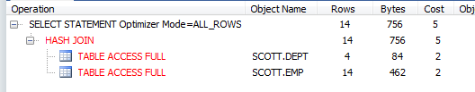
>
>  
>
> 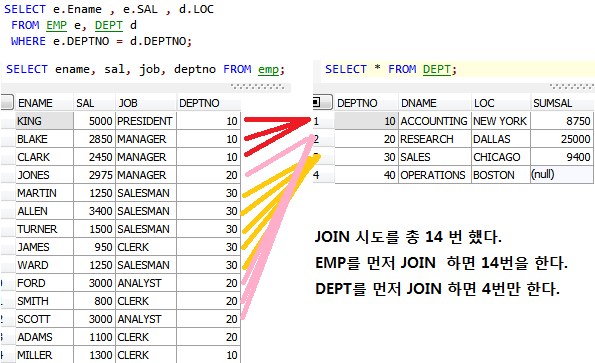
>
>  
>
> 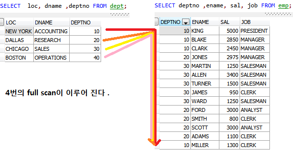
>
> (From 지우)

 

 

# 조인 튜닝시에 가장 중요한 2가지

## 조인순서
-   Ordered : from 절에서 기술한 테이블 순서데로 조인
-   Leading : leading 힌트 안에쓴 테이블 순서대로 조인

## 조인 방법
-   Use\_nl : nested loop 조인으로 유도
-   Use\_hash : hash 조인으로 유도
-   Use\_merge : sort merge 조인으로 조인해라

Pb 45. ordered 힌트를 이용해서 아래 SQL의 조인순서를 emp -&gt; dept 순으로 조인되게 하시오

    SELECT /\*+ ordered\*/e.ename,e.sal,d.loc
    fROM EMP e, DEPT d
    Where e.deptno = d.deptno;

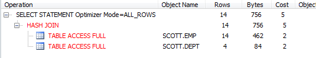

  

Nested loop join
----------------

* 테이블을 조인할 때  한건씩 순차적으로 반복해서 조인 하는 조인방법 (조인 되는 건수가 적을 때 유리한 조인 방법)

* 조인되는 후행 테이블의 조인 컬럼에 인덱스가 존재해야 한다. 인덱스가 없다면 후행 테이블 반복 full scan으로 성능에 매우 좋지 않다.

* Single block I/O 이며 Random Access 발생(테이블 access 가 필요한 경우)

* 8소량의 데이터 처리는 유리하며 대량의 데이터 처리(batch)는 큰 부하 발생
* 먼저 수해되는 집합의 처리 범위가 전체 성능을 좌우한다.

Pb 46. 아래의 SQL을 아래의 방법으로 조인하시오

    조인순서 : emp - sal - dept
    조인방법 : nested loop join
    
    Select e.ename, e.sal, d.loc
    From emp e, dept d
    Where e.deptno = d.deptno;
    
    Answer)
    SELECT \*+ ordered use_nl(d) */
    e.ename, e.sal, d.loc
    FROM EMP e, DEPT d
    WHERE e.deptno=d.deptno;

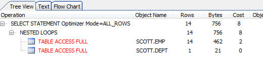

 Nested loop Join 으로 바뀜

 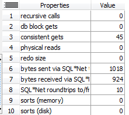

>  
>

Pb 47. 아래의 조인 SQL 을 튜닝하시오

    SELECT /*+ ordered use_nl(d) */
    e.ename, e.sal, d.loc
    FROM EMP e, DEPT d
    WHERE e.deptno=d.deptno;

  

 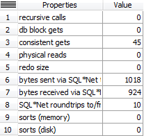

	Tuning)
	SELECT /*+ ordered use_nl(e) */
	e.ename, e.sal, d.loc
	FROM dEPT d, EMP e
	WHERE e.deptno=d.deptno;

 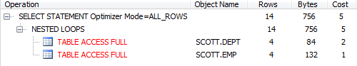

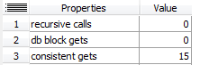

Pb 48. 아래의 조인 SQL에 적절한 힌트를 주시오

    SELECT e.ename, e.sal, d.loc
    FROM DEPT d, EMP e
    WHERE e.deptno = d.deptno
    AND e.job = 'SALESMAN'
    AND d.loc = 'CHICAGO';
    
    Tuning)
    SELECT /*leading(d e) use_al(e) */ e.ename, e.sal, d.loc
    FROM DEPT d, EMP e
    WHERE e.deptno = d.deptno
    AND e.job = 'SALESMAN'
    AND d.loc = 'CHICAGO';

세일즈맨의 데이타는 job 테이블에 4개
CHCAGO는 dept 테이블에 한개
그러므로 dept table에 먼저 접근

**leading (a b) : a에서 부터 조인한다는 뜻**

Nested join은 대량의 data 처리시 부적합할수 있다 왜냐하면 후행에서 join 된 테이블의 select 절에 컬럼에 index가 걸려있지 않다면 random access시 문제가 발생할수 있기 때문이다.

Pb 49. SK 텔레콤 통신사인 학생들의 이름과 주소, 나이, 통신사, 통신사 월 금액을 출력

> (emp2와 telecom\_price 조인)

 

 

> SELECT /\* + leading (t e) use\_nl(e)\*/ename,address, t\_price
>
> FROM EMP2 e , TELECOM\_PRICE t
>
> WHERE e.telecom=t.telecom
>
> and e.telecom='sk';
>
>  

 

>  

Pb 50. Price 테이블과 Market\_code를 조인해서 a\_name, a\_price, m\_type\_name을 출력 하시오

> SELECT p.a\_name,p.a\_price, m.m\_type\_name
>
> FROM PRICE p,market\_code m
>
> WHERE p.m\_type\_code=m.m\_type\_code;
>
> 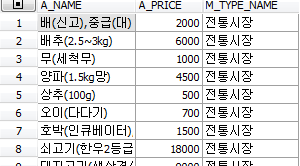
>
>  
>
>  
>
> SELECT /\* leading (m p) use\_nl(p) \*/p.a\_name,p.a\_price, m.m\_type\_name
>
> FROM PRICE p,market\_code m
>
> WHERE p.m\_type\_code=m.m\_type\_code;
>
>  
>
> 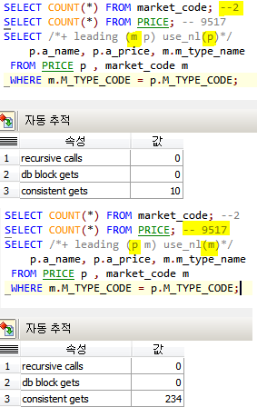

 

> Whole
>
> CREATE TABLE market\_code
>
> AS
>
> SELECT DISTINCT m\_type\_code, m\_type\_name
>
> FROM PRICE;
>
>  
>
>  
>
> CREATE TABLE gu\_code
>
> AS
>
> SELECT DISTINCT m\_gu\_code, m\_gu\_name
>
> FROM PRICE;
>
>  
>
> ALTER TABLE PRICE
>
> DROP COLUMN m\_gu\_name;
>
>  
>
> ALTER TABLE PRICE
>
> DROP COLUMN m\_type\_name;
>
>  
>
> SELECT p.a\_name,p.a\_price, m.m\_type\_name
>
> FROM PRICE p,market\_code m
>
> WHERE p.m\_type\_code=m.m\_type\_code;
>
>  
>
> SELECT /\*+ leading(p m) use\_nl(m) \*/p.a\_name,p.a\_price, m.m\_type\_name
>
> FROM PRICE p,market\_code m
>
> WHERE p.m\_type\_code=m.m\_type\_code;
>
>  
>
>  

Pb 51. 이름이 Scott 인 사원의 이름과 월급과 부서위치를 출력하는데 적절한 조인 순서와 조인방법을 힌트를 주어서 작성하시오.

> SELECT /\*+ leading (e d) use\_nl(d)\*/ e.ename, e.sal, d.loc
>
> FROM EMP e, DEPT d
>
> WHERE e.deptno=d.deptno AND e.ename='SCOTT';
>
>  
>
> // e먼저 why? 1건이니까

 

Pb 52. Price 테이블과 gu\_code를 조인 해서 a\_name, a\_price, m\_gu\_name을 출력하는데 적절한 조인 힌트를 줘서 작성하시오.

> SELECT /\*+ leading (g p) use\_nl(p)\*/p.a\_name,p.a\_price,g.m\_gu\_name
>
> FROM PRICE p, gu\_code g
>
> WHERE p.m\_gu\_code=g.m\_gu\_code;
>
>  

Pb 53. 위의 결과에서 이마트 역삼점만 출력

> SELECT /\*+ leading (g p) use\_nl(p)\*/p.a\_name,p.a\_price,g.m\_gu\_name
>
> FROM PRICE p, gu\_code g
>
> WHERE p.m\_gu\_code=g.m\_gu\_code AND p.m\_name LIKE '이마트%역삼%';
>
>  

Pb 54. (3개의 테이블 조인) 이름, 월급, 부서위치, 급여등급(grade)를 출력

> SELECT e.ename,e.sal,d.loc
>
> FROM EMP e,DEPT d,SALGRADE g
>
> WHERE e.dept(3개의 테이블 조인) 이름, 월급, 부서위치, 급여등급(grade)를 출력하는데 적절한 조인 순서와 조인 방법의 힌트를 주고 작성하시오. no=d.deptno AND e.sal BETWEEN g.losal AND g.hisal;

 

Pb 55. (3개의 테이블 조인) 이름, 월급, 부서위치, 급여등급(grade)를 출력하는데 적절한 조인 순서와 조인 방법의 힌트를 주고 작성하시오.

> SELECT /\*+ leading (g d e) use\_nl(d e)\*/ e.ename,e.sal,d.loc
>
> FROM EMP e,DEPT d,SALGRADE g
>
> WHERE e.deptno=d.deptno AND e.sal BETWEEN g.losal AND g.hisal;
>
>  

Pb 56. (3개 테이블 조인) Price 테이블, gu\_code테이블, market\_code테이블 3개의 테이블을 조인후 a\_name, a\_prcie, m\_gu\_name, m\_type\_name 출력하는데 적절한 조인 순서와 힌트를 주고 실행하시오.

> SELECT /\*+ leading(m g p) use\_nl(g) use\_nl(p) \*/ p.a\_name,p.a\_price,g.m\_gu\_name,m.m\_type\_name
>
> FROM PRICE p, gu\_code g, market\_code m
>
> WHERE p.m\_gu\_code=g.m\_gu\_code AND p.m\_type\_code=m.m\_type\_code;
>
> //이 조인순서는 정상적이지 않지만 가장 적은 consistent 블럭 생성
>
>  
>
> SELECT /\*+ leading(m p g) use\_nl(p) use\_nl(g) \*/ p.a\_name,p.a\_price,g.m\_gu\_name,m.m\_type\_name
>
> FROM PRICE p, gu\_code g, market\_code m
>
> WHERE p.m\_gu\_code=g.m\_gu\_code AND p.m\_type\_code=m.m\_type\_code;
>
>  

Pb 57. 급여등급이 2등급이 사원들의 이름과 월급과 부서위치와 급여등급을 출력하는데 적절한 조인순서와 조인방법을 써서 구현하시오

> SELECT /\*+ leading(g d e) use\_nl(d) use\_nl(e)\*/e.ename,e.sal,d.loc,g.grade
>
> FROM EMP e,DEPT d,SALGRADE g
>
> WHERE e.deptno=d.deptno AND e.sal BETWEEN g.losal AND g.hisal AND g.grade=2;
>
>  
>
>  

Pb 58. 아래의 SQL을 튜닝하시오

>  
>
> Before)
>
> SELECT /\*+ leading(t s) use\_nl(s) \*/
>
> t.calendar\_year, SUM(s.amount\_sold)
>
> FROM sales200 s, times200 t
>
> WHERE s.time\_id = t.time\_id
>
> AND t.week\_ending\_day\_id=1581
>
> GROUP BY t.calendar\_year;
>
>  
>
> After)
>
> SELECT /\*+ leading(s t) use\_nl(t) \*/
>
> t.calendar\_year, SUM(s.amount\_sold)
>
> FROM sales200 s, times200 t
>
> WHERE s.time\_id = t.time\_id
>
> AND t.week\_ending\_day\_id=1581
>
> GROUP BY t.calendar\_year;
>

Pb 59. 아래의 SQL을 튜닝하시오

> Before)
>
> SELECT /\*+leading(s c) use\_nl(c) \*/ COUNT(\*)
>
> FROM sales200 s,customers200 c
>
> WHERE s.cust\_id = c.cust\_id
>
> AND c.country\_id=52790
>
> AND s.time\_id BETWEEN TO\_DATE('1999/01/01','RRRR/MM/DD') AND TO\_DATE('1999/12/31','RRRR/MM/DD');
>
> After)
>
> SELECT /\*+leading(c s) use\_nl(s) \*/ COUNT(\*)
>
> FROM sales200 s,customers200 c
>
> WHERE s.cust\_id = c.cust\_id
>
> AND c.country\_id=52790
>
> AND s.time\_id BETWEEN TO\_DATE('1999/01/01','RRRR/MM/DD') AND TO\_DATE('1999/12/31','RRRR/MM/DD');
>
>  

Pb 60. 위의 쿼리를 잘 실행하기 위해 인덱스 생성

    CREATE INDEX sales200_cust_id ON sales200(cust_id);
    CREATE INDEX customers200_cust_id ON customers200(cust_id);

Pb 61. 아래의 SQL을 nested loop 조인으로 수행하면서 좋은 성능을 보이겠금 인덱스를 생성하시오.

> SELECT /\*+ leading(t s) use\_nl(s) \*/
>
> t.calendar\_year, SUM(s.amount\_sold)
>
> FROM sales200 s, times200 t
>
> WHERE s.time\_id = t.time\_id
>
> AND t.week\_ending\_day\_id=1581
>
> GROUP BY t.calendar\_year;
>
> 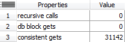
>
>  
>
>  
>
> CREATE INDEX sales200\_time\_id ON sales200(time\_id);
>
> CREATE INDEX times200\_time\_id ON times200(time\_id);
>
> CREATE INDEX times200\_week\_ending\_day\_id on times200(week\_ending\_day\_id);
>
>  
>
> SELECT /\*+ leading(t s) use\_nl(s) \*/
>
> t.calendar\_year, SUM(s.amount\_sold)
>
> FROM sales200 s, times200 t
>
> WHERE s.time\_id = t.time\_id
>
> AND t.week\_ending\_day\_id=1581
>
> GROUP BY t.calendar\_year;
>
>  
>
>  
>
> 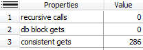
>
>  

Pb 62. 아래의 SQL을 튜닝하시오.

> Before)
>
> SELECT /\*+ leading(s t p) use\_nl(t) use\_nl(p) \*/p.prod\_name, t.calendar\_year,
>
> SUM(s.amount\_sold)
>
> FROM sales200 s, times200 t, products200 p
>
> WHERE s.time\_id = t.time\_id
>
> AND s.prod\_id = p.prod\_id
>
> AND t.calendar\_year IN (2000,2001)
>
> AND p.prod\_name LIKE 'Deluxe%'
>
> GROUP BY p.prod\_name, t.calendar\_year;
>
> 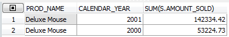
>
>  
>
> After)
>
>  
>
> CREATE INDEX sales200\_prod\_id ON sales200(prod\_id);
>
> CREATE INDEX products200\_time\_id ON products200(prod\_id);
>
> CREATE INDEX products200\_prod\_name ON products200(prod\_name);
>
> CREATE INDEX times200\_calendar\_year ON times200(calendar\_year);
>
>  
>
> SELECT /\*+ leading(p s t) use\_nl(s) use\_nl(t) \*/p.prod\_name, t.calendar\_year,
>
> SUM(s.amount\_sold)
>
> FROM sales200 s, times200 t, products200 p
>
> WHERE s.time\_id = t.time\_id
>
> AND s.prod\_id = p.prod\_id
>
> AND t.calendar\_year IN (2000,2001)
>
> AND p.prod\_name LIKE 'Deluxe%'
>
> GROUP BY p.prod\_name, t.calendar\_year;
>
>  
>
> 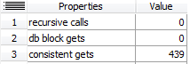
>
>  

Pb 63. 아래의 SQL을 해쉬조인으로 수행하시오

>
> SELECT /\*+ leading(p s t) use\_nl(s) use\_nl(t) \*/p.prod\_name, t.calendar\_year,
>
> SUM(s.amount\_sold)
>
> FROM sales200 s, times200 t, products200 p
>
> WHERE s.time\_id = t.time\_id
>
> AND s.prod\_id = p.prod\_id
>
> AND t.calendar\_year IN (2000,2001)
>
> AND p.prod\_name LIKE 'Deluxe%'
>
> GROUP BY p.prod\_name, t.calendar\_year;
>
>  
>
> After)

    SELECT /*+ leading(p s t) use_hash(s) use\_hash(t) */p.prod_name, t.calendar_year,
    SUM(s.amount_sold)
    FROM sales200 s, times200 t, products200 p
    WHERE s.time_id = t.time_id
    AND s.prod_id = p.prod_id
    AND t.calendar_year IN (2000,2001)
    AND p.prod_name LIKE 'Deluxe%'
    GROUP BY p.prod_name, t.calendar_year;

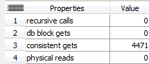

  

Hash 조인의 원리
----------------

    SELECT /*+ leading(d e) use_hash(e)*/ E.NAME, d.loc
    FROM EMP e, DEPT d
    WHERE d.deptno=d.deptno;

- 해쉬조인을 하게 되면 dept 테이블을 메모리에 올려놓고 메모리에 있는 dept테이블과 emp와 조인을 시도한다
- 작은 테이블을 메모리에 올려서 해쉬함수를 써서 조인을 시도한다

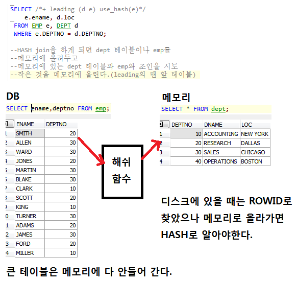
> From 지우
>
> 
>
>  

Pb 64. 아래의 SQL을 hash join으로 수행하는데 times 테이블을 해쉬 테이블로 구성 하는것과 sales테이블을 해쉬 테이블로 구성하는것과의 성능차이를 확인하시오

    SELECT /*+ leading(t s) use\_hash(s) */
    t.calendar_year, SUM(s.amount_sold)
    FROM sales200 s, times200 t
    WHERE s.time_id = t.time_id
    AND t.week_ending_day_id = 1581
    GROUP BY t.CALENDAR_YEAR;
>
> 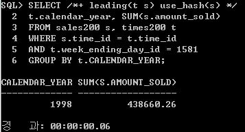
>
>  
>
>   SELECT /*+ leading(s t) use_hash(t) */
>   t.calendar_year, SUM(s.amount_sold)
>   FROM sales200 s, times200 t
>   WHERE s.time_id = t.time_id
>   AND t.week_ending_day_id = 1581
>   GROUP BY t.CALENDAR_YEAR;
>
> 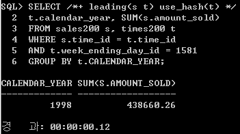
>
> Times200을 올리면 조금더 걸린다
>

Pb 65. 아래의 SQL을 조인 순서와 조인방버을 아래와 같이 설정하시오

조인순서 times-&gt; sales -&gt; products

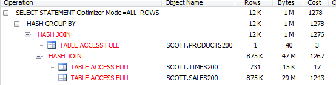

1번째 조인 : Times200 (메모리) &lt;-&gt; Sales200

2번째 조인 : products200(메모리) &lt;-&gt; (times200/sales200)

  

> 위에 있는게 메모리에 올라간다
>
>  

Pb 66. 해쉬 조인순서를 아래와 같이 만드시오

> 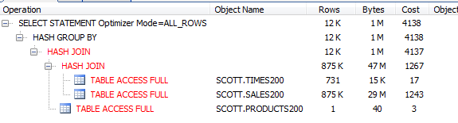

 

    SELECT /*+ leading(t s p) use_hash(s) use_hash(p) no_swap_join_inputs(p) */
    p.prod_name, t.calendar_year,
    SUM(s.amount\_sold)
    FROM sales200 s, times200 t, products200 p
    WHERE s.time\_id = t.time\_id
    AND s.prod\_id = p.prod\_id
    AND t.calendar\_year IN (2000,2001)
    AND p.prod\_name LIKE 'Deluxe%'
    GROUP BY p.prod\_name, t.calendar\_year;

해쉬조인 사용시 힌트
--------------------

1.  Use\_hash(테이블명) : 해쉬조인

2.  Swap\_join\_inputs : 해쉬테이블을 선정할때 사용하는 힌트

3.  No\_swap\_join\_inputs : prob 테이블을 선정할때 사용하는 힌트

### 해쉬테이블과 prob 테이블
>
>
>
>  1.  해쉬 테이블 : 메모리로 올라가는 테이블
>
>  2.  탐색 테이블 : 디스크에서 메모리에 있는 해쉬 테이블과 >조인하는 테이블

    SELECT \*+ leading(d e) use_hash(e) */
    e.ename,d.loc
    FROM EMP e, DEPT d
    WHERE e.deptno=d.deptno;

*위의 경우 d가 해쉬테이블이 된다*

> - 테이블이 2개면 leading 힌트만으로도 해쉬 테이블과 탐색 테이블을 선정할 수 있다.
> - 테이블이 3개면 leading 힌트만으로도 해쉬 테이블과 탐색 테이블을 선정하기가 어려워진다.
> - 그래서 필요한 힌트가 swap\_join\_inputs와 no\_swap\_inputs 이다

**Pb 67. 아래와 같이 계획되게 만드시오**

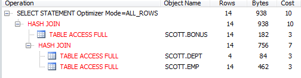

Before)

    SELECT /\*+ leading(d e b) use\_hash(e) use\_hash(b)\*/
    e.ename, d.loc
    FROM EMP e, DEPT d, BONUS b
    WHERE e.deptno=d.deptno
    AND e.empno=b.empno;

After)

    SELECT /\*+ leading(d e b) use\_hash(e) use\_hash(b) swap\_join\_inputs(b)\*/
    e.ename, d.loc
    FROM EMP e, DEPT d, BONUS b
    WHERE e.deptno=d.deptno
    AND e.empno=b.empno;
>
>

**Pb 68. 아래와 같이 실행계획이 나오게 하시오**

    SELECT /\*+ leading(b e d) use\_hash(b) use\_hash(e) swap\_join\_inputs(d)\*/
    e.ename, d.loc
    FROM EMP e, DEPT d, BONUS b
    WHERE e.deptno=d.deptno
    AND e.empno=b.empno;

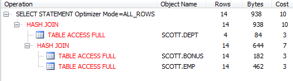

* 실제 현업에서의 테이블은 자주 변하게 때문에 힌트를 꼭 써야한다.
* 테이블 에 대해 수동으로 분석작업을 수행

    ANALYZE TABLE EMP COMPUTE statistics;

Pb 70. emp와 salgrade를 조인해서 이름, 월급, 급여 등급을 출력하는데 조인방법이 hash로 되게 하시오

    SELECT /* leading(s e) use_hash(e)*/ e.ename, e.sal, s.grade
    FROM EMP e, SALGRADE s
    WHERE e.sal BETWEEN e.losal AND hisal;

non equi join 은 해쉬조인을 쓸수없다.

# Sort merge join
when you cannot use hash join for equal join, **merge join** could be solution.

**Sort merge join try to join after sorting each column of each table.**

* If first table column is index column, set it into fisrt table to avoid sorting process.

hint : use_merge
ex)

    select /*+ leading(d e) use_merge(e)*/ e.ename, d.loc, e.deptno
    from emp e, dept d
    where e.deptno = d.deptno;

without order by, it show sorted result of deptno.

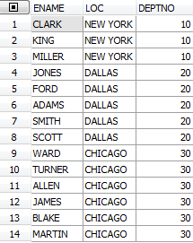

Pb 71. query ename, sal and salgrade joining EMP table and salgrade table using sort merge join.

    SELECT /* leading(s e) use_merge(e)*/ e.ename, e.sal, s.grade
    FROM EMP e, SALGRADE s
    WHERE e.sal BETWEEN s.losal AND s.hisal;

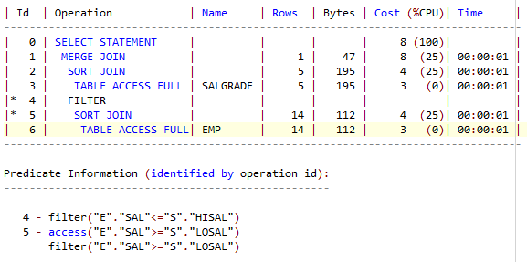

pb 72. 부서위치, 부서위치별 토탈월급을 출력하는데 적절한 조인순서와 조인방법을 명시해서 쿼리를 작성하시오

    SELECT /*+ leading(d e) use_nl(e) */ d.loc,SUM(e.sal)
    FROM EMP e, DEPT d
    WHERE e.deptno=d.deptno
    GROUP BY d.loc;

>

pb 73. 이름과 월급과 부서위치, 급여등급을 출력하는데 아래와 같이 실행계획이 출력되게 하시오

    SELECT /*+ leading(s e d) use_nl(e) use_hash(d)  */ e.ename,e.sal,d.loc
    FROM EMP e, DEPT d, SALGRADE s
    WHERE e.deptno=d.deptno AND e.sal BETWEEN s.losal AND s.hisal;

# Outer sentence tuning

Pb 74. query ename and location but using outer join, print out boston at the same time.

! use nested loop join

    SELECT /*+ leading(d e) use_nl(e)*/e.ename,e.sal,d.loc
    FROM EMP e, DEPT d
    WHERE e.deptno(+)=d.deptno;

Pb 75. change the above join method to nested join with dept -> emp join order.

    SELECT /*+ leading(d e) use_nl(e)*/ E.eNAME, d.loc
    FROM EMP e,DEPT d
    WHERE e.deptno = d.deptno(+);

***when joining with outer join sign, join order changes as from the side without outer join sign to the side with outer join sign by force***

pb 76. by using hash join, make the above join order as dept-emp

    SELECT /*+ leading(d e) use_hash(e) swap_join_inputs(d)*/ E.eNAME, d.loc
    FROM EMP e,DEPT d
    WHERE e.deptno = d.deptno(+);

pb 77. Do tuning the below SQL.

    before)
    select e.ename, d.loc, e.job
    from emp e, dept d
    where e.deptno = d.deptno(+)
        and d.loc(+) = 'DALLLAS';
    
    After)
    select /*+ swap_join_inputs(d) use_hash(e)*/ e.ename, d.loc, e.job
    from emp e, dept d
    where e.deptno = d.deptno(+)
        and d.loc(+) = 'DALLAS';

Pb 78. Tune the below full outer join.

    before)
    select e.ename, d.loc
    from emp e full outer join dept d
    where e.deptno=d.deptn
    
    After)
    SELECT /*+ opt_param('_optimizer_native_full_outer_join', 'off') */ e.ename, d.loc
    from emp e full outer join dept d
    ON(e.deptno=d.deptno);

* opt_param('_optimizer_native_full_outer_join', 'off') 
  -> **will not use full outer join execute plan**
* opt_param('_optimizer_native_full_outer_join', 'force') 
  -> **will use full outer join execute plan**

Pb 79. tune the below query

    before)
    select ename,sal,job
    from emp
    where ename like '%EN%' or 
        ename like'%IN%';
    
    after)
    SELECT /+ leading (e3 e1) use_nl(e1) rowid(e1)/
    e1.ename, e1.sal, e1.job    
    FROM EMP e1,
    (SELECT /+ indexffs(e2 emp_ename) no_merge/ ROWID rr
    FROM EMP e2
    WHERE ename LIKE '%EN%'
    OR ename LIKE '%IN%')e3
    WHERE E1.ROWID = e3.rr;

**no_merge** : lnline 뷰를 해체하지 말아라

Pb 80. 우리반 테이블에서 주소가 송파구와 동작구에 사는 학생들의 이름, 주소와 나이를 출력 
	SELECT ename,address, age
	FROM EMP2
	WHERE address LIKE '%송파%' or address LIKE '%동작%';

    SELECT /*+ leading(e3 e1) use_nal(e1)*/ e1.ename, e1.address, e1.age
    FROM EMP2 e1,
    (
    SELECT  /*+ index_ffs(e emp2_address) no_merge */ROWID rr
    FROM EMP2 e
    WHERE address LIKE '%송파%' or address LIKE '%동작%'
    ) e3
    WHERE e1.rowid=e3.rr;

Ex)  이름과 부서위치를 출력하는데 해쉬조인으로 수행되게 하시오

	SELECT /*+ leading (d e) use_hash(e) */ e.ename,d.loc
	FROM EMP e, DEPT d
	WHERE e.deptno=d.deptno;

pb 81. 아래의 HASH 조인 문장의 full table scan이 병렬로 처리 되게 하시오. 

    select /*leading (d e) use_hash(e) */
    e.ename, d.loc
    from emp e, dept d
    where e.deptno=d.deptno;

After)

	select /*+ leading(d e) use_hash(e) full(e) full(d) parallel(e,4) parallel(d,4) */
	e.ename, d.loc
	from emp e, dept d
	where e.deptno=d.deptno;

* index range scan을 막고 full scan 시키는게 full(e) full(d) 명령어다. 
* Hash Join 에서는 인덱스를 타지 말아야 성능이 더 좋다.